# Action Tree — Religious Organization Management System

## Mermaid Code

```mermaid
graph TD
    Root["Religious Organization Management System"]

    Root --> M1["Member & Household Directory"]
    Root --> M2["Worship & Sacrament Management"]
    Root --> M3["Tithe & Contribution Accounting"]
    Root --> M4["Ministry & Small Group Coordination"]
    Root --> M5["Religious Education & Classes"]
    Root --> M6["Facility & Community Outreach"]

    M1 --> A11["Register Member & Household"]
    M1 --> A12["Update Family Directory Status"]
    M1 --> A13["Log Pastoral Counseling Notes"]
    M1 --> A14["Export Member Directory"]

    M2 --> A21["Schedule Worship Services"]
    M2 --> A22["Officiate Sacrament Events"]
    M2 --> A23["Generate Sacrament Certificates"]
    M2 --> A24["Stream Live Video Broadcast"]

    M3 --> A31["Process Online Tithes & Offerings"]
    M3 --> A32["Manage Building Fund Pledges"]
    M3 --> A33["Generate Annual Tax Statements"]
    M3 --> A34["Post to Financial Ledger ERP"]

    M4 --> A41["Establish Ministry Teams"]
    M4 --> A42["Assign Volunteer Shifts"]
    M4 --> A43["Track Background Check Clearance"]
    M4 --> A44["Manage Small Group Calendars"]

    M5 --> A51["Configure Sunday School Classes"]
    M5 --> A52["Enroll Students & Track Attendance"]
    M5 --> A53["Assign Volunteer Class Teachers"]
    M5 --> A54["Issue Completion Diplomas"]

    M6 --> A61["Reserve Sanctuary & Rooms"]
    M6 --> A62["Log Equipment Maintenance"]
    M6 --> A63["Dispatch Emergency Prayer Alerts"]
    M6 --> A64["Export Statutory Regulatory Logs"]
```

## Module Description | Mô tả Module

| # | Module | Description | Actions |
|---|--------|-------------|---------|
| 1 | Member & Household Directory | Manages individual member profiles, family household links, pastoral care counseling notes, and directory exports. | Register Member & Household, Update Family Directory Status, Log Pastoral Counseling Notes, Export Member Directory |
| 2 | Worship & Sacrament Management | Schedules regular services, officiates personal sacraments (baptisms, weddings), generates certificates, and handles live streams. | Schedule Worship Services, Officiate Sacrament Events, Generate Sacrament Certificates, Stream Live Video Broadcast |
| 3 | Tithe & Contribution Accounting | Processes online tithes, tracks building fund pledges, generates annual tax-deductible statements, and posts to financial accounting ledgers. | Process Online Tithes & Offerings, Manage Building Fund Pledges, Generate Annual Tax Statements, Post to Financial Ledger ERP |
| 4 | Ministry & Small Group Coordination | Coordinates volunteer teams, manages shift rosters, verifies background check clearances, and schedules small group meetings. | Establish Ministry Teams, Assign Volunteer Shifts, Track Background Check Clearance, Manage Small Group Calendars |
| 5 | Religious Education & Classes | Configures Sunday school and catechism courses, handles student enrollments, assigns teachers, and issues completion diplomas. | Configure Sunday School Classes, Enroll Students & Track Attendance, Assign Volunteer Class Teachers, Issue Completion Diplomas |
| 6 | Facility & Community Outreach | Oversees sanctuary room bookings, AV equipment maintenance, emergency prayer broadcast alerts, and statutory government filings. | Reserve Sanctuary & Rooms, Log Equipment Maintenance, Dispatch Emergency Prayer Alerts, Export Statutory Regulatory Logs |
