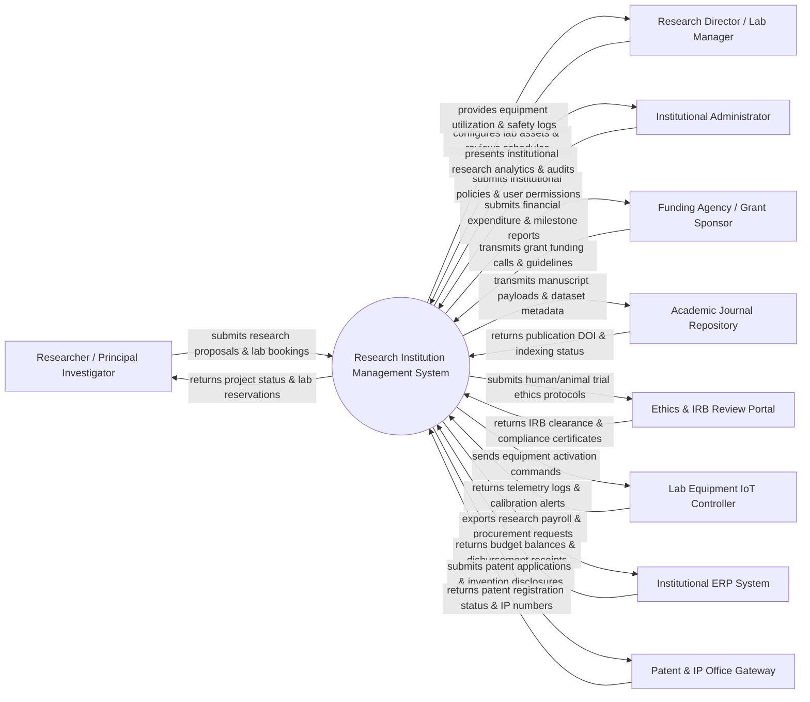

# Context Diagram — Research Institution Management System

## Mermaid Code

## Actor & Interaction Table | Bảng Actor & Tương tác

| # | Actor | Actor Type | Data Sent TO System | Data Received FROM System | Notes |
|---|-------|------------|---------------------|---------------------------|-------|
| 1 | Researcher / Principal Investigator | Primary | Project proposals, grant applications, lab equipment bookings, manuscript drafts, dataset uploads, experiment logs | Proposal approval decisions, equipment reservation confirmations, grant budget balances, publication tracking | Academic researchers, professors, and lab technicians leading research projects. |
| 2 | Research Director / Lab Manager | Primary | Laboratory room definitions, equipment maintenance schedules, safety guidelines, resource quotas | Equipment usage analytics, safety violation alerts, lab booking calendars, maintenance logs | Senior institutional leaders managing research facilities and department budgets. |
| 3 | Institutional Administrator | Primary | Institutional research policies, user security roles, department structures, compliance audit rules | Institution-wide research metrics, grant performance dashboards, audit logs | Executive management and compliance officers governing institutional research ops. |
| 4 | Funding Agency / Grant Sponsor | External System | Grant call notices, funding guidelines, award allocations, reporting templates | Grant application dossiers, financial expenditure statements, milestone deliverables | External government or private bodies providing research funding (e.g., NSF, NIH). |
| 5 | Academic Journal Repository | Supporting System | Digital Object Identifiers (DOIs), indexing confirmations, citation metadata, review status | Open-access manuscript files, author metadata, research dataset links | Academic journal databases and repositories (e.g., IEEE, Springer, PubMed, Crossref). |
| 6 | Ethics & IRB Review Portal | Supporting System | Institutional Review Board (IRB) clearance codes, ethical protocol feedback, compliance rules | Human/animal experiment protocols, subject safety plans, consent forms | Board evaluating ethical standards and safety compliance for research projects. |
| 7 | Lab Equipment IoT Controller | Supporting System | Real-time usage metrics, operating temperature, calibration status, error codes | Remote equipment start/stop signals, user authorization tokens, run duration limits | Hardware controllers and IoT sensors managing physical scientific instruments. |
| 8 | Institutional ERP System | Supporting System | Department budget balances, payroll details, purchase order numbers, vendor records | Approved procurement requests, research assistant payroll data, grant expenditure logs | Enterprise ERP managing institutional finance, procurement, and human resources. |
| 9 | Patent & IP Office Gateway | Supporting System | Patent application numbers, examination status codes, patent grant certificates | Invention disclosure forms, patent claims, priority filings, technology transfer docs | Government intellectual property offices (e.g., USPTO, WIPO, national IP offices). |

## System Boundary Description | Mô tả Phạm vi Hệ thống

The **Research Institution Management System (RIMS)** is a comprehensive software platform designed to manage the end-to-end research lifecycle of an academic or scientific institution. Inside the system boundary, RIMS processes research proposal submissions, manages laboratory asset scheduling, tracks grant funding budgets, facilitates ethics review workflows, archives scientific publications, and registers intellectual property disclosures. External to the system boundary are external funding bodies (Grant Sponsors), academic publishing networks (Journal Repositories), regulatory review portals (Ethics & IRB Portal), laboratory hardware controllers (Lab Equipment IoT Controller), core enterprise financial systems (Institutional ERP System), and official patent registration bodies (Patent & IP Office Gateway).
