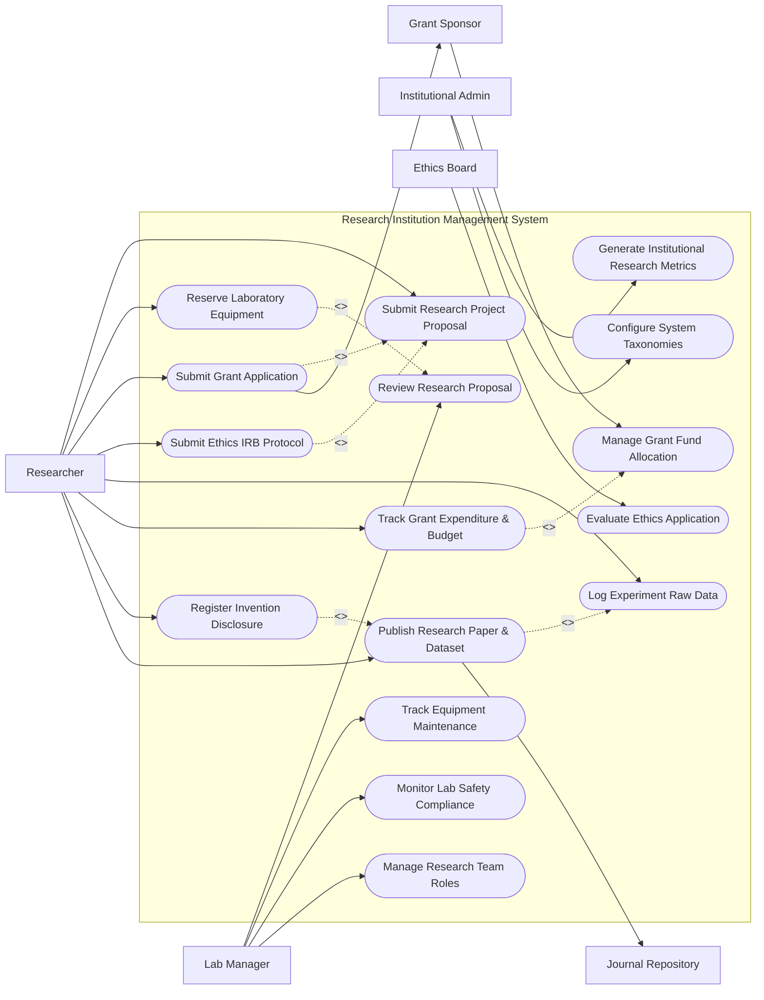

# Use Case Diagram — Research Institution Management System

## Mermaid Code

## Actor Table | Bảng Actor

| # | Actor | Actor Type | Role Description | Related Use Cases |
|---|-------|------------|------------------|-------------------|
| 1 | Researcher | Primary | Academic investigator or lab technician proposing projects, conducting experiments, and writing papers. | UC01, UC03, UC05, UC07, UC09, UC10, UC11, UC12 |
| 2 | Lab Manager | Primary | Senior facility manager overseeing laboratory equipment, approving bookings, and ensuring safety compliance. | UC02, UC04, UC13, UC14 |
| 3 | Ethics Board | Primary | Institutional Review Board (IRB) evaluating human/animal subjects safety and ethical compliance. | UC08 |
| 4 | Grant Sponsor | Secondary | External funding organization reviewing grant applications and disbursing funding allocations. | UC05, UC06 |
| 5 | Journal Repository | System | External publisher network indexing scientific manuscripts and assigning DOIs. | UC12 |
| 6 | Institutional Admin | Primary | Executive administrator managing system policies, department structures, and institution analytics. | UC15, UC16 |

## Use Case Table | Bảng Use Case

| # | UC ID | Use Case Name | Primary Actor | Secondary Actor | Description | Priority |
|---|-------|---------------|---------------|-----------------|-------------|----------|
| 1 | UC01 | Submit Research Project Proposal | Researcher | Lab Manager | Submits a new scientific project proposal complete with research objectives, methodology, and budget draft. | High |
| 2 | UC02 | Review Research Proposal | Lab Manager | Researcher | Evaluates submitted proposals for scientific merit, feasibility, and resource allocation. | High |
| 3 | UC03 | Reserve Laboratory Equipment | Researcher | Lab Manager | Schedules time slots for specialized scientific instruments and lab facilities. | High |
| 4 | UC04 | Track Equipment Maintenance | Lab Manager | None | Logs calibration dates, repair orders, and downtime for lab equipment assets. | Medium |
| 5 | UC05 | Submit Grant Application | Researcher | Grant Sponsor | Compiles approved project details into a grant proposal dossier sent to external sponsors. | High |
| 6 | UC06 | Manage Grant Fund Allocation | Grant Sponsor | Institutional Admin | Records award notifications, grant ledger accounts, and fund disbursement tranches. | High |
| 7 | UC07 | Submit Ethics IRB Protocol | Researcher | Ethics Board | Submits ethical review protocols regarding human participants, animal subjects, or biohazards. | High |
| 8 | UC08 | Evaluate Ethics Application | Ethics Board | Researcher | Reviews research protocols, issues IRB approval certificates, or requests modifications. | High |
| 9 | UC09 | Log Experiment Raw Data | Researcher | None | Uploads primary experiment observations, raw sensor readings, and analytical data files. | Medium |
| 10 | UC10 | Track Grant Expenditure & Budget | Researcher | Institutional Admin | Logs research purchases, equipment acquisitions, and assistant stipends against grant budget. | High |
| 11 | UC11 | Register Invention Disclosure | Researcher | Institutional Admin | Submits novel technology disclosures for patent review and institutional IP filing. | Medium |
| 12 | UC12 | Publish Research Paper & Dataset | Researcher | Journal Repository | Connects published peer-reviewed papers with underlying datasets and open-access repositories. | High |
| 13 | UC13 | Monitor Lab Safety Compliance | Lab Manager | None | Tracks chemical inventory, radiation safety checks, and hazardous waste logs. | Medium |
| 14 | UC14 | Manage Research Team Roles | Lab Manager | Researcher | Assigns postdocs, PhD candidates, and lab technicians to specific research projects. | Medium |
| 15 | UC15 | Generate Institutional Research Metrics | Institutional Admin | None | Exports h-index metrics, total citation counts, annual grant revenue, and publication outputs. | Medium |
| 16 | UC16 | Configure System Taxonomies | Institutional Admin | None | Defines research field classifications (FOR codes), grant types, and lab safety categories. | Low |

## Use Case Specification | Đặc tả Use Case

---

### UC01 — Submit Research Project Proposal

| Field | Detail |
|-------|--------|
| **UC ID** | UC01 |
| **Use Case Name** | Submit Research Project Proposal |
| **Actor(s)** | Primary: Researcher / Secondary: Lab Manager |
| **Description** | Allows a Principal Investigator or Researcher to draft and submit a formal research project proposal including title, abstract, methodology, timeline, and estimated budget. |
| **Precondition** | 1. Researcher is logged in with an active institutional account.   2. The user has investigator status within an academic department. |
| **Main Flow** | 1. Actor selects "Create Project Proposal".   2. System presents proposal creation form with fields for Title, Abstract, Research Area, Principal Investigator, and Co-Investigators.   3. Actor fills in general project details and uploads methodology documentation.   4. Actor specifies project start/end dates, required lab facilities, and budget estimates.   5. Actor submits the proposal package.   6. System validates all required fields, assigns a unique Proposal ID, and sets status to "Under Departmental Review".   7. System sends notification email to the Department Research Director / Lab Manager. |
| **Alternative Flow** | **AF1** — Save as Draft: Actor selects "Save Draft"; System saves the incomplete proposal in "Draft" status for later editing.   **AF2** — Multi-Department Joint Project: Actor tags secondary departments; System routes proposal for multi-department co-approval. |
| **Exception Flow** | **EX1** — Incomplete Budget Breakdown: If budget items lack category specification (e.g. equipment vs salary), System highlights missing fields and blocks submission.   **EX2** — File Size Exceeded: If attached methodology document exceeds 50MB limit, System displays error "Attachment size limit exceeded (Max 50MB)". |
| **Postcondition** | A Project record is created in status "Under Review" and queued in the Department Director's review matrix. |
| **Business Rule** | **BR1**: Proposals requesting over $100,000 in institutional seed funding require additional vice-president level authorization.   **BR2**: Project start date must be at least 30 days after proposal submission date. |

---

### UC03 — Reserve Laboratory Equipment

| Field | Detail |
|-------|--------|
| **UC ID** | UC03 |
| **Use Case Name** | Reserve Laboratory Equipment |
| **Actor(s)** | Primary: Researcher / Secondary: Lab Manager |
| **Description** | Enables researchers to search for specialized lab instruments (e.g. Electron Microscope, NMR Spectrometer), view calendar availability, and reserve time slots. |
| **Precondition** | 1. Researcher is assigned to an active research project.   2. Researcher holds active safety clearance certification for the target equipment. |
| **Main Flow** | 1. Actor selects "Equipment Reservation" and searches by instrument name or facility category.   2. System displays matching instruments along with real-time schedule calendars and operating rules.   3. Actor selects target instrument and picks open start and end time slots.   4. Actor inputs project ID and experiment protocol notes.   5. Actor submits reservation request.   6. System verifies user safety clearance, checks slot availability, reserves the time slot, and sets status to "Confirmed" (or "Pending Manager Approval").   7. System sends calendar invite and IoT access pin code to Researcher. |
| **Alternative Flow** | **AF1** — High-Demand Equipment Approval: For instruments flagged as "High-Demand", reservation status sets to "Pending Manager Review" until Lab Manager confirms slot allocation.   **AF2** — Recurring Reservation: Researcher sets weekly recurring slot; System reserves matching recurring slots subject to max limit. |
| **Exception Flow** | **EX1** — Missing Safety Certification: If Researcher lacks valid equipment training badge, System blocks reservation and alerts "Safety Certification Required: Complete Module ENV-201".   **EX2** — Schedule Overlap: If chosen slot is booked during submission, System displays error "Slot unavailable. Please pick an open time window." |
| **Postcondition** | An Equipment_Booking entity is persisted in status "Confirmed", reserving instrument capacity and syncing to IoT controller access lists. |
| **Business Rule** | **BR1**: Researchers cannot hold more than 15 hours of peak-time reservations per week on high-demand instruments.   **BR2**: Cancellations must be made at least 4 hours prior to slot start time to avoid penalty flags. |

---

### UC07 — Submit Ethics IRB Protocol

| Field | Detail |
|-------|--------|
| **UC ID** | UC07 |
| **Use Case Name** | Submit Ethics IRB Protocol |
| **Actor(s)** | Primary: Researcher / Secondary: Ethics Board |
| **Description** | Allows researchers to submit Institutional Review Board (IRB) ethical protocols detailing human participant involvement, animal care, or biohazard handling for evaluation. |
| **Precondition** | 1. Research project proposal (UC01) is created.   2. Project involves human subjects, animal subjects, or hazardous biological materials. |
| **Main Flow** | 1. Actor navigates to Project Compliance section and clicks "New IRB Protocol Submission".   2. System presents IRB questionnaire selecting subject type (Human Participants, Animal Care, Biohazard/Radiation).   3. Actor fills in risk assessment, subject selection criteria, informed consent forms, and data privacy safeguards.   4. Actor attaches research protocol documents and participant consent templates.   5. Actor submits IRB package.   6. System validates protocol completeness, assigns IRB Reference Number (e.g. IRB-2026-089), and sets status to "Queued for Board Review".   7. System notifies Ethics Board secretary. |
| **Alternative Flow** | **AF1** — Expedited Review Request: If research meets criteria for minimal risk, Actor checks "Expedited Review", and System routes protocol to designated single reviewer queue.   **AF2** — Exempt Category Declaration: Actor claims "IRB Exempt Status" with rationale; System routes for exemption verification. |
| **Exception Flow** | **EX1** — Missing Consent Form Template: If human subject research option is selected without attaching consent form template, System blocks submission with alert "Consent form template required for human subjects".   **EX2** — Expired CITI Ethics Training: If Principal Investigator's human subject research certification has expired, System prompts user to renew certification before submitting. |
| **Postcondition** | An Ethics_Approval record is persisted in status "Submitted", linking the project to an active IRB protocol. |
| **Business Rule** | **BR1**: No experimental data collection involving human or animal subjects can commence prior to full IRB approval issuance. |

---

### UC10 — Track Grant Expenditure & Budget

| Field | Detail |
|-------|--------|
| **UC ID** | UC10 |
| **Use Case Name** | Track Grant Expenditure & Budget |
| **Actor(s)** | Primary: Researcher / Secondary: Institutional Admin |
| **Description** | Allows Principal Investigators to monitor awarded grant budget lines, log research supply purchases, record personnel stipends, and view real-time available balances. |
| **Precondition** | 1. Active grant funding allocation (UC06) is assigned to the research project.   2. User has Principal Investigator or Grant Financial Delegate authorization. |
| **Main Flow** | 1. Actor opens the Financial Management module for an active grant.   2. System displays total grant award amount, categorized budget pools (Personnel, Equipment, Supplies, Travel, Overhead), committed funds, and remaining balance.   3. Actor clicks "Log Requisition / Expense Claim".   4. Actor enters expense item, vendor, amount, target budget category, and attaches invoice/receipt receipt.   5. Actor submits expense claim.   6. System checks budget line availability, records pending transaction, and forwards requisition to Institutional ERP / Finance Dept.   7. System updates remaining budget balance in real-time. |
| **Alternative Flow** | **AF1** — Budget Reallocation Request: Actor requests transferring funds between categories (e.g. Travel pool to Supplies pool); System submits budget modification request for sponsor approval.   **AF2** — Recurring Salary Payroll Commitments: System automatically posts monthly research assistant stipend commitments against the Personnel budget pool. |
| **Exception Flow** | **EX1** — Insufficient Category Balance: If expense amount exceeds available balance in chosen category pool, System alerts "Over-budget error: Requested $5,000 exceeds available Supplies balance of $3,200".   **EX2** — Post-Grant Expiry Claim: If expense date is after grant closing date, System rejects transaction with error "Grant project account is closed". |
| **Postcondition** | Financial transaction is recorded against the Grant_Funding ledger, updating committed and spent figures. |
| **Business Rule** | **BR1**: Reallocations exceeding 10% of total grant award value require formal written approval from the external Grant Sponsor. |

---

### UC12 — Publish Research Paper & Dataset

| Field | Detail |
|-------|--------|
| **UC ID** | UC12 |
| **Use Case Name** | Publish Research Paper & Dataset |
| **Actor(s)** | Primary: Researcher / Secondary: Journal Repository |
| **Description** | Enables researchers to register peer-reviewed journal publications, link underlying research raw datasets (UC09), assign DOIs, and archive institutional open-access papers. |
| **Precondition** | 1. Research project exists and has completed experiments or data logging.   2. Manuscript has been accepted or published by a journal/conference. |
| **Main Flow** | 1. Actor selects "Register New Publication & Dataset".   2. System displays publication registry form requesting Paper Title, Journal Name, ISSN, Publication Date, Volume/Issue, and Author list.   3. Actor inputs Digital Object Identifier (DOI) or clicks "Fetch Metadata via Crossref".   4. System queries external Journal Repository API, auto-populates citation metadata, and displays paper preview.   5. Actor links associated raw research datasets (UC09) and selects open-access licensing terms (e.g. CC-BY 4.0).   6. Actor uploads accepted manuscript PDF and submits registration.   7. System stores Publication entity, links paper to Project and Grant records, and indexes paper in Institutional Open Repository. |
| **Alternative Flow** | **AF1** — Dataset-Only Repository Publishing: Researcher registers a standalone scientific dataset, and System generates a Data DOI via DataCite API.   **AF2** — Institutional Repository Deposit (Green Open Access): System checks publisher embargo period and schedules public PDF release date automatically. |
| **Exception Flow** | **EX1** — Duplicate DOI: If entered DOI already exists in the system database, System alerts "Publication DOI already registered" and opens existing record.   **EX2** — Unlinked Mandatory Grant Acknowledgment: If grant funding rules require grant citation and no grant is selected, System prompts "Grant acknowledgment required for this publication". |
| **Postcondition** | A Publication record and associated Dataset links are stored, updating investigator h-index metrics and institutional research output counters. |
| **Business Rule** | **BR1**: Publications originating from publicly funded grants must be deposited into open-access repositories within 12 months of publication. |
