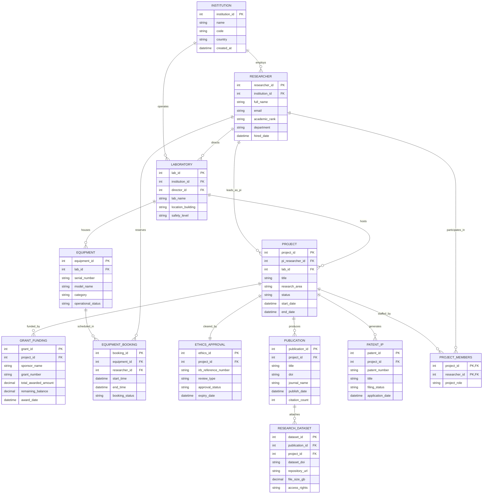

# Conceptual ERD — Research Institution Management System

## Mermaid Code

## Entity Description Table | Bảng mô tả Entity

| # | Entity Name | Vietnamese Name | Description | Key Attributes | Main Relationships |
|---|-------------|-----------------|-------------|----------------|-------------------|
| 1 | INSTITUTION | Viện Nghiên cứu | Represents the core academic or scientific institution governing laboratories and researchers. | institution_id (PK), name, code, country | Employs Researchers, operates Laboratories |
| 2 | RESEARCHER | Nhà Nghiên cứu | Individual researcher, professor, postdoc, or technician conducting scientific work. | researcher_id (PK), institution_id (FK), full_name, academic_rank | Belongs to Institution, leads Projects, reserves Equipment |
| 3 | LABORATORY | Phòng Thí nghiệm | Physical research facility equipped with specialized instruments and safety levels. | lab_id (PK), institution_id (FK), director_id (FK), lab_name, safety_level | Belongs to Institution, houses Equipment, hosts Projects |
| 4 | PROJECT | Đề tài Nghiên cứu | Core research initiative with defined scientific goals, timeline, and principal investigator. | project_id (PK), pi_researcher_id (FK), lab_id (FK), title, status | Led by PI Researcher, funded by Grants, produces Publications |
| 5 | GRANT_FUNDING | Nguồn Kinh phí Tài trợ | Financial award provided by external sponsors or internal seed funds to support a project. | grant_id (PK), project_id (FK), sponsor_name, total_awarded_amount | Funds Project |
| 6 | EQUIPMENT | Thiết bị Thí nghiệm | Scientific instrument, microscope, or specialized hardware asset located in a laboratory. | equipment_id (PK), lab_id (FK), model_name, serial_number, operational_status | Housed in Laboratory, scheduled in Bookings |
| 7 | EQUIPMENT_BOOKING | Lịch Đặt Thiết bị | Time reservation slot booked by a researcher to operate specific lab equipment. | booking_id (PK), equipment_id (FK), researcher_id (FK), start_time, end_time | Belongs to Equipment, reserved by Researcher |
| 8 | ETHICS_APPROVAL | Phê duyệt Đạo đức (IRB) | Institutional Review Board compliance certification for human/animal subjects research. | ethics_id (PK), project_id (FK), irb_reference_number, approval_status | Clears Project |
| 9 | PUBLICATION | Bài báo Khoa học | Peer-reviewed journal paper, conference proceeding, or book chapter originating from research. | publication_id (PK), project_id (FK), title, doi, journal_name | Produced by Project, attaches Datasets |
| 10 | RESEARCH_DATASET | Dữ liệu Nghiên cứu | Raw or curated analytical dataset supporting research findings deposited in digital repositories. | dataset_id (PK), publication_id (FK), project_id (FK), dataset_doi, repository_url | Attached to Publication and Project |
| 11 | PATENT_IP | Bằng sáng chế & Sở hữu Trí tuệ | Intellectual property disclosure or granted patent resulting from research discoveries. | patent_id (PK), project_id (FK), patent_number, title, filing_status | Generated by Project |

## Relationship Description | Mô tả Quan hệ

| # | From Entity | Cardinality | To Entity | Relationship Label | Business Explanation |
|---|-------------|-------------|-----------|-------------------|----------------------|
| 1 | INSTITUTION | one-to-many | RESEARCHER | employs | An Institution employs multiple academic Researchers. |
| 2 | INSTITUTION | one-to-many | LABORATORY | operates | An Institution operates multiple research Laboratories. |
| 3 | LABORATORY | one-to-many | EQUIPMENT | houses | A Laboratory houses multiple scientific Equipment assets. |
| 4 | RESEARCHER | one-to-many | LABORATORY | directs | A senior Researcher directs one or more Laboratories. |
| 5 | RESEARCHER | one-to-many | PROJECT | leads_as_pi | A Researcher leads multiple research Projects as Principal Investigator. |
| 6 | LABORATORY | one-to-many | PROJECT | hosts | A Laboratory hosts one or more research Projects. |
| 7 | PROJECT | one-to-many | GRANT_FUNDING | funded_by | A Project can be funded by one or multiple Grant awards. |
| 8 | EQUIPMENT | one-to-many | EQUIPMENT_BOOKING | scheduled_in | Equipment is reserved across multiple time Bookings. |
| 9 | RESEARCHER | one-to-many | EQUIPMENT_BOOKING | reserves | A Researcher makes multiple Equipment Bookings. |
| 10 | PROJECT | one-to-one | ETHICS_APPROVAL | cleared_by | A Project is cleared by an Ethics Approval protocol. |
| 11 | PROJECT | one-to-many | PUBLICATION | produces | A Project produces multiple scientific Publications. |
| 12 | PUBLICATION | one-to-many | RESEARCH_DATASET | attaches | A Publication attaches one or more public Research Datasets. |
| 13 | PROJECT | one-to-many | PATENT_IP | generates | A Project generates one or more Patent & IP filings. |
| 14 | PROJECT | many-to-many | RESEARCHER | staffed_by | Projects are staffed by multiple Researchers (via PROJECT_MEMBERS). |
