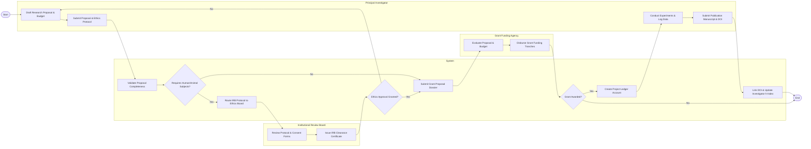

# Swimlane Diagram — Research Institution Management System

## Mermaid Code

## Flow Description | Mô tả luồng

| Lane | Actor | Role in Flow |
|------|-------|-------------|
| 1 | Principal Investigator | Authors project proposal, drafts budget, submits ethics protocols, conducts experimental lab work, and registers publications. |
| 2 | System | Automates proposal routing, checks ethics prerequisites, transmits grant dossiers, sets up financial project ledgers, and tracks publication metrics. |
| 3 | Institutional Review Board | Evaluates research protocols for human/animal subjects safety, reviews consent documentation, and issues official IRB clearance certificates. |
| 4 | Grant Funding Agency | Conducts competitive peer review of grant applications, issues funding awards, and disburses research financial tranches. |
