# Action Tree — Research Institution Management System

## Mermaid Code

```mermaid
graph TD
    Root["Research Institution Management System"]

    Root --> M1["Project & Proposal Management"]
    Root --> M2["Lab Resource & Asset Scheduling"]
    Root --> M3["Grant & Budget Accounting"]
    Root --> M4["Ethics & Compliance Review"]
    Root --> M5["IP & Publication Registry"]
    Root --> M6["System & Institutional Analytics"]

    M1 --> A11["Draft Project Proposal"]
    M1 --> A12["Submit Milestone Deliverables"]
    M1 --> A13["Manage Project Team Roles"]
    M1 --> A14["Archive Completed Projects"]

    M2 --> A21["Register Lab Instruments"]
    M2 --> A22["Reserve Equipment Slots"]
    M2 --> A23["Log Maintenance & Calibration"]
    M2 --> A24["Trigger Remote IoT Start Signal"]

    M3 --> A31["Submit Grant Proposal Dossier"]
    M3 --> A32["Record Award Allocation"]
    M3 --> A33["Track Requisitions & Claims"]
    M3 --> A34["Reallocate Budget Pools"]

    M4 --> A41["Submit IRB Ethics Protocol"]
    M4 --> A42["Review Consent Templates"]
    M4 --> A43["Issue Clearance Certificates"]
    M4 --> A44["Audit Hazardous Materials"]

    M5 --> A51["Fetch DOI Metadata"]
    M5 --> A52["Deposit Open-Access Manuscripts"]
    M5 --> A53["Link Scientific Raw Datasets"]
    M5 --> A54["Register Patent Disclosures"]

    M6 --> A61["Calculate h-Index & Citations"]
    M6 --> A62["Generate Grant Revenue Metrics"]
    M6 --> A63["Export Institutional Audits"]
    M6 --> A64["Configure System FOR Taxonomies"]
```

## Module Description | Mô tả Module

| # | Module | Description | Actions |
|---|--------|-------------|---------|
| 1 | Project & Proposal Management | Manages the creation, departmental review, staffing, milestone tracking, and archiving of research projects. | Draft Project Proposal, Submit Milestone Deliverables, Manage Project Team Roles, Archive Completed Projects |
| 2 | Lab Resource & Asset Scheduling | Coordinates lab facility definitions, equipment reservations, IoT instrument activation, and maintenance logs. | Register Lab Instruments, Reserve Equipment Slots, Log Maintenance & Calibration, Trigger Remote IoT Start Signal |
| 3 | Grant & Budget Accounting | Tracks external grant submissions, award ledger accounts, purchase requisitions, and budget pool reallocations. | Submit Grant Proposal Dossier, Record Award Allocation, Track Requisitions & Claims, Reallocate Budget Pools |
| 4 | Ethics & Compliance Review | Handles IRB human/animal subject review protocols, participant consent forms, clearance certificates, and hazard audits. | Submit IRB Ethics Protocol, Review Consent Templates, Issue Clearance Certificates, Audit Hazardous Materials |
| 5 | IP & Publication Registry | Connects peer-reviewed publications with underlying datasets, fetches DOI metadata, and logs patent disclosures. | Fetch DOI Metadata, Deposit Open-Access Manuscripts, Link Scientific Raw Datasets, Register Patent Disclosures |
| 6 | System & Institutional Analytics | Generates institutional research metrics, calculates h-index outputs, exports audit logs, and sets field taxonomies. | Calculate h-Index & Citations, Generate Grant Revenue Metrics, Export Institutional Audits, Configure System FOR Taxonomies |
