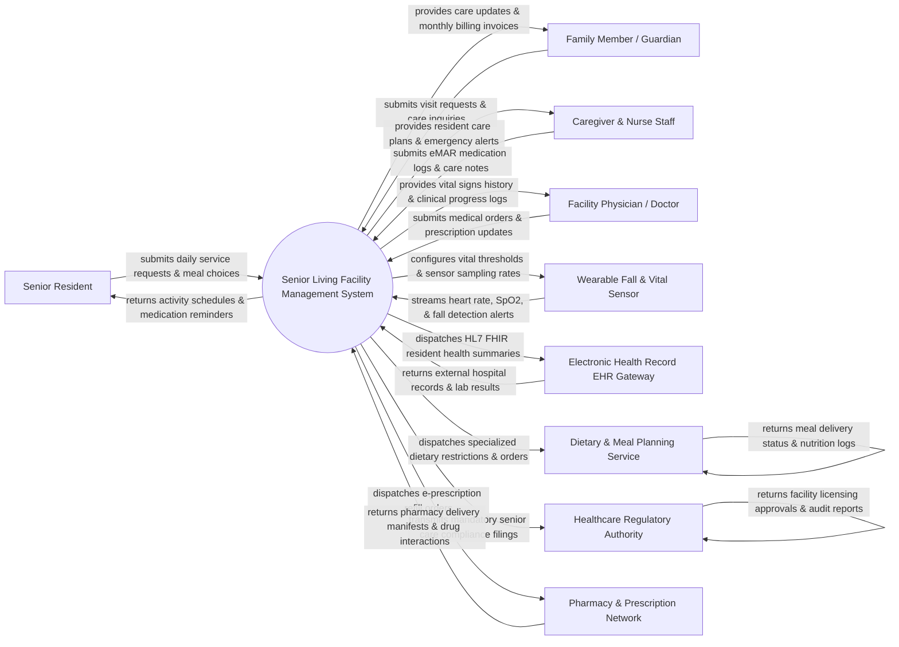

# Context Diagram — Senior Living Facility Management System

## Mermaid Code

## Actor & Interaction Table | Bảng Actor & Tương tác

| # | Actor | Actor Type | Data Sent TO System | Data Received FROM System | Notes |
|---|-------|------------|---------------------|---------------------------|-------|
| 1 | Senior Resident | Primary | Daily meal choices, activity registrations, maintenance requests, pendant nurse call triggers | Daily activity schedules, medication reminders, dining menus, wellness goals | Elderly residents residing in independent living, assisted living, or memory care units. |
| 2 | Family Member / Guardian | Primary | Scheduled visit reservations, care inquiry messages, bill payments, power of attorney documents | Real-time care status updates, vital sign summaries, monthly room invoices, incident reports | Authorized family members or legal guardians monitoring the senior's well-being. |
| 3 | Caregiver & Nurse Staff | Primary | Electronic Medication Administration Record (eMAR) logs, ADL (Activities of Daily Living) notes, shift handovers | Individualized resident care plans, high-priority emergency fall alerts, shift task checklists | Registered nurses (RN), licensed practical nurses (LPN), and certified nursing assistants (CNA). |
| 4 | Facility Physician / Doctor | Primary | Medical diagnoses, prescription orders, therapy directives, care plan revisions | Historical vital signs trends, lab results, eMAR compliance reports, physician encounter notes | Attending medical doctors, nurse practitioners, and visiting specialists. |
| 5 | Wearable Fall & Vital Sensor | Primary / Hardware | Continuous heart rate (BPM), blood oxygen (SpO2), skin temp, 3D accelerometer fall alerts | Sensor threshold configurations, battery health alerts, telemetry ping intervals | Medical-grade wearable pendants, smart wristbands, and room motion sensors. |
| 6 | Electronic Health Record EHR Gateway | Supporting System | External hospital discharge summaries, specialist consultation notes, diagnostic lab results | Interoperable HL7 / FHIR resident health records, immunization histories, allergy profiles | Regional hospital EHR systems (Epic, Cerner) exchanging resident health records. |
| 7 | Dietary & Meal Planning Service | Supporting System | Meal delivery confirmations, nutritional breakdown logs, inventory stock alerts | Resident dietary restriction profiles (Diabetic, Low-Sodium, Pureed), custom meal orders | Facility kitchen and catering service managing specialized geriatric nutrition. |
| 8 | Healthcare Regulatory Authority | Regulatory System | State nursing home regulations, health inspector guidelines, mandatory staffing ratios | Annual facility licensing filings, incident investigation reports, staffing ratio logs | Department of Health and Human Services (HHS) enforcing elder care standards. |
| 9 | Pharmacy & Prescription Network | Supporting System | Prescription fulfillment manifests, drug-drug interaction warnings, blister pack batch tracking | E-prescription refill orders, resident medication discontinuation notices | Partner retail or institutional pharmacy delivering pre-packaged unit-dose medications. |

## System Boundary Description | Mô tả Phạm vi Hệ thống

The **Senior Living Facility Management System (SLFMS)** is an integrated elder care, clinical nursing, and assisted living administration platform. Inside the system boundary, SLFMS manages resident admission onboarding, individualized care plan authoring, eMAR medication administration, real-time wearable vital sign and fall alert tracking, specialized dietary meal ordering, room allocation, family portal communication, monthly billing invoices, and state healthcare compliance reporting. External to the system boundary are senior residents (Senior Resident), family members (Family Member / Guardian), wearable sensors (Wearable Fall & Vital Sensor), hospital EHR networks (EHR Gateway), kitchen catering (Dietary & Meal Planning Service), partner pharmacies (Pharmacy Network), and government healthcare inspectors (Healthcare Regulatory Authority).
