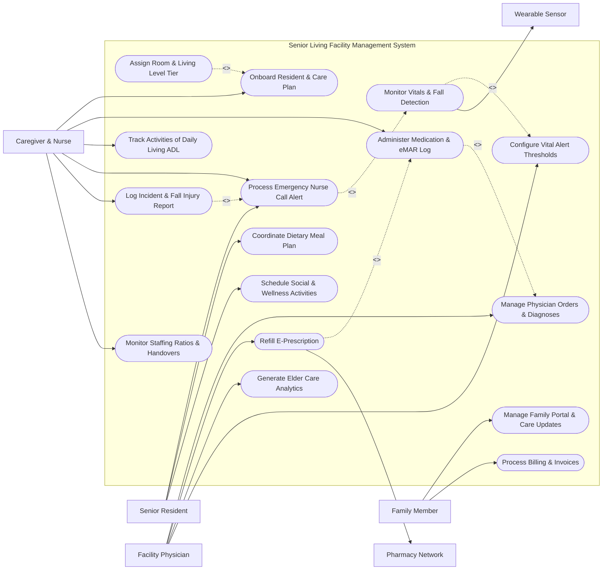

# Use Case Diagram — Senior Living Facility Management System

## Mermaid Code

## Actor Table | Bảng Actor

| # | Actor | Actor Type | Role Description | Related Use Cases |
|---|-------|------------|------------------|-------------------|
| 1 | Senior Resident | Primary | Elderly resident living in facility requesting services, attending activities, and triggering emergency nurse calls. | UC06, UC08, UC09 |
| 2 | Family Member | Primary | Authorized relative or guardian reviewing care updates, messaging staff, and paying monthly invoices. | UC10, UC11 |
| 3 | Caregiver & Nurse | Primary | Registered nurse or CNA administering medications, logging ADLs, responding to fall alerts, and managing shift handovers. | UC01, UC03, UC04, UC06, UC13, UC14 |
| 4 | Facility Physician | Primary | Attending physician writing medical orders, reviewing vital signs trends, prescribing medications, and setting thresholds. | UC07, UC12, UC15, UC16 |
| 5 | Wearable Sensor | Hardware | Medical-grade wearable sensor streaming heart rate, SpO2, skin temperature, and 3D fall detection telemetry. | UC05 |
| 6 | Pharmacy Network | System | Institutional pharmacy fulfilling e-prescriptions, providing drug interaction checks, and delivering blister packs. | UC12 |

## Use Case Table | Bảng Use Case

| # | UC ID | Use Case Name | Primary Actor | Secondary Actor | Description | Priority |
|---|-------|---------------|---------------|-----------------|-------------|----------|
| 1 | UC01 | Onboard Resident & Care Plan | Caregiver & Nurse | None | Onboards a new senior resident, conducting clinical health assessments and creating individualized care plans. | High |
| 2 | UC02 | Assign Room & Living Level Tier | Caregiver & Nurse | None | Assigns room unit based on care level tier (Independent Living, Assisted Living, Memory Care, Skilled Nursing). | High |
| 3 | UC03 | Administer Medication & eMAR Log | Caregiver & Nurse | None | Verifies the "5 Rights of Medication Administration", scans barcode on drug blister pack, and logs electronic eMAR. | High |
| 4 | UC04 | Track Activities of Daily Living ADL | Caregiver & Nurse | None | Logs resident daily assistance with bathing, dressing, mobility, grooming, and incontinence care. | High |
| 5 | UC05 | Monitor Vitals & Fall Detection | Caregiver & Nurse | Wearable Sensor | Ingests continuous wearable sensor telemetry (BPM, SpO2) and detects 3D accelerometer impact falls in real-time. | High |
| 6 | UC06 | Process Emergency Nurse Call Alert | Senior Resident | None | Receives pendant press or fall detection alert, alerting nearby nurse mobile app and escalating if unacknowledged. | High |
| 7 | UC07 | Manage Physician Orders & Diagnoses | Facility Physician | None | Records physician clinical notes, ICD-10 medical diagnoses, physical therapy orders, and lab requisitions. | High |
| 8 | UC08 | Coordinate Dietary Meal Plan | Senior Resident | None | Manages specialized resident diets (Diabetic, Renal, Low-Sodium, Pureed) and records daily caloric intake. | High |
| 9 | UC09 | Schedule Social & Wellness Activities | Senior Resident | None | Schedules community group outings, bingo games, gardening workshops, and physical therapy sessions. | Medium |
| 10 | UC10 | Manage Family Portal & Care Updates | Family Member | None | Provides family members secure access to view daily care logs, photo updates, vital trends, and message care staff. | High |
| 11 | UC11 | Process Billing & Invoices | Family Member | None | Generates monthly room & board invoices, care level service fees, medication co-pays, and processes payments. | High |
| 12 | UC12 | Refill E-Prescription | Facility Physician | Pharmacy Network | Transmits electronic prescription refill orders directly to partner institutional pharmacy for blister pack delivery. | High |
| 13 | UC13 | Log Incident & Fall Injury Report | Caregiver & Nurse | None | Documents post-fall physical assessment, root cause analysis, neurological vitals check, and state regulatory report. | High |
| 14 | UC14 | Monitor Staffing Ratios & Handovers | Caregiver & Nurse | None | Verifies nurse-to-resident ratios per shift and records electronic shift change handover notes. | High |
| 15 | UC15 | Generate Elder Care Analytics | Facility Physician | None | Exports quality metric dashboards (fall rates, medication error rates, pressure ulcer prevalence, hospital readmissions). | Medium |
| 16 | UC16 | Configure Vital Alert Thresholds | Facility Physician | None | Sets custom physiological alert limits (e.g. Heart Rate <50 or >110 BPM, SpO2 <90%) per resident medical profile. | Medium |

## Use Case Specification | Đặc tả Use Case

---

### UC01 — Onboard Resident & Care Plan

| Field | Detail |
|-------|--------|
| **UC ID** | UC01 |
| **Use Case Name** | Onboard Resident & Care Plan |
| **Actor(s)** | Primary: Caregiver & Nurse / Secondary: None |
| **Description** | Conducts comprehensive clinical admission assessments (MDS 3.0, Fall Risk, Cognitive Status), assigns care level tier, and authors an individualized resident care plan. |
| **Precondition** | 1. Resident admission contract and medical history documents are received.   2. Registered Nurse (RN) holds clinical administrative privileges. |
| **Main Flow** | 1. Actor selects "Admit New Resident".   2. Actor enters Demographics: Full Name, DOB, Gender, Emergency Contacts, Primary Physician, and Advance Directives (DNR/DNI status).   3. Actor conducts Clinical Assessments:   &nbsp;&nbsp;&nbsp;&nbsp;a. Minimum Data Set (MDS 3.0) functional assessment.   &nbsp;&nbsp;&nbsp;&nbsp;b. Morse Fall Scale assessment (e.g. Score 65 - High Fall Risk).   &nbsp;&nbsp;&nbsp;&nbsp;c. Mini-Mental State Examination (MMSE) cognitive score (e.g. Score 22 - Mild Cognitive Impairment).   &nbsp;&nbsp;&nbsp;&nbsp;d. Braden Scale pressure ulcer risk assessment.   4. System calculates Care Level Tier: "Assisted Living Tier 2 - High Fall Supervision".   5. Actor defines Individual Care Plan: specifies required ADL assistance (Bathing 3x/week, 2-person transfer assistance, daily vitals check).   6. System initializes Electronic Medication Administration Record (eMAR UC03) and dietary profile (UC08).   7. System stores Senior_Resident and Resident_Care_Plan records, auto-generating a resident RFID wristband barcode. |
| **Alternative Flow** | **AF1** — Memory Care Unit Admission: Cognitive assessment indicates severe dementia (MMSE <10); System assigns resident to secure "Memory Care Unit" with automated door wander-guard monitoring.   **AF2** — Respite Short-Term Care: Onboarding a 14-day temporary respite stay resident following hospital hip surgery. |
| **Exception Flow** | **EX1** — Unsigned Advance Directives Warning: DNR (Do Not Resuscitate) box checked without attached signed legal document; System flags "Pending Legal Verification" and requires attachment before finalizing profile.   **EX2** — Care Level Exceeds Facility Capacity: Assessment indicates requirement for 24/7 ventilator care beyond facility license; System alerts "Level of Care Exceeds Licensing." |
| **Postcondition** | Senior_Resident and Care_Plan entities are persisted, assigning care tier, care schedules, and barcode credentials. |
| **Business Rule** | **BR1**: Every newly admitted resident must complete a standardized MDS 3.0 assessment and fall risk evaluation within 24 hours of arrival. |

---

### UC03 — Administer Medication & eMAR Log

| Field | Detail |
|-------|--------|
| **UC ID** | UC03 |
| **Use Case Name** | Administer Medication & eMAR Log |
| **Actor(s)** | Primary: Caregiver & Nurse / Secondary: None |
| **Description** | Enforces the "5 Rights of Medication Administration" (Right Patient, Right Drug, Right Route, Right Time, Right Dose), scanning resident wristband and drug blister pack barcodes before logging eMAR. |
| **Precondition** | 1. Physician medication orders (UC07) are active.   2. Nurse is equipped with a mobile eMAR barcode scanner terminal. |
| **Main Flow** | 1. Nurse opens mobile eMAR application; retrieves scheduled medication pass list for Shift (e.g. 8:00 AM Med Pass).   2. Nurse selects Resident (e.g. "Room 104 - Mary Johnson") and approaches resident.   3. Nurse scans Resident RFID Wristband barcode; System verifies "Right Resident" match.   4. System displays scheduled 8:00 AM medications: `Donepezil 10mg Oral Tablet`, `Lisinopril 10mg Oral Tablet`.   5. Nurse scans Barcode on pre-packaged Pharmacy Blister Pack unit dose.   6. System performs automated 5-Rights Verification: checks Drug Name, Dose, Route, Expiry Date, and Time Window (±60 mins).   7. System checks real-time vital signs prerequisite: (e.g. Lisinopril requires Systolic BP >100 mmHg; System reads recent BP 124/80 - Pass).   8. Nurse administers medication to resident, taps "Administer", and signs electronic signature.   9. System records Medication_Administration_Log entry marked "GIVEN", updating medication inventory. |
| **Alternative Flow** | **AF1** — Resident Refusal Log: Resident refuses medication; Nurse selects "Refused", inputs reason ("Resident claims nausea"), and System alerts attending physician (UC07).   **AF2** — PRN (As-Needed) Pain Medication: Nurse administers PRN Morphine for pain score 7/10; System prompts mandatory post-administration pain re-evaluation timer 45 minutes later. |
| **Exception Flow** | **EX1** — Wrong Drug / Wrong Patient Barcode Mismatch: Nurse accidentally scans wrong blister pack; System displays loud warning "WRONG DRUG DISCREPANCY", flashes red screen, and blocks administration.   **EX2** — Vital Sign Hold Condition Exceeded: Resident HR is 48 BPM (below 50 BPM threshold for Digoxin); System displays "MEDICATION HELD - Bradycardia" and notifies RN. |
| **Postcondition** | Medication administration is verified, logged in eMAR, and timestamped with nurse signature and vital prerequisites. |
| **Business Rule** | **BR1**: The eMAR system must enforce double-barcode verification (Resident Wristband + Drug Package Barcode) prior to unlocking medication dosing confirmation. |

---

### UC05 — Monitor Resident Vitals & Fall Detection

| Field | Detail |
|-------|--------|
| **UC ID** | UC05 |
| **Use Case Name** | Monitor Resident Vitals & Fall Detection |
| **Actor(s)** | Primary: Caregiver & Nurse / Secondary: Wearable Sensor |
| **Description** | Continuously streams vital signs (Heart Rate, SpO2, Skin Temp) and processes 3D accelerometer data from medical wearables to detect sudden impact falls in real-time. |
| **Precondition** | 1. Resident is wearing a paired medical smartwatch or pendant sensor.   2. Resident vital alert thresholds (UC16) are configured. |
| **Main Flow** | 1. Wearable Sensor streams encrypted telemetry data (via BLE/Wi-Fi) to system every 10 seconds.   2. System parses vital signs: Heart Rate (72 BPM), Pulse Oximetry (96% SpO2), Skin Temp (36.6°C).   3. System checks values against configured threshold ranges (UC16); logs data into Vital_Sensor_Telemetry database.   4. Sensor 3D tri-axial accelerometer detects a sudden rapid free-fall vector (>2.5g impact force) followed by 10 seconds of complete immobility (hard fall signature).   5. System algorithm calculates high-confidence Fall Event (>98% confidence).   6. System immediately triggers UC06 (Process Emergency Nurse Call Alert): activates high-priority audible alarm on floor nurse station console, displays "FALL DETECTED - Room 208", and pushes urgent alert to assigned nurse mobile phone.   7. Nurse arrives at room, assesses resident, and taps "Acknowledge & Clear Alert" on mobile app.   8. System logs Fall_Incident_Event record with pre-fall and post-fall vital sign telemetry snapshots. |
| **Alternative Flow** | **AF1** — Wearable Pendant Manual SOS Press: Resident presses red emergency SOS button on pendant; System triggers immediate nurse call alert (UC06).   **AF2** — Nighttime Bed Exit Motion Sensor Alert: Memory care resident exits bed at 3:00 AM; Room optical sensor detects bed exit and alerts night nurse to prevent wander fall. |
| **Exception Flow** | **EX1** — False Positive Fall Cancellation: Resident drops pendant on floor; Resident presses "Cancel False Alarm" on pendant within 15 seconds; System logs "Cancelled False Positive" and suppresses nurse dispatch.   **EX2** — Critical Oxygen Desaturation (SpO2 <85%): Sensor detects SpO2 dropping to 84%; System triggers automated medical emergency alert to floor nurse. |
| **Postcondition** | Vital signs are continuously logged, and hard fall impacts automatically trigger immediate high-priority nurse call alerts. |
| **Business Rule** | **BR1**: Fall detection alerts must bypass silent phone modes and trigger high-priority audible alarms on assigned nurse mobile devices within 3 seconds of impact. |

---

### UC08 — Coordinate Dietary Meal Plan

| Field | Detail |
|-------|--------|
| **UC ID** | UC08 |
| **Use Case Name** | Coordinate Dietary Meal Plan |
| **Actor(s)** | Primary: Senior Resident / Secondary: None |
| **Description** | Manages individual resident dietary restrictions, food allergies, texture modifications (Pureed, Soft Chopped), and daily meal order selections, tracking caloric intake. |
| **Precondition** | 1. Resident dietary prescriptions (e.g. Consistent Carbohydrate 1800 kcal, Low-Sodium <2g) are set in care plan (UC01).   2. Kitchen dining menu database is active. |
| **Main Flow** | 1. Resident (or caregiver) opens dining module on room tablet or handheld console.   2. System retrieves resident Dietary Profile: Texture (Mechanically Soft), Diet Type (Diabetic Low-Sodium), Allergies (Severe Shellfish Allergy).   3. System presents customized Breakfast/Lunch/Dinner Menu automatically filtering out shellfish and high-sodium items.   4. Resident selects Meal Choice: "Baked Salmon, Steamed Carrots, Mashed Potatoes, Sugar-Free Custard".   5. System checks nutritional compliance: verifies total sodium (450 mg) and carbohydrates (45g) conform to physician prescribed limits.   6. System dispatches meal order ticket to kitchen display terminal.   7. Kitchen prepares meal, attaches barcode tray card, and delivers meal to resident dining room table (or room service).   8. Caregiver scans tray card barcode post-meal and logs Fluid & Caloric Intake Percentage (e.g. "Consumed 85% of Meal").   9. System stores Dietary_Meal_Order record and updates weekly weight/nutrition tracking charts. |
| **Alternative Flow** | **AF1** — Dysphagia Pureed Diet Auto-Formatting: Resident has severe swallowing difficulty (Dysphagia Level 1); System automatically converts all ordered foods to pureed texture specifications for kitchen preparation.   **AF2** — Tube Feeding Enteral Nutrition: Resident receives PEG tube enteral nutrition; System schedules automated pump pouch delivery times and flush volumes. |
| **Exception Flow** | **EX1** — Accidental Allergen Selection Attempt: Caregiver manually attempts to order clam chowder for shellfish-allergic resident; System blocks order with bold red alert "CRITICAL ALLERGY CONFLICT: Shellfish Allergy."   **EX2** — Unplanned Weight Loss Alert: Resident consumes <50% of meals for 3 consecutive days; System automatically flags "Nutritional Deficit Risk" and alerts dietitian. |
| **Postcondition** | Medically compliant meal choices are prepared, delivered, and resident caloric intake percentage is logged in health records. |
| **Business Rule** | **BR1**: Dietary orders must automatically filter out known resident food allergens and strictly enforce physician-prescribed texture modifications. |

---

### UC11 — Process Family Portal Billing & Care Updates

| Field | Detail |
|-------|--------|
| **UC ID** | UC11 |
| **Use Case Name** | Process Family Portal Billing & Care Updates |
| **Actor(s)** | Primary: Family Member / Secondary: None |
| **Description** | Enables authorized family members to view daily resident care updates, vital sign trends, activity photos, receive monthly itemized room invoices, and process online payments. |
| **Precondition** | 1. Family member is authenticated and linked via HIPAA/Power of Attorney authorization.   2. Monthly billing calculation engine is active. |
| **Main Flow** | 1. Family Member logs into Family Portal mobile app or web console.   2. System presents Family Dashboard displaying:   &nbsp;&nbsp;&nbsp;&nbsp;a. Daily Care Timeline: ADL assistance summary (UC04), medication pass logs (UC03), meal intake % (UC08).   &nbsp;&nbsp;&nbsp;&nbsp;b. Wellness Trends: Weekly blood pressure chart, weight graph, participation in social bingo (UC09).   &nbsp;&nbsp;&nbsp;&nbsp;c. Photo Gallery: Caregiver-shared activity photos.   3. Family Member selects "Billing & Financial Statements".   4. System retrieves itemized Monthly Invoice: Monthly Room Base Rate ($4,500), Assisted Living Tier 2 Care Fee ($1,200), Prescription Co-Pays ($85), Salon Services ($40) = Total Due: $5,825.00 USD.   5. Family Member reviews line-item breakdown and selects "Pay Statement Online".   6. Family Member inputs payment method (ACH Bank Transfer / Credit Card) and authorizes payment.   7. System clears transaction via payment gateway, updates Senior_Living_Invoice status to "PAID", and emails tax-deductible receipt.   8. System posts payment ledger entry to facility accounting database. |
| **Alternative Flow** | **AF1** — Secure Staff Messaging: Family member submits question ("Did Mom sleep well last night?"); System routes message to duty charge nurse portal (UC10).   **AF2** — Auto-Pay Recurring Subscription: Family member enables monthly ACH auto-pay; System automatically debits bank account on the 1st of every month. |
| **Exception Flow** | **EX1** — Unauthorized Relative Access Attempt: Non-authorized family member requests access; System denies access displaying "HIPAA Restrictions: Contact Primary Guardian for Authorization."   **EX2** — Overdue Invoice Fee Penalty: Payment is 15 days overdue; System generates "Past Due Reminder Notice" and applies 1.5% late fee. |
| **Postcondition** | Monthly room & care invoices are viewed and paid, care updates communicated, and accounting ledgers reconciled. |
| **Business Rule** | **BR1**: Access to resident medical and daily care logs via the family portal must strictly comply with HIPAA privacy regulations and guardian authorization. |
