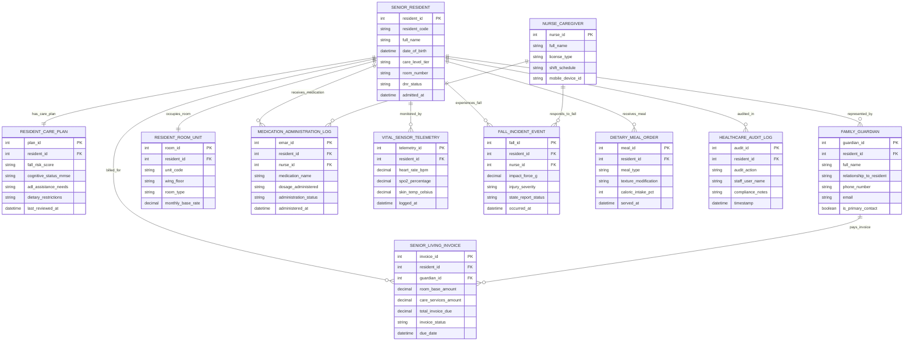

# Conceptual ERD — Senior Living Facility Management System

## Mermaid Code

## Entity Description Table | Bảng mô tả Entity

| # | Entity Name | Vietnamese Name | Description | Key Attributes | Main Relationships |
|---|-------------|-----------------|-------------|----------------|-------------------|
| 1 | SENIOR_RESIDENT | Cụ ông / Cụ bà Cư dân | Primary senior resident profile storing personal details, care level tier, and DNR status. | resident_id (PK), resident_code, full_name, care_level_tier, dnr_status | Has Care Plan, represented by Guardian, occupies Room, receives Meds |
| 2 | RESIDENT_CARE_PLAN | Kế hoạch Chăm sóc Cư dân | Individual care plan documenting fall risk scores, cognitive status, ADL needs, and diet. | plan_id (PK), resident_id (FK), fall_risk_score, cognitive_status_mmse, adl_assistance_needs | Belongs to Senior Resident |
| 3 | FAMILY_GUARDIAN | Thân nhân / Giám hộ | Authorized family member or legal guardian managing billing and receiving care updates. | guardian_id (PK), resident_id (FK), full_name, relationship_to_resident, is_primary_contact | Represents Senior Resident, pays Invoices |
| 4 | RESIDENT_ROOM_UNIT | Phòng / Căn hộ Dưỡng lão | Living unit (Independent, Assisted Living, Memory Care) assigned to a resident. | room_id (PK), resident_id (FK), unit_code, wing_floor, monthly_base_rate | Occupied by Senior Resident |
| 5 | NURSE_CAREGIVER | Điều dưỡng / Nhân viên | Registered nurse or caregiver administering eMAR meds and responding to fall alerts. | nurse_id (PK), full_name, license_type, shift_schedule, mobile_device_id | Administers Meds, responds to Falls |
| 6 | MEDICATION_ADMINISTRATION_LOG | Nhật ký Cho uống Thuốc | Electronic eMAR log tracking drug administration times, dosages, and nurse signatures. | emar_id (PK), resident_id (FK), nurse_id (FK), medication_name, administration_status | Received by Resident, administered by Nurse |
| 7 | VITAL_SENSOR_TELEMETRY | Telemetry Cảm biến Sinh hiệu | Real-time wearable sensor telemetry streaming heart rate, SpO2, and skin temperature. | telemetry_id (PK), resident_id (FK), heart_rate_bpm, spo2_percentage, logged_at | Monitors Senior Resident |
| 8 | FALL_INCIDENT_EVENT | Sự cố Té ngã Cư dân | Fall detection incident log capturing G-force impact, injuries, and state reports. | fall_id (PK), resident_id (FK), nurse_id (FK), impact_force_g, injury_severity, occurred_at | Experienced by Resident, responded by Nurse |
| 9 | DIETARY_MEAL_ORDER | Khẩu phần Ăn Dinh dưỡng | Customized meal order tracking texture modifications and daily caloric intake %. | meal_id (PK), resident_id (FK), meal_type, texture_modification, caloric_intake_pct | Received by Senior Resident |
| 10 | SENIOR_LIVING_INVOICE | Hóa đơn Viện Dưỡng lão | Monthly billing invoice covering room base rate, care service fees, and pharmacy co-pays. | invoice_id (PK), resident_id (FK), guardian_id (FK), total_invoice_due, invoice_status | Billed for Resident, paid by Guardian |
| 11 | HEALTHCARE_AUDIT_LOG | Nhật ký Kiểm toán Y tế | Compliance and security audit trail recording staff actions, HIPAA checks, and care edits. | audit_id (PK), resident_id (FK), audit_action, staff_user_name, timestamp | Audits Senior Resident care |

## Relationship Description | Mô tả Quan hệ

| # | From Entity | Cardinality | To Entity | Relationship Label | Business Explanation |
|---|-------------|-------------|-----------|-------------------|----------------------|
| 1 | SENIOR_RESIDENT | one-to-one | RESIDENT_CARE_PLAN | has_care_plan | A Senior Resident has one individualized Resident Care Plan. |
| 2 | SENIOR_RESIDENT | one-to-many | FAMILY_GUARDIAN | represented_by | A Senior Resident is represented by multiple Family Guardians. |
| 3 | SENIOR_RESIDENT | one-to-one | RESIDENT_ROOM_UNIT | occupies_room | A Senior Resident occupies one Resident Room Unit. |
| 4 | SENIOR_RESIDENT | one-to-many | MEDICATION_ADMINISTRATION_LOG | receives_medication | A Senior Resident receives multiple Medication Administration Logs (eMAR). |
| 5 | NURSE_CAREGIVER | one-to-many | MEDICATION_ADMINISTRATION_LOG | administers_med | A Nurse Caregiver administers multiple Medication Administration Logs. |
| 6 | SENIOR_RESIDENT | one-to-many | VITAL_SENSOR_TELEMETRY | monitored_by | A Senior Resident is monitored by Vital Sensor Telemetry. |
| 7 | SENIOR_RESIDENT | one-to-many | FALL_INCIDENT_EVENT | experiences_fall | A Senior Resident may experience Fall Incident Events. |
| 8 | NURSE_CAREGIVER | one-to-many | FALL_INCIDENT_EVENT | responds_to_fall | A Nurse Caregiver responds to Fall Incident Events. |
| 9 | SENIOR_RESIDENT | one-to-many | DIETARY_MEAL_ORDER | receives_meal | A Senior Resident receives multiple Dietary Meal Orders. |
| 10 | SENIOR_RESIDENT | one-to-many | SENIOR_LIVING_INVOICE | billed_for | A Senior Resident is billed for monthly Senior Living Invoices. |
| 11 | FAMILY_GUARDIAN | one-to-many | SENIOR_LIVING_INVOICE | pays_invoice | A Family Guardian pays Senior Living Invoices. |
| 12 | SENIOR_RESIDENT | one-to-many | HEALTHCARE_AUDIT_LOG | audited_in | A Senior Resident's care is audited in Healthcare Audit Logs. |
