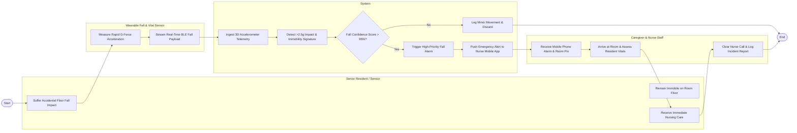

# Swimlane Diagram — Senior Living Facility Management System

## Mermaid Code

## Flow Description | Mô tả luồng

| Lane | Actor | Role in Flow |
|------|-------|-------------|
| 1 | Senior Resident / Sensor | Suffers an accidental floor fall impact, remains immobile, and receives immediate nursing care upon responder arrival. |
| 2 | System | Ingests accelerometer telemetry, runs fall signature detection algorithms, checks confidence thresholds, triggers high-priority alarms, and pushes mobile alerts. |
| 3 | Wearable Fall & Vital Sensor | Measures rapid G-force acceleration, detects hard floor impact, and streams real-time BLE fall payload to system. |
| 4 | Caregiver & Nurse Staff | Receives loud mobile phone alarm with room location pin, arrives at resident room within seconds, assesses vitals, provides care, and logs fall incident report. |
