# Action Tree — Senior Living Facility Management System

## Mermaid Code

```mermaid
graph TD
    Root["Senior Living Facility Management System"]

    Root --> M1["Resident Admission & Individual Care Planning"]
    Root --> M2["Medication Administration eMAR & Pharmacy"]
    Root --> M3["Vital Signs & Wearable Fall Detection"]
    Root --> M4["Dietary Management & Specialized Nutrition"]
    Root --> M5["Facility Room Allocation & Billing"]
    Root --> M6["Regulatory Healthcare & Safety Audit"]

    M1 --> A11["Conduct MDS 3.0 Clinical Health Assessments"]
    M1 --> A12["Evaluate Morse Fall Risk & MMSE Cognitive Scores"]
    M1 --> A13["Author Individualized Resident Care Plans"]
    M1 --> A14["Assign Living Level Care Tiers"]

    M2 --> A21["Scan Resident Barcode & Blister Pack eMAR"]
    M2 --> A22["Enforce 5-Rights of Medication Administration"]
    M2 --> A23["Refill E-Prescriptions with Partner Pharmacy"]
    M2 --> A24["Track PRN Pain Medication Re-evaluation Timers"]

    M3 --> A31["Stream Wearable Heart Rate & SpO2 Telemetry"]
    M3 --> A32["Detect Real-Time 3D Accelerometer Fall Impacts"]
    M3 --> A33["Escalate High-Priority Emergency Nurse Call Alerts"]
    M3 --> A34["Configure Vital Sign Alert Threshold Limits"]

    M4 --> A41["Configure Texture Modified Diets Pureed/Soft"]
    M4 --> A42["Enforce Food Allergy Conflict Auto-Filtering"]
    M4 --> A43["Track Post-Meal Caloric & Fluid Intake %"]
    M4 --> A44["Manage PEG Tube Enteral Nutrition Schedules"]

    M5 --> A51["Assign Living Units & Memory Care Rooms"]
    M5 --> A52["Calculate Itemized Monthly Care Level Invoices"]
    M5 --> A53["Process Online Family Portal ACH Payments"]
    M5 --> A54["Track Facility Maintenance & Sanitation Orders"]

    M6 --> A61["File Mandatory State Elder Care Incident Reports"]
    M6 --> A62["Monitor Nurse-to-Resident Shift Staffing Ratios"]
    M6 --> A63["Log HIPAA Compliant Data Access Audit Trails"]
    M6 --> A64["Generate Fall Rate & Readmission Quality Metrics"]
```

## Module Description | Mô tả Module

| # | Module | Description | Actions |
|---|--------|-------------|---------|
| 1 | Resident Admission & Individual Care Planning | Onboards senior residents, conducts MDS 3.0 assessments, evaluates fall/cognitive risks, and authors care plans. | Conduct MDS 3.0 Clinical Health Assessments, Evaluate Morse Fall Risk & MMSE Cognitive Scores, Author Individualized Resident Care Plans, Assign Living Level Care Tiers |
| 2 | Medication Administration eMAR & Pharmacy | Enforces 5-rights medication administration, scans barcodes for eMAR logging, refills e-prescriptions, and tracks PRN timers. | Scan Resident Barcode & Blister Pack eMAR, Enforce 5-Rights of Medication Administration, Refill E-Prescriptions with Partner Pharmacy, Track PRN Pain Medication Re-evaluation Timers |
| 3 | Vital Signs & Wearable Fall Detection | Streams heart rate/SpO2 telemetry, detects accelerometer falls, escalates nurse alerts, and sets vital threshold limits. | Stream Wearable Heart Rate & SpO2 Telemetry, Detect Real-Time 3D Accelerometer Fall Impacts, Escalate High-Priority Emergency Nurse Call Alerts, Configure Vital Sign Alert Threshold Limits |
| 4 | Dietary Management & Specialized Nutrition | Configures texture modified diets, filters allergens, tracks caloric/fluid intake percentages, and manages enteral feeding. | Configure Texture Modified Diets Pureed/Soft, Enforce Food Allergy Conflict Auto-Filtering, Track Post-Meal Caloric & Fluid Intake %, Manage PEG Tube Enteral Nutrition Schedules |
| 5 | Facility Room Allocation & Billing | Assigns living rooms, generates itemized monthly care invoices, processes family portal payments, and monitors maintenance. | Assign Living Units & Memory Care Rooms, Calculate Itemized Monthly Care Level Invoices, Process Online Family Portal ACH Payments, Track Facility Maintenance & Sanitation Orders |
| 6 | Regulatory Healthcare & Safety Audit | Files state incident reports, monitors shift staffing ratios, logs HIPAA audit trails, and exports quality metric dashboards. | File Mandatory State Elder Care Incident Reports, Monitor Nurse-to-Resident Shift Staffing Ratios, Log HIPAA Compliant Data Access Audit Trails, Generate Fall Rate & Readmission Quality Metrics |
