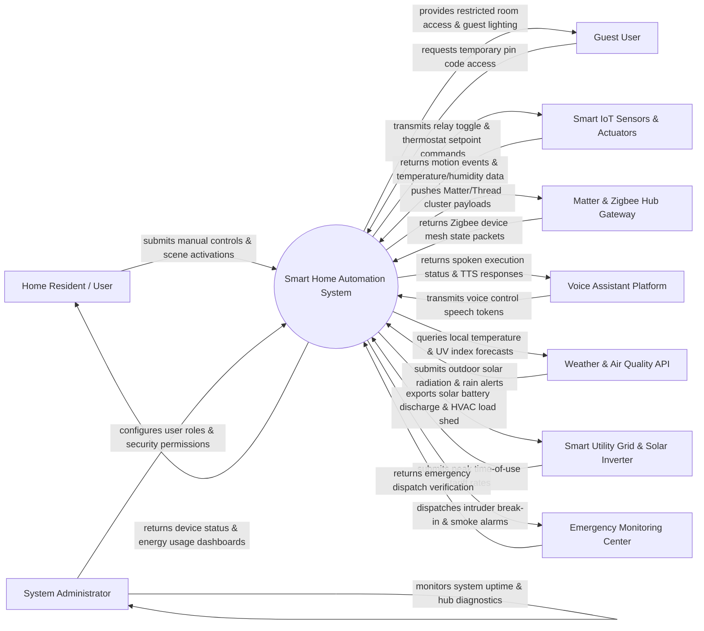

# Context Diagram — Smart Home Automation System

## Mermaid Code

## Actor & Interaction Table | Bảng Actor & Tương tác

| # | Actor | Actor Type | Data Sent TO System | Data Received FROM System | Notes |
|---|-------|------------|---------------------|---------------------------|-------|
| 1 | Home Resident / User | Primary | Manual device toggles, scene triggers ("Movie Night", "Goodnight"), target thermostat temperatures, routine rules | Live device status, room environmental cards, energy cost charts, push notifications | Primary household residents controlling smart home devices via mobile or wall touch panels. |
| 2 | Guest User | Primary | Temporary PIN codes, guest room lighting adjustment requests, temporary access requests | Temporary smart lock access, restricted room controls, guest Wi-Fi credentials | Visitors, house sitters, or Airbnb guests granted limited temporary smart home controls. |
| 3 | System Administrator | Primary | User access role assignments, hub firmware update schedules, network security rules, backup configs | System uptime logs, mesh network health graphs, battery low warnings, hub diagnostics | Master household admin managing network security, user access rights, and hub updates. |
| 4 | Smart IoT Sensors & Actuators | Primary / Hardware | Motion detection events, door/window contact states, temperature/humidity values, power draw (Watts) | Relay turn ON/OFF commands, dimming level (0-100%), thermostat setpoints, smart lock lock/unlock | Physical smart devices (Philips Hue, Nest, Aqara, Yale) connected in the home. |
| 5 | Matter & Zigbee Hub Gateway | Supporting System | Device mesh state updates, Thread network routing packets, Z-Wave node status | Matter cluster payloads, Zigbee command frames, network pairing triggers | Multi-protocol hub (Home Assistant, SmartThings, Apple Home HomePod) managing local wireless mesh. |
| 6 | Voice Assistant Platform | Supporting System | Speech-to-Text intent tokens ("Turn off living room lights", "Set AC to 22C"), voice user profile ID | Spoken execution confirmation strings ("Living room lights off"), device execution state | Cloud voice platforms (Amazon Alexa, Google Assistant, Apple Siri) processing voice commands. |
| 7 | Weather & Air Quality API | Supporting System | Local outdoor temperature, humidity, UV index, rain warnings, air quality index (AQI) | Forecast query payloads, location geocode queries | External weather services providing outdoor climate data to trigger automated window/blinds actions. |
| 8 | Smart Utility Grid & Solar Inverter | Supporting System | Dynamic Time-of-Use (TOU) power tariff rates, solar generation wattage, grid outage notices | Automated HVAC load shedding signals, EV charger scheduling, solar battery storage commands | Smart power grid meter and rooftop solar inverter optimizing home energy usage costs. |
| 9 | Emergency Monitoring Center | Supporting System | Dispatch confirmation, false alarm cancellation verification, guard unit arrival status | Intruder alarm events, smoke/fire emergency triggers, water leak shutoff notifications | Professional 24/7 security monitoring center receiving urgent alarm notifications. |

## System Boundary Description | Mô tả Phạm vi Hệ thống

The **Smart Home Automation System (SHAS)** is a centralized IoT smart home hub and automation platform. Inside the system boundary, SHAS manages smart device pairing, room zone mapping, multi-condition automation routines ("If motion detected AND after sunset THEN turn on hall light"), scene presets, real-time climate/lighting adjustments, security alarm arming, energy optimization, and local offline mesh communication. External to the system boundary are physical IoT end devices (Smart Sensors & Actuators), local multi-protocol gateways (Matter & Zigbee Hub Gateway), cloud voice platforms (Voice Assistant Platform), external weather services (Weather API), smart energy meters (Smart Utility Grid), and professional security dispatch services (Emergency Monitoring Center).
