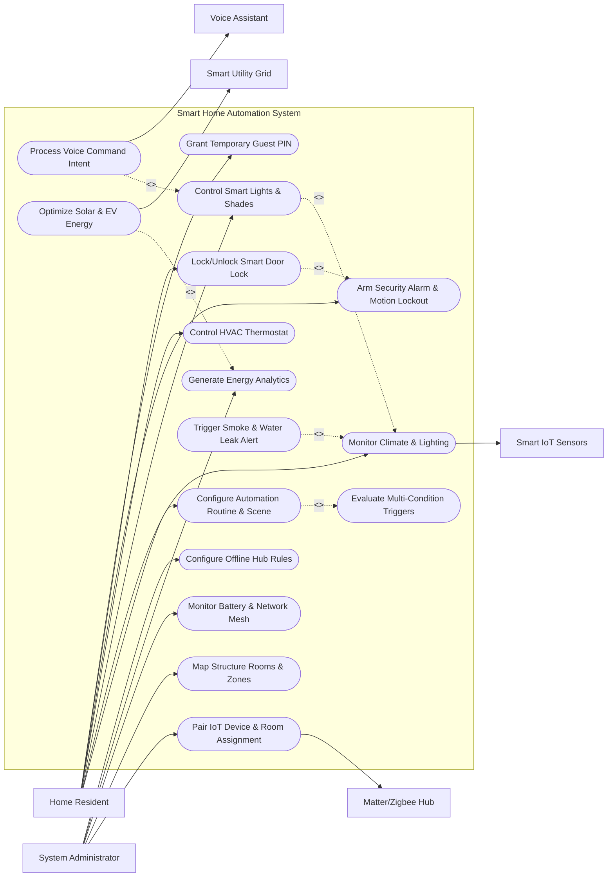

# Use Case Diagram — Smart Home Automation System

## Mermaid Code

## Actor Table | Bảng Actor

| # | Actor | Actor Type | Role Description | Related Use Cases |
|---|-------|------------|------------------|-------------------|
| 1 | Home Resident | Primary | Household resident controlling room lights, adjusting HVAC thermostat, arming security, and triggering scenes. | UC03, UC05, UC06, UC07, UC08, UC09, UC13 |
| 2 | System Administrator | Primary | Primary homeowner managing device pairing, room zone hierarchy, hub firmware, and offline mesh rules. | UC01, UC02, UC14, UC15, UC16 |
| 3 | Smart IoT Sensors | Hardware | Physical sensors (motion, contact, temp) and actuators (switches, relays, smart plugs) in the home. | UC05 |
| 4 | Matter/Zigbee Hub | System | Local hub gateway communicating over Matter, Thread, Zigbee, and Z-Wave wireless mesh protocols. | UC01 |
| 5 | Voice Assistant | System | Voice service (Amazon Alexa, Google Assistant, Apple Siri) parsing speech into device control intents. | UC10 |
| 6 | Smart Utility Grid | System | Smart power grid meter and solar inverter supplying electricity tariff rates and generation data. | UC12 |

## Use Case Table | Bảng Use Case

| # | UC ID | Use Case Name | Primary Actor | Secondary Actor | Description | Priority |
|---|-------|---------------|---------------|-----------------|-------------|----------|
| 1 | UC01 | Pair IoT Device & Room Assignment | System Administrator | Matter/Zigbee Hub | Scans QR code or triggers pairing mode to add a new smart device, assign it to a room, and configure parameters. | High |
| 2 | UC02 | Map Structure Rooms & Zones | System Administrator | None | Defines home structure layout (Floors, Rooms, Outdoor Zones) to organize smart device control topologies. | High |
| 3 | UC03 | Configure Automation Routine & Scene | Home Resident | None | Creates multi-condition automation rules ("If Motion AND Night THEN Turn On 20% Light") and one-tap scene presets. | High |
| 4 | UC04 | Evaluate Multi-Condition Triggers | System Administrator | None | Evaluates time-of-day, occupancy, temperature, and sensor state conditions to execute scheduled automation actions. | High |
| 5 | UC05 | Monitor Real-Time Climate & Lighting | Home Resident | Smart IoT Sensors | Streams real-time room temperature, humidity, illuminance (Lux), motion events, and door contact states. | High |
| 6 | UC06 | Control Smart Lights & Shades | Home Resident | None | Adjusts light brightness, color temperature (RGB/Tunable White), and motorized shade extension percentage. | High |
| 7 | UC07 | Control HVAC Thermostat | Home Resident | None | Sets target heating/cooling setpoints, fan speeds, HVAC modes (Eco, Heat, Cool, Auto), and scheduled setbacks. | High |
| 8 | UC08 | Arm Security Alarm & Motion Lockout | Home Resident | None | Arms home security system in "Away", "Home", or "Night" modes, locking doors and enabling motion intrusion alerts. | High |
| 9 | UC09 | Lock/Unlock Smart Door Lock | Home Resident | None | Controls electronic deadbolts via PIN code, biometric fingerprint, smartphone Bluetooth, or remote tap. | High |
| 10 | UC10 | Process Voice Command Intent | Home Resident | Voice Assistant | Ingests voice assistant control intents and translates them into local device execution commands. | Medium |
| 11 | UC11 | Trigger Smoke & Water Leak Alert | System Administrator | Smart IoT Sensors | Detects emergency smoke, carbon monoxide, or water leak events, cutting main water valves and sounding sirens. | High |
| 12 | UC12 | Optimize Solar & EV Energy | System Administrator | Smart Utility Grid | Schedules heavy energy loads (EV charging, heat pump) during off-peak solar generation hours to minimize utility bills. | Medium |
| 13 | UC13 | Grant Temporary Guest PIN | Home Resident | None | Generates temporary smart lock access PIN codes valid only during specific date/time windows for visitors. | Medium |
| 14 | UC14 | Monitor Battery & Network Mesh | System Administrator | None | Monitors battery levels across wireless sensors and displays Zigbee/Thread mesh signal strength heatmaps. | Medium |
| 15 | UC15 | Generate Energy Analytics | System Administrator | None | Exports historical kWh energy consumption logs, utility cost breakdowns, and device power usage pie charts. | Medium |
| 16 | UC16 | Configure Offline Hub Rules | System Administrator | None | Configures local hub execution fallbacks to guarantee offline automation execution during internet outages. | Low |

## Use Case Specification | Đặc tả Use Case

---

### UC01 — Pair IoT Device & Room Assignment

| Field | Detail |
|-------|--------|
| **UC ID** | UC01 |
| **Use Case Name** | Pair IoT Device & Room Assignment |
| **Actor(s)** | Primary: System Administrator / Secondary: Matter/Zigbee Hub |
| **Description** | Onboards a new smart device (Smart Light, Thermostat, Motion Sensor, Smart Lock) via Matter QR code scan, Zigbee pairing mode, or Wi-Fi discovery, and assigns it to a specific room zone. |
| **Precondition** | 1. Administrator has logged into smart home mobile app.   2. Hub gateway (Matter/Zigbee) is powered on and connected to local network. |
| **Main Flow** | 1. Actor selects "Add New Smart Device".   2. System prompts pairing method selection: Scan Matter QR Code, Enable Zigbee/Thread Pairing Mode, or Auto-Discover Wi-Fi Device.   3. Actor scans Matter QR code on device package (or puts device into pairing mode).   4. System initiates commissioning handshake via Matter/Thread protocol (or Zigbee cluster binding via UC01).   5. System verifies successful device discovery, queries device metadata (Manufacturer, Model ID, Firmware Version, Supported Clusters: On/Off, Dimmer, Color, Motion).   6. Actor enters Device Display Name (e.g. "Living Room Overhead Light") and assigns device to a Room Zone (e.g. "Living Room" on "1st Floor").   7. System saves Smart_Device entity, maps control clusters, and updates room dashboard layout. |
| **Alternative Flow** | **AF1** — Bulk Device Pairing: Administrator pairs a starter kit containing 6 smart bulbs sequentially; System auto-increments device names ("Bulb 1", "Bulb 2").   **AF2** — Wi-Fi Local Network Discovery: System scans local IP subnet via mDNS/UPnP and discovers smart TV or Wi-Fi plug. |
| **Exception Flow** | **EX1** — Pairing Timeout: If device fails to join Zigbee mesh network within 60 seconds, System alerts "Device pairing timed out. Reset device to factory settings and retry."   **EX2** — Unsupported Device Cluster: If device features proprietary unmapped clusters, System flags "Basic On/Off control available; advanced clusters unmapped." |
| **Postcondition** | A Smart_Device entity is persisted, assigned to a Room_Zone, and accessible for manual control and automation routines. |
| **Business Rule** | **BR1**: All smart locks and security sensors must enforce encrypted Matter/Thread security commission channels during pairing. |

---

### UC03 — Configure Automation Routine & Scene

| Field | Detail |
|-------|--------|
| **UC ID** | UC03 |
| **Use Case Name** | Configure Automation Routine & Scene |
| **Actor(s)** | Primary: Home Resident / Secondary: None |
| **Description** | Creates multi-condition IF-THEN automation rules (combining time, motion sensors, contact sensors, weather) and single-tap scene presets (e.g. "Movie Time", "Goodnight"). |
| **Precondition** | 1. Smart devices are paired and assigned to rooms (UC01).   2. Resident opens Automation Studio in smart home app. |
| **Main Flow** | 1. Actor selects "Create New Automation Routine" (or "Create New Scene").   2. If Scene, Actor enters Scene Name (e.g. "Relaxing Dinner"), selects target devices (Dining Lights, Shades, Speaker), and sets target states (Dim Lights to 30% Warm Amber, Lower Shades 80%, Play Jazz Playlist).   3. If Automation Routine, Actor configures Trigger Event: Time-based (7:00 AM weekdays), Sensor-based (Motion detected in Hallway), or Geofence-based (User arrives home).   4. Actor configures Condition Filters: Time Window (Only between Sunset and 11:00 PM), Security Mode (Only if Security Armed), or Temperature Condition (Only if Temp > 25°C).   5. Actor configures Action Payload: Set Lights to 50%, Set HVAC to 22°C, Send Push Notification to phone.   6. System validates routine logic, checks for conflicting rules, compiles rule payload for local hub execution (UC16), and activates routine. |
| **Alternative Flow** | **AF1** — Sunrise/Sunset Relative Triggers: Resident sets trigger to "30 minutes before Sunset"; System automatically recalculates execution time daily based on Weather API (UC05).   **AF2** — Auto-Off Motion Timer Routine: Trigger: "No motion detected in Bathroom for 10 minutes" -> Action: "Turn off Bathroom Light". |
| **Exception Flow** | **EX1** — Conflicting Automation Loop Detected: If routine conflicts with existing rule (e.g., Rule A turns light ON at 8:00 AM while Rule B turns light OFF at 8:00 AM), System alerts "Rule Conflict: Resolve schedule overlap before saving."   **EX2** — Missing Device Dependency: If target device in routine is un-paired, System highlights missing device in red. |
| **Postcondition** | An Automation_Routine or Scene_Preset entity is saved and loaded into the local automation engine for execution. |
| **Business Rule** | **BR1**: Automation routines must be executed locally on the smart hub hardware to ensure execution even during internet outages. |

---

### UC05 — Monitor Real-Time Climate & Lighting

| Field | Detail |
|-------|--------|
| **UC ID** | UC05 |
| **Use Case Name** | Monitor Real-Time Climate & Lighting |
| **Actor(s)** | Primary: Home Resident / Secondary: Smart IoT Sensors |
| **Description** | Displays real-time telemetry from environmental sensors (temperature, humidity, air quality CO2/VOC, illuminance Lux, motion, door contact) across all rooms. |
| **Precondition** | 1. Environmental sensors are active and streaming state updates over Zigbee/Matter mesh.   2. Resident opens Home Dashboard on mobile or wall touchscreen display. |
| **Main Flow** | 1. System receives real-time telemetry state reports from room sensors via hub gateway (UC05).   2. System parses incoming cluster data: Temperature (°C/°F), Relative Humidity (%), Illuminance (Lux), CO2 Level (PPM), TVOC Index, Motion Occupancy status (Clear/Detected), and Door/Window Contact status (Closed/Open).   3. System updates Room_Zone dashboard cards in real-time.   4. System checks environmental values against comfort thresholds and outdoor weather values.   5. System displays color-coded status badges: Green (Comfortable), Yellow (High Humidity / Poor Air Quality), Red (Temperature Extreme / Door Left Open).   6. System archives telemetry values into Device_Telemetry time-series database for energy analytics (UC15). |
| **Alternative Flow** | **AF1** — Door Left Open Alert: Door contact sensor remains open for >5 minutes while AC is running; System displays alert "Patio Door Open - AC Running" and sends push notification.   **AF2** — Air Quality Spike Protocol: Indoor CO2 exceeds 1200 PPM; System automatically triggers smart air purifier and HVAC fresh air damper. |
| **Exception Flow** | **EX1** — Sensor Offline Warning: If a room sensor stops sending heartbeats for 2 hours, System grays out room card and displays "Sensor Offline (Check Battery)".   **EX2** — Extreme Freeze Warning: Temperature drops below 4°C in basement; System triggers emergency pipe freeze alert to phone. |
| **Postcondition** | Real-time climate and security sensor telemetry is rendered on user dashboards and stored for automation rule evaluation. |
| **Business Rule** | **BR1**: Environmental sensor telemetry updates must refresh on home dashboards within 1 second of physical state change. |

---

### UC08 — Arm Security Alarm & Motion Lockout

| Field | Detail |
|-------|--------|
| **UC ID** | UC08 |
| **Use Case Name** | Arm Security Alarm & Motion Lockout |
| **Actor(s)** | Primary: Home Resident / Secondary: None |
| **Description** | Arms the home security system in "Away", "Home", or "Night" mode, activating motion sensors, door contact triggers, glass break detectors, and smart door locks. |
| **Precondition** | 1. Security sensors (door contact, motion, glass break) are registered and online.   2. Resident enters security keypad PIN or selects Arm Mode on mobile app. |
| **Main Flow** | 1. Resident selects Security Arming Mode: "Arm Away" (All motion + door sensors active), "Arm Home" (Exterior doors active, interior motion bypassed), or "Arm Night" (Perimeter active + entry delay reduced).   2. System checks perimeter sensor status: verifies all doors and windows are closed.   3. System initiates 45-second Exit Delay countdown, sounding audible keypad beeps.   4. Resident exits home and closes front door.   5. Exit delay expires; System sets Security Alarm Status to "ARMED AWAY", locks all smart door locks (UC09), closes motorized garage doors, and activates motion intrusion detection.   6. System dispatches status update push notification to all resident smartphones ("Home Armed Away"). |
| **Alternative Flow** | **AF1** — Disarm via Biometric Keypad: Resident arrives home, scans fingerprint or enters 4-digit PIN on smart door lock keypad; System disarms security alarm and cancels entry delay countdown.   **AF2** — Geofence Auto-Arm Prompt: All family members leave 500m home geofence; System sends push prompt "Everyone left home. Arm Security System now?". |
| **Exception Flow** | **EX1** — Bypassed Open Window: If bedroom window is left open when arming, System alerts "Window Open: Close Bedroom Window or select Bypass to continue arming."   **EX2** — Unauthorized Intrusion Trigger: Motion detected while Armed Away; System triggers 105 dB indoor siren, flashes exterior red lights, dispatches emergency notification to Monitoring Center (UC11), and locks down interior doors. |
| **Postcondition** | Security alarm is armed in target mode, locking doors and monitoring perimeter sensors for unauthorized intrusion. |
| **Business Rule** | **BR1**: Arming security in "Away" mode must automatically trigger automatic smart lock deadbolt engagement on all perimeter doors. |

---

### UC11 — Trigger Smoke & Water Leak Emergency Alert

| Field | Detail |
|-------|--------|
| **UC ID** | UC11 |
| **Use Case Name** | Trigger Smoke & Water Leak Emergency Alert |
| **Actor(s)** | Primary: System Administrator / Secondary: Smart IoT Sensors |
| **Description** | Automatically detects emergency life-safety hazards (smoke, carbon monoxide, water pipe burst), sounding high-decibel alarms, cutting main water valves, and alerting emergency contacts. |
| **Precondition** | 1. Smoke/CO detectors or water leak puck sensors are active.   2. Smart water shutoff main valve actuator is paired (UC01). |
| **Main Flow** | 1. Smart water leak sensor under washing machine detects moisture conductive bridge (OR smoke detector senses photoelectric combustion particles).   2. Sensor immediately transmits high-priority emergency alarm packet to hub gateway over Matter/Zigbee mesh.   3. System processes emergency payload and initiates automated Safety Protocol:   &nbsp;&nbsp;&nbsp;&nbsp;a. If Water Leak: Dispatches immediate CLOSE command to Main Water Valve Actuator, shutting off main water supply within 5 seconds.   &nbsp;&nbsp;&nbsp;&nbsp;b. If Smoke/CO: Turns ON all indoor lights to 100% Full White (for evacuation visibility), unlocks all smart door locks (UC09) for firefighter access, and shuts off HVAC blower fan (to prevent smoke recirculation).   4. System triggers indoor hub sirens and smoke detector interconnected alarm sounders.   5. System sends high-priority emergency push notification and automated phone call to all resident mobile numbers ("EMERGENCY: Water Leak Detected in Laundry Room!").   6. System transmits emergency payload to Emergency Monitoring Center (UC11) for professional dispatch.   7. System logs Security_Alarm_Event record with exact timestamp and sensor location. |
| **Alternative Flow** | **AF1** — False Alarm Cancellation: Resident accidentally burns toast; opens app and presses "Silence Smoke Alarm - False Alarm"; System silences sirens and resets emergency mode after 60 seconds.   **AF2** — Frozen Pipe Prevention Shutoff: Temperature drops below 2°C and pressure drops; System closes main water valve to prevent pipe burst flooding. |
| **Exception Flow** | **EX1** — Main Valve Mechanical Jam: If main water valve fails to close completely, System sends urgent alert "CRITICAL: Water Valve Jammed! Manually shut off main valve."   **EX2** — Internet Outage During Emergency: System executes local hub sirens, local valve shutoff, and local light triggers offline (UC16) despite internet disconnection. |
| **Postcondition** | Emergency safety protocols are executed, main water/power hazards isolated, sirens triggered, and residents/emergency services notified. |
| **Business Rule** | **BR1**: Smoke, CO, and water leak emergency automation rules must operate at the local hardware hub layer with zero dependence on cloud internet connectivity. |
