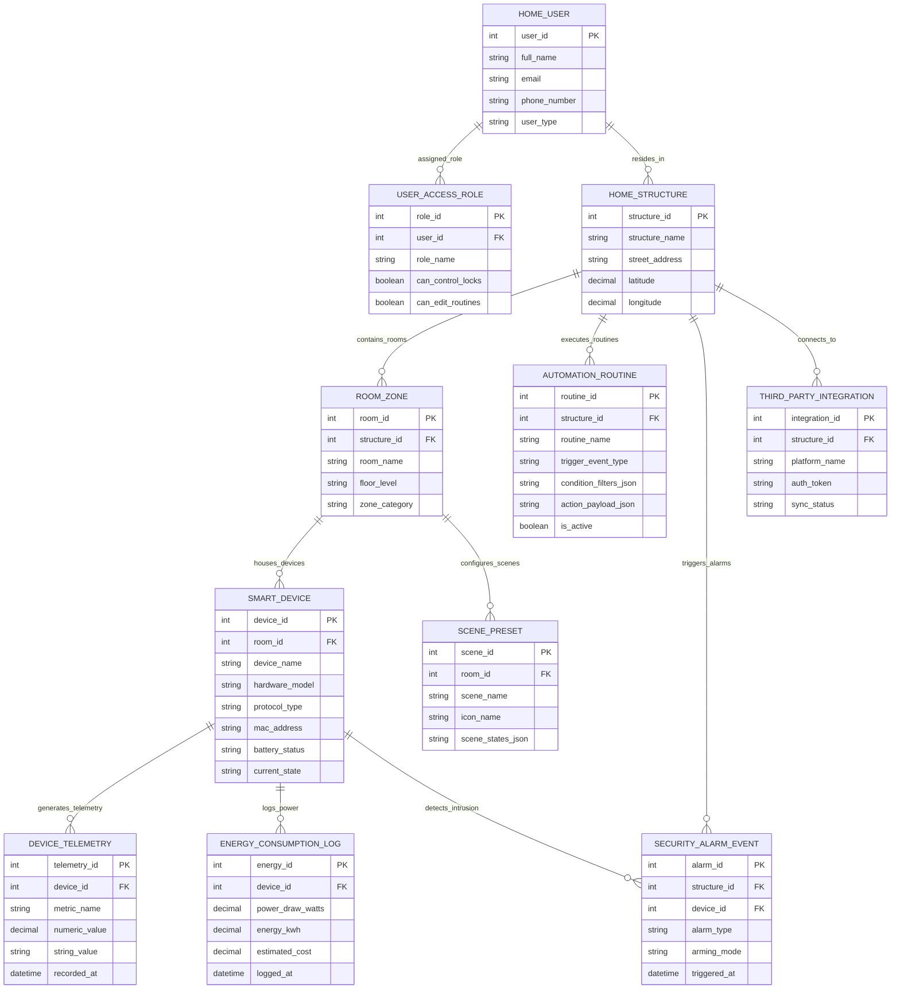

# Conceptual ERD — Smart Home Automation System

## Mermaid Code

## Entity Description Table | Bảng mô tả Entity

| # | Entity Name | Vietnamese Name | Description | Key Attributes | Main Relationships |
|---|-------------|-----------------|-------------|----------------|-------------------|
| 1 | HOME_USER | Người dùng Nhà | Resident or guest user profile controlling devices and receiving notifications. | user_id (PK), full_name, email, phone_number, user_type | Assigned User Access Roles, resides in Home Structure |
| 2 | USER_ACCESS_ROLE | Quyền Truy cập | Access permissions (Admin, Family Member, Guest, Child) governing door lock and routine rights. | role_id (PK), user_id (FK), role_name, can_control_locks | Belongs to Home User |
| 3 | HOME_STRUCTURE | Ngôi nhà / Bất động sản | Physical smart home property structure containing rooms, geofence coordinates, and hub. | structure_id (PK), structure_name, street_address, latitude, longitude | Contains Room Zones, executes Automation Routines, triggers Alarms |
| 4 | ROOM_ZONE | Phòng / Khu vực | Individual room or outdoor zone (Living Room, Kitchen, Patio) organizing device placement. | room_id (PK), structure_id (FK), room_name, floor_level, zone_category | Belongs to Home Structure, houses Smart Devices, configures Scenes |
| 5 | SMART_DEVICE | Thiết bị Thường / IoT | Physical smart device (Light, Thermostat, Motion Sensor, Lock, Plug) paired in the home. | device_id (PK), room_id (FK), device_name, hardware_model, protocol_type, current_state | Housed in Room Zone, generates Telemetry, logs Energy, detects Alarms |
| 6 | AUTOMATION_ROUTINE | Kịch bản Tự động hóa | Multi-condition IF-THEN rule engine defining triggers, time windows, and device actions. | routine_id (PK), structure_id (FK), routine_name, trigger_event_type, is_active | Belongs to Home Structure |
| 7 | SCENE_PRESET | Contextual Scene Preset | One-tap room scene configuration setting multiple device states (e.g. Movie Night, Dinner). | scene_id (PK), room_id (FK), scene_name, scene_states_json | Belongs to Room Zone |
| 8 | DEVICE_TELEMETRY | Nhật ký Telemetry IoT | High-frequency time-series telemetry recording sensor metrics (Temperature, Lux, Motion, CO2). | telemetry_id (PK), device_id (FK), metric_name, numeric_value, recorded_at | Generated by Smart Device |
| 9 | SECURITY_ALARM_EVENT | Báo động An ninh | Security alarm incident log capturing intrusion, smoke, or water leak emergency events. | alarm_id (PK), structure_id (FK), device_id (FK), alarm_type, arming_mode | Belongs to Home Structure, detected by Smart Device |
| 10 | ENERGY_CONSUMPTION_LOG | Nhật ký Điện năng Consumed | Energy usage log tracking watts, kWh consumption, and calculated electricity cost. | energy_id (PK), device_id (FK), power_draw_watts, energy_kwh, estimated_cost | Logged by Smart Device |
| 11 | THIRD_PARTY_INTEGRATION | Tích hợp Bên thứ ba | Integration credentials for voice assistants (Alexa, Google Assistant) and weather services. | integration_id (PK), structure_id (FK), platform_name, sync_status | Connects to Home Structure |

## Relationship Description | Mô tả Quan hệ

| # | From Entity | Cardinality | To Entity | Relationship Label | Business Explanation |
|---|-------------|-------------|-----------|-------------------|----------------------|
| 1 | HOME_STRUCTURE | one-to-many | ROOM_ZONE | contains_rooms | A Home Structure contains multiple Room Zones. |
| 2 | HOME_USER | one-to-many | USER_ACCESS_ROLE | assigned_role | A Home User is assigned one or more User Access Roles. |
| 3 | HOME_STRUCTURE | one-to-many | AUTOMATION_ROUTINE | executes_routines | A Home Structure executes multiple Automation Routines. |
| 4 | ROOM_ZONE | one-to-many | SMART_DEVICE | houses_devices | A Room Zone houses multiple Smart Devices. |
| 5 | ROOM_ZONE | one-to-many | SCENE_PRESET | configures_scenes | A Room Zone configures multiple Scene Presets. |
| 6 | SMART_DEVICE | one-to-many | DEVICE_TELEMETRY | generates_telemetry | A Smart Device generates continuous Device Telemetry records. |
| 7 | SMART_DEVICE | one-to-many | ENERGY_CONSUMPTION_LOG | logs_power | A Smart Device logs Energy Consumption Logs. |
| 8 | HOME_STRUCTURE | one-to-many | SECURITY_ALARM_EVENT | triggers_alarms | A Home Structure records Security Alarm Events. |
| 9 | SMART_DEVICE | one-to-many | SECURITY_ALARM_EVENT | detects_intrusion | A Smart Device detects Security Alarm Events. |
| 10 | HOME_STRUCTURE | one-to-many | THIRD_PARTY_INTEGRATION | connects_to | A Home Structure connects to Third Party Integrations. |
| 11 | HOME_USER | many-to-many | HOME_STRUCTURE | resides_in | Home Users reside in Home Structures. |
