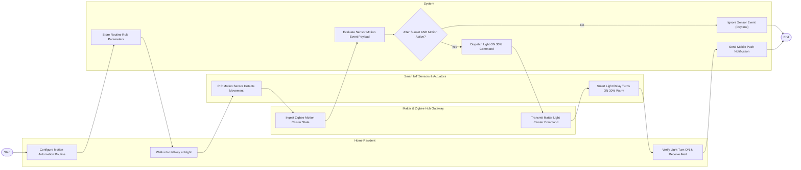

# Swimlane Diagram — Smart Home Automation System

## Mermaid Code

## Flow Description | Mô tả luồng

| Lane | Actor | Role in Flow |
|------|-------|-------------|
| 1 | Home Resident | Configures hallway motion automation routines, walks into the hallway at night, and observes automatic warm light activation and notifications. |
| 2 | System | Persists routine rule triggers, evaluates incoming sensor telemetry, verifies time-of-day condition filters, dispatches execution commands, and sends push alerts. |
| 3 | Matter & Zigbee Hub Gateway | Ingests Zigbee PIR motion sensor cluster state updates and transmits Matter light control cluster commands over the local wireless mesh. |
| 4 | Smart IoT Sensors & Actuators | PIR motion sensor detects physical movement, and smart light relay actuates to turn ON at 30% warm color temperature. |
