# Action Tree — Smart Home Automation System

## Mermaid Code

```mermaid
graph TD
    Root["Smart Home Automation System"]

    Root --> M1["Device Onboarding & Topology"]
    Root --> M2["Climate & Lighting Control"]
    Root --> M3["Security & Access Management"]
    Root --> M4["Automation Routine Engine"]
    Root --> M5["Energy Monitoring & Solar Management"]
    Root --> M6["Emergency Alarms & Safety Notifications"]

    M1 --> A11["Pair Matter/Zigbee Smart Device"]
    M1 --> A12["Map Home Structure Rooms & Zones"]
    M1 --> A13["Monitor Sensor Battery Levels"]
    M1 --> A14["Configure Local Hub Mesh Offline Rules"]

    M2 --> A21["Adjust Smart Light Brightness & Color"]
    M2 --> A22["Control Motorized Window Shades"]
    M2 --> A23["Set HVAC Thermostat Mode & Setpoints"]
    M2 --> A24["Trigger Scene Presets Movie/Dinner"]

    M3 --> A31["Arm Security System Away/Home/Night"]
    M3 --> A32["Lock/Unlock Smart Door Deadbolt"]
    M3 --> A33["Grant Temporary Guest Access PIN"]
    M3 --> A34["Process Voice Assistant Control Intent"]

    M4 --> A41["Configure Multi-Condition IF-THEN Rules"]
    M4 --> A42["Evaluate Geofence Arrival Triggers"]
    M4 --> A43["Evaluate Sunrise/Sunset Time Rules"]
    M4 --> A44["Execute Auto-Off Motion Timers"]

    M5 --> A51["Track Real-Time Watts Energy Draw"]
    M5 --> A52["Optimize EV Charger Peak Shift"]
    M5 --> A53["Schedule Solar Battery Discharge"]
    M5 --> A54["Export Monthly kWh Utility Cost Reports"]

    M6 --> A61["Detect Smoke & CO Emergency Hazards"]
    M6 --> A62["Auto-Shutoff Main Water Valve on Leak"]
    M6 --> A63["Trigger Indoor Siren & Light Flash"]
    M6 --> A64["Dispatch Alerts to Monitoring Center"]
```

## Module Description | Mô tả Module

| # | Module | Description | Actions |
|---|--------|-------------|---------|
| 1 | Device Onboarding & Topology | Manages Matter/Zigbee device pairing, room zone hierarchy, sensor battery health monitoring, and offline mesh rules. | Pair Matter/Zigbee Smart Device, Map Home Structure Rooms & Zones, Monitor Sensor Battery Levels, Configure Local Hub Mesh Offline Rules |
| 2 | Climate & Lighting Control | Controls smart light brightness/color, motorized window shades, HVAC thermostat setpoints, and scene presets. | Adjust Smart Light Brightness & Color, Control Motorized Window Shades, Set HVAC Thermostat Mode & Setpoints, Trigger Scene Presets Movie/Dinner |
| 3 | Security & Access Management | Handles security alarm arming, smart door lock deadbolts, temporary guest access PINs, and voice assistant intent execution. | Arm Security System Away/Home/Night, Lock/Unlock Smart Door Deadbolt, Grant Temporary Guest Access PIN, Process Voice Assistant Control Intent |
| 4 | Automation Routine Engine | Evaluates multi-condition IF-THEN rules, geofence triggers, sunrise/sunset time schedules, and motion auto-off timers. | Configure Multi-Condition IF-THEN Rules, Evaluate Geofence Arrival Triggers, Evaluate Sunrise/Sunset Time Rules, Execute Auto-Off Motion Timers |
| 5 | Energy Monitoring & Solar Management | Tracks real-time wattage power draw, optimizes EV charging for off-peak rates, schedules solar battery storage, and exports cost ledgers. | Track Real-Time Watts Energy Draw, Optimize EV Charger Peak Shift, Schedule Solar Battery Discharge, Export Monthly kWh Utility Cost Reports |
| 6 | Emergency Alarms & Safety Notifications | Detects smoke, CO, and water leaks, auto-closes main water valves, triggers indoor sirens, and dispatches alerts to monitoring centers. | Detect Smoke & CO Emergency Hazards, Auto-Shutoff Main Water Valve on Leak, Trigger Indoor Siren & Light Flash, Dispatch Alerts to Monitoring Center |
