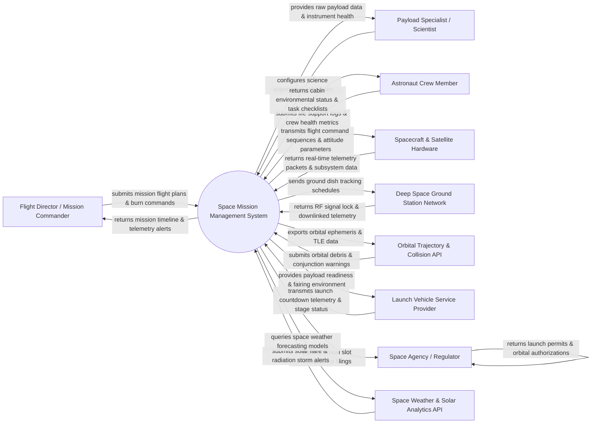

# Context Diagram — Space Mission Management System

## Mermaid Code

## Actor & Interaction Table | Bảng Actor & Tương tác

| # | Actor | Actor Type | Data Sent TO System | Data Received FROM System | Notes |
|---|-------|------------|---------------------|---------------------------|-------|
| 1 | Flight Director / Mission Commander | Primary | Flight plan sequences, orbital burn execution commands, mission phase transitions, emergency overrides | Mission timeline status, anomaly alerts, spacecraft telemetry summary, trajectory plots | Senior mission controllers leading flight operations from Mission Control. |
| 2 | Payload Specialist / Scientist | Primary | Science experiment schedules, instrument calibration commands, observation targets, payload activation requests | Downlinked science data files, payload instrument health metrics, spectral imaging feeds | Scientists and payload managers operating scientific instruments aboard spacecraft. |
| 3 | Astronaut Crew Member | Primary | Cabin environmental logs, EVA space walk updates, medical health metrics, manual flight inputs | Life support status (O2/CO2 levels), mission schedule checklists, emergency warnings | Crew members residing aboard space stations or crewed spacecraft (e.g. ISS, Lunar Gateway). |
| 4 | Spacecraft & Satellite Hardware | Primary / Hardware | CCSDS telemetry frames, thruster status, solar array power voltage, attitude determination data | Command sequence uplink packets, thruster burn duration, reaction wheel momentum commands | Uncrewed satellites, deep space probes, or crewed spacecraft modules in orbit. |
| 5 | Deep Space Ground Station Network | Supporting System | RF carrier signal lock, demodulated telemetry frames, Doppler ranging data | Antenna tracking schedules, azimuth/elevation pointing vectors, RF command uplink streams | Global dish networks (e.g. NASA DSN, ESA ESTRACK) maintaining RF links with spacecraft. |
| 6 | Orbital Trajectory & Collision API | Supporting System | Two-Line Element (TLE) updates, orbital conjunction assessment alerts, space debris tracking | Spacecraft state vectors, active orbit ephemeris data, planned maneuver burns | Space domain awareness networks (e.g., USSPACECOM, EU SST) tracking orbital debris risks. |
| 7 | Launch Vehicle Service Provider | Supporting System | Rocket stage separation signals, fairing jettison telemetry, launch countdown clocks | Payload health status, orbital insertion target parameters, separation arming signals | Commercial or national launch providers (e.g., SpaceX, Arianespace, ULA) launching payloads. |
| 8 | Space Weather & Solar Analytics API | Supporting System | Solar flare warnings, coronal mass ejection (CME) alerts, geomagnetic storm indices | Spacecraft location queries, radiation shielding status requests | Space weather forecasting agencies (NOAA SWPC) predicting radiation hazards. |
| 9 | Space Agency / Regulator | Regulatory System | International orbital slot allocations, radio frequency licenses, planetary protection guidelines | Statutory launch filings, post-mission disposal plans, de-orbit compliance logs | Government space oversight bodies (FAA AST, ITU, UNOOSA) governing space operations. |

## System Boundary Description | Mô tả Phạm vi Hệ thống

The **Space Mission Management System (SMMS)** is an aerospace-grade software environment designed to control and monitor space missions across pre-launch, orbital insertion, cruise, surface operation, and de-orbit phases. Inside the system boundary, SMMS manages mission timeline scheduling, orbital flight dynamics, CCSDS command uplink generation, high-rate telemetry parsing, crew life support monitoring, scientific payload data downlinking, and anomaly detection. External to the system boundary are physical spacecraft hardware (Spacecraft & Satellite Hardware), global antenna tracking networks (Deep Space Ground Station Network), launch rocket controllers (Launch Vehicle Service Provider), orbital debris tracking platforms (Orbital Trajectory API), space weather monitors (Space Weather API), and international space regulatory agencies (Space Agency / Regulator).
