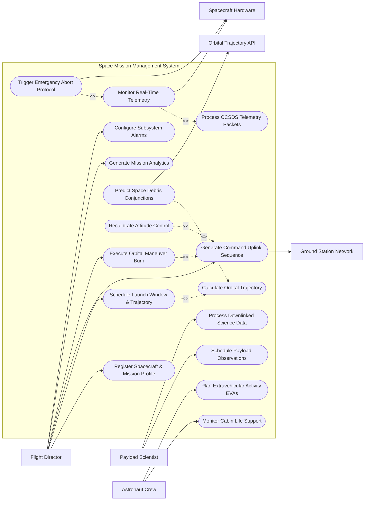

# Use Case Diagram — Space Mission Management System

## Mermaid Code

## Actor Table | Bảng Actor

| # | Actor | Actor Type | Role Description | Related Use Cases |
|---|-------|------------|------------------|-------------------|
| 1 | Flight Director | Primary | Mission Commander leading flight operations, issuing burn commands, and governing mission safety. | UC01, UC03, UC06, UC07, UC15, UC16 |
| 2 | Payload Scientist | Primary | Scientific investigator scheduling instrument targets and analyzing downlinked science data files. | UC09, UC10 |
| 3 | Astronaut Crew | Primary | Crew member operating spacecraft systems, monitoring life support, and performing spacewalks. | UC08, UC13 |
| 4 | Spacecraft Hardware | Hardware | On-board flight computer streaming CCSDS telemetry frames and executing thruster burn commands. | UC05, UC11 |
| 5 | Ground Station Network | System | Antenna ground station network uplinking command sequences and downlinking RF telemetry. | UC06 |
| 6 | Orbital Trajectory API | System | External space domain awareness system tracking Two-Line Elements (TLE) and debris conjunctions. | UC12 |

## Use Case Table | Bảng Use Case

| # | UC ID | Use Case Name | Primary Actor | Secondary Actor | Description | Priority |
|---|-------| ---------------|---------------|-----------------|-------------|----------|
| 1 | UC01 | Register Spacecraft & Mission Profile | Flight Director | None | Registers spacecraft subsystem specs, orbital parameters, communication frequencies, and team roles. | High |
| 2 | UC02 | Calculate Orbital Trajectory | Flight Director | None | Computes Keplerian orbital elements, propagation vectors, ground track projections, and visibility windows. | High |
| 3 | UC03 | Schedule Launch Window & Trajectory | Flight Director | Launch Provider | Analyzes planetary alignment, delta-v budgets, and launch constraints to lock in target launch windows. | High |
| 4 | UC04 | Process CCSDS Telemetry Packets | Flight Director | Ground Station Network | Ingests, decommutes, and parses Consultative Committee for Space Data Systems (CCSDS) telemetry frames. | High |
| 5 | UC05 | Monitor Real-Time Telemetry | Flight Director | Spacecraft Hardware | Displays live spacecraft telemetry (power, temperature, pressure, attitude) and flags out-of-limit readings. | High |
| 6 | UC06 | Generate Command Uplink Sequence | Flight Director | Ground Station Network | Constructs, verifies, and packages cryptographically signed command sequences for ground station uplink. | High |
| 7 | UC07 | Execute Orbital Maneuver Burn | Flight Director | Spacecraft Hardware | Executes delta-v thruster burn commands for orbital stationkeeping, transfer orbits, or collision avoidance. | High |
| 8 | UC08 | Monitor Cabin Life Support | Astronaut Crew | None | Monitors crew cabin oxygen/nitrogen pressures, CO2 scrubbing, water recycling, and thermal control. | High |
| 9 | UC09 | Schedule Payload Observations | Payload Scientist | None | Schedules telescope pointing, spectrometer sampling, or sensor capture passes over target coordinates. | Medium |
| 10 | UC10 | Process Downlinked Science Data | Payload Scientist | None | Decodes, calibrates, and formats raw downlinked science payloads into usable astronomical datasets. | Medium |
| 11 | UC11 | Trigger Emergency Abort Protocol | Flight Director | Spacecraft Hardware | Initiates automated launch abort, safe-mode entry, or emergency trajectory burn upon catastrophic anomaly. | High |
| 12 | UC12 | Predict Space Debris Conjunctions | Flight Director | Orbital Trajectory API | Analyzes close-approach (conjunction) risks with space debris and recommends avoidance maneuvers. | High |
| 13 | UC13 | Plan Extravehicular Activity EVAs | Astronaut Crew | None | Details spacewalk timelines, airlock depressurization schedules, suit oxygen reserves, and safety tethers. | Medium |
| 14 | UC14 | Recalibrate Attitude Control | Flight Director | Spacecraft Hardware | Commands star tracker updates, reaction wheel desaturation, and IMU gyro drift recalibrations. | Medium |
| 15 | UC15 | Generate Mission Analytics | Flight Director | None | Exports propellant consumption curves, power budget efficiency, and mission milestone completion rates. | Medium |
| 16 | UC16 | Configure Subsystem Alarms | Flight Director | None | Configures yellow warning and red critical alarm threshold limits for all spacecraft telemetry points. | Low |

## Use Case Specification | Đặc tả Use Case

---

### UC01 — Register Spacecraft & Mission Profile

| Field | Detail |
|-------|--------|
| **UC ID** | UC01 |
| **Use Case Name** | Register Spacecraft & Mission Profile |
| **Actor(s)** | Primary: Flight Director / Secondary: None |
| **Description** | Registers a new space mission, configures spacecraft Bus & Payload subsystems, sets target orbital parameters (Perigee, Apogee, Inclination), and assigns mission team roles. |
| **Precondition** | 1. User is authenticated as a Flight Director with mission configuration privileges.   2. Spacecraft engineering specifications and telemetry database (TDB) dictionary are available. |
| **Main Flow** | 1. Actor selects "Create New Space Mission".   2. System presents mission registration form requesting Mission Name (e.g., Artemis Lunar Explorer), Mission Type (Deep Space, LEO Earth Observation, Planetary Lander), and Target Organization.   3. Actor inputs Spacecraft Bus details: Mass (kg), Solar Array Power Output (Watts), Thruster Type (Monopropellant, Bipropellant, Electric Ion), and Total Delta-V Capacity (m/s).   4. Actor uploads Telemetry Database (TDB) XML dictionary defining all telemetry parameter IDs (PIDs), bit offsets, scaling equations, and unit labels.   5. Actor defines target orbit parameters (Semimajor Axis, Eccentricity, Inclination, RAAN, Argument of Perigee).   6. Actor assigns mission control console roles (Flight Director, CAPCOM, ADCO, GNC, POWER, PROP, SURGEON).   7. System validates inputs, assigns unique Mission ID (e.g. MS-2026-LUNAR01), initializes flight database, and sets status to "Mission Planning Phase". |
| **Alternative Flow** | **AF1** — Multi-Spacecraft Fleet Registration: Actor registers constellation of CubeSats; System duplicates bus specifications while generating unique spacecraft IDs.   **AF2** — Import Flight Provenance Template: Actor imports standard satellite bus template (e.g. SmallSat 3U); System auto-populates subsystem configurations. |
| **Exception Flow** | **EX1** — Malformed Telemetry Dictionary: If uploaded TDB XML file contains duplicate parameter IDs or invalid scaling formulas, System alerts "TDB Dictionary parsing error at line 142".   **EX2** — Insufficient Delta-V Budget: If entered thrance fuel mass is insufficient for the defined target orbit, System alerts "Warning: Delta-V budget negative (-120 m/s margin)." |
| **Postcondition** | A Space_Mission and Spacecraft entity are created, loading telemetry parameter definitions and flight dynamics constraints. |
| **Business Rule** | **BR1**: Every spacecraft registration must include cryptographically signed uplink command authentication keys approved by the Chief Systems Engineer. |

---

### UC03 — Schedule Launch Window & Trajectory

| Field | Detail |
|-------|--------|
| **UC ID** | UC03 |
| **Use Case Name** | Schedule Launch Window & Trajectory |
| **Actor(s)** | Primary: Flight Director / Secondary: Launch Provider |
| **Description** | Analyzes launch site coordinates, planetary alignments, orbital mechanics, and upper-stage performance to compute viable launch windows and flight trajectories. |
| **Precondition** | 1. Spacecraft profile (UC01) and target orbit parameters are registered.   2. Launch vehicle performance parameters are available. |
| **Main Flow** | 1. Actor opens Flight Dynamics module and selects "Launch Window Generator".   2. System inputs launch site coordinates (e.g., Kennedy Space Center LC-39A), target orbit, and desired mission launch date range.   3. System calculates planetary orbital positions, Earth rotation geometry, solar illumination angles, and launch azimutal headings.   4. System runs orbital propagation trajectory simulation (UC02) incorporating N-body gravitational perturbations (Sun, Moon, J2 Earth oblateness).   5. System outputs viable Launch Windows displaying Opening/Closing timestamps, Launch Azimuth, Insertion Altitude, and required Stage 2 separation velocity.   6. Actor selects target launch window and clicks "Confirm Launch Schedule".   7. System locks launch window, updates mission timeline, and dispatches trajectory parameters to Launch Vehicle Service Provider API. |
| **Alternative Flow** | **AF1** — Interplanetary Transfer Window (Porkchop Plot): For interplanetary missions (e.g. Mars transfer), System computes C3 energy porkchop plots and highlights minimum energy departure dates.   **AF2** — Instantaneous Launch Window: For ISS rendezvous missions, System calculates 1-second instantaneous launch window for planar alignment. |
| **Exception Flow** | **EX1** — No Viable Launch Windows: If constraints yield zero windows in selected date range, System displays "No viable launch windows found. Expand date range or adjust inclination."   **EX2** — Range Safety Trajectory Violation: If launch trajectory crosses populated landmasses, System flags "Range Safety Warning: Azimuth crosses restricted airspace." |
| **Postcondition** | Launch window dates and trajectory ephemerides are locked into the mission master timeline. |
| **Business Rule** | **BR1**: Launch windows must maintain a minimum 15% delta-v reserve margin to account for launch vehicle insertion dispersions. |

---

### UC05 — Monitor Real-Time Spacecraft Telemetry

| Field | Detail |
|-------|--------|
| **UC ID** | UC05 |
| **Use Case Name** | Monitor Real-Time Spacecraft Telemetry |
| **Actor(s)** | Primary: Flight Director / Secondary: Spacecraft Hardware |
| **Description** | Ingests downlinked CCSDS telemetry frames (UC04) from ground stations, decommutes parameters, monitors real-time subsystem metrics, and flags out-of-limit conditions. |
| **Precondition** | 1. Ground station RF signal lock (RF carrier lock) is established.   2. Telemetry database parameter dictionary (TDB) is loaded (UC01). |
| **Main Flow** | 1. System receives raw CCSDS telemetry frame stream from Ground Station Network (UC04).   2. System validates frame synchronization markers, checks Reed-Solomon / LDPC error correction codes, and decommutes binary telemetry packets.   3. System applies polynomial scaling equations to translate raw counts into engineering units (e.g., converting hex `0x3FF` to `28.4 Volts` or `42.1 °C`).   4. System streams parsed metrics to Mission Control console displays (Electrical Power, Thermal, Attitude & Orbit Control, Propulsion, Life Support).   5. System checks parameter values against yellow warning and red critical alarm thresholds (UC16).   6. If all parameters are within limits, System displays green status badges on console.   7. System archives all processed telemetry parameters into Mission_Telemetry time-series database. |
| **Alternative Flow** | **AF1** — Out-of-Limit (OOL) Alarm Triggered: Telemetry parameter exceeds red critical threshold (e.g., Battery Temp >55°C); System flashes red console warning, sounds audible alarm, and alerts Flight Director.   **AF2** — Stored Telemetry Playback: Ground station downlinks recorded solid-state recorder (SSR) dump from pass over dark side of Earth; System processes playback frames and backfills timeline gaps. |
| **Exception Flow** | **EX1** — Uncorrectable Frame Error Rate (FER): If RF interference causes high frame error rate (>10%), System flags telemetry as "Corrupted / Frame Sync Lost" and alerts RF engineer.   **EX2** — Stale Telemetry Stream: If ground station loses carrier lock, System displays "Telemetry Stream Stale (No frame received in 5 sec)" and freezes display values. |
| **Postcondition** | Real-time telemetry is displayed on mission control consoles and stored in time-series telemetry archives. |
| **Business Rule** | **BR1**: Critical safety-of-flight telemetry parameters (e.g. cabin pressure, battery voltage) must update at a minimum rate of 1 Hz during active operations. |

---

### UC07 — Execute Orbital Maneuver Burn Command

| Field | Detail |
|-------|--------|
| **UC ID** | UC07 |
| **Use Case Name** | Execute Orbital Maneuver Burn Command |
| **Actor(s)** | Primary: Flight Director / Secondary: Spacecraft Hardware |
| **Description** | Calculates, verifies, uplinks, and executes an orbital maneuver thruster burn command to change spacecraft velocity (delta-v), adjust orbit altitude, or avoid space debris. |
| **Precondition** | 1. Flight Director holds active burn authorization.   2. Spacecraft is in nominal operating mode with verified propellant pressure and thruster thermal readiness. |
| **Main Flow** | 1. Actor selects "Plan Orbital Maneuver Burn".   2. System computes maneuver vector parameters: Delta-V Magnitude (m/s), Burn Direction Vector (Prograde/Retrograde, Normal/Antinormal, Radial/Antiradial), Ignition Epoch (UTC), and Duration (sec).   3. System simulates post-burn orbit to verify target orbit achievement and check post-burn solar array alignment.   4. System formats command sequence payload (UC06), applies cryptographic HMAC signature, and generates command uplink file.   5. Actor and CAPCOM/GNC officer execute "Two-Person Verification Check" approving burn command package.   6. System transmits command sequence to Ground Station Network for uplink to spacecraft.   7. Spacecraft flight computer receives uplink, verifies command signature, performs automated pre-burn attitude slew, and fires thrusters at ignition epoch.   8. System monitors burn execution in real-time via telemetry (UC05), verifies delta-v achievement via Doppler ranging, and updates orbit state vector. |
| **Alternative Flow** | **AF1** — Collision Avoidance Maneuver (CAM): Automated space debris warning (UC12) triggers emergency CAM burn generation; Flight Director approves fast-track uplink.   **AF2** — Electric Propulsion Low-Thrust Burn: For ion thruster maneuver, System schedules multi-day continuous low-thrust burn sequence. |
| **Exception Flow** | **EX1** — Pre-Burn Slew Timeout: If reaction wheels fail to achieve target burn attitude orientation prior to ignition epoch, Spacecraft flight computer aborts burn and enters safe-mode.   **EX2** — Thruster Underburn Detected: If telemetry indicates thruster pressure drop during burn resulting in <90% expected delta-v, System alerts "Maneuver Underburn: Re-calculating trajectory." |
| **Postcondition** | Spacecraft executes thruster burn, updating orbital state vector and confirming post-burn orbit via ground tracking. |
| **Business Rule** | **BR1**: Major orbital maneuver burns (>5 m/s delta-v) require mandatory two-person cryptographic sign-off before uplink transmission. |

---

### UC11 — Trigger Emergency Abort Protocol

| Field | Detail |
|-------|--------|
| **UC ID** | UC11 |
| **Use Case Name** | Trigger Emergency Abort Protocol |
| **Actor(s)** | Primary: Flight Director / Secondary: Spacecraft Hardware |
| **Description** | Initiates an immediate launch abort, crew escape sequence, or spacecraft safe-mode entry upon detection of catastrophic system failure or safety-of-life threat. |
| **Precondition** | 1. Catastrophic anomaly occurs (e.g. pressure drop, uncommanded attitude spin, launch vehicle stage failure).   2. Abort system is armed. |
| **Main Flow** | 1. Trigger event occurs: Flight Director hits console "ABORT" hard-button (OR spacecraft flight computer automatically detects loss of thrust during launch phase).   2. System (or flight computer abort logic) issues high-priority discrete Abort Command payload to spacecraft and launch escape system.   3. If during launch phase, Launch Escape System (LES) fires abort motors, pulling crew capsule away from failing launch vehicle to safe altitude.   4. If during orbital flight phase, Spacecraft flight computer halts non-essential loads, shuts down payload instruments, slews solar arrays toward Sun, opens sun-pointing safe-mode attitude, and enables omnidirectional emergency beacon.   5. System commands ground station network to lock emergency frequency channel and stream diagnostic dump.   6. System generates Anomaly_Incident report logging exact timestamp, pre-abort telemetry snapshot, and failure codes.   7. Flight Director and Anomaly Resolution Team convene emergency briefing. |
| **Alternative Flow** | **AF1** — Automated Cabin Depressurization Abort: Sensor detects rapid cabin pressure drop; Autonomous life support controller seals emergency bulkheads and deploys full pressure suits for crew.   **AF2** — Safe-Mode Recovery Sequence: Once anomaly is stabilized, Flight Director issues step-by-step diagnostic recovery sequence to restore nominal operations. |
| **Exception Flow** | **EX1** — Primary Abort Motor Ignition Failure: If primary escape motor fails to ignite, System automatically triggers secondary backup abort thruster bank.   **EX2** — Command Uplink Blocked: If RF uplink is blocked by plasma sheath, Spacecraft autonomous on-board abort computer executes self-contained abort routine independently. |
| **Postcondition** | Abort/safe-mode sequence is executed, prioritizing crew survival and spacecraft preservation, and alerting emergency recovery teams. |
| **Business Rule** | **BR1**: On-board autonomous abort systems must possess zero-latency authority to initiate launch escape without waiting for ground control commands. |
