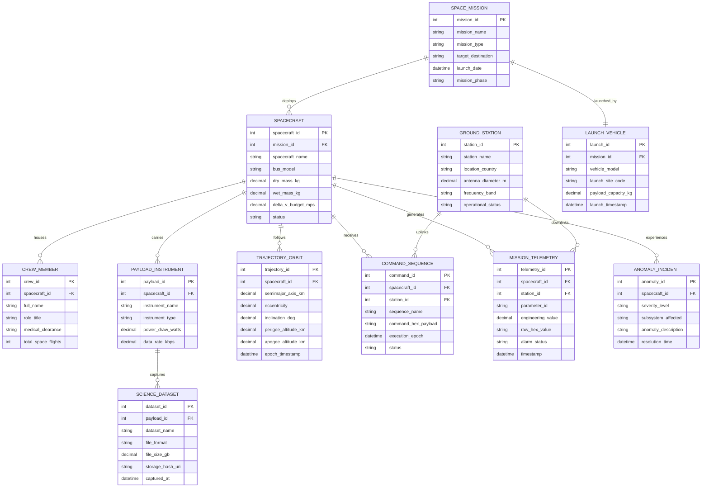

# Conceptual ERD — Space Mission Management System

## Mermaid Code

## Entity Description Table | Bảng mô tả Entity

| # | Entity Name | Vietnamese Name | Description | Key Attributes | Main Relationships |
|---|-------------|-----------------|-------------|----------------|-------------------|
| 1 | SPACE_MISSION | Sứ mệnh Không gian | Master space mission entity tracking destination, phases, launch dates, and goals. | mission_id (PK), mission_name, mission_type, target_destination, mission_phase | Deploys Spacecraft, launched by Launch Vehicle |
| 2 | SPACECRAFT | Tàu Vũ trụ / Vệ tinh | Spacecraft bus hardware carrying crew, scientific instruments, propulsion, and avionics. | spacecraft_id (PK), mission_id (FK), spacecraft_name, dry_mass_kg, wet_mass_kg, status | Belongs to Space Mission, houses Crew, carries Payloads, follows Trajectory Orbit |
| 3 | CREW_MEMBER | Phi hành gia | Astronaut crew member residing aboard crewed spacecraft or space stations. | crew_id (PK), spacecraft_id (FK), full_name, role_title, medical_clearance | Housed in Spacecraft |
| 4 | PAYLOAD_INSTRUMENT | Tải trọng Khoa học | Scientific sensor, telescope, camera, or spectrometer installed on the spacecraft. | payload_id (PK), spacecraft_id (FK), instrument_name, instrument_type, power_draw_watts | Carried by Spacecraft, captures Science Datasets |
| 5 | TRAJECTORY_ORBIT | Quỹ đạo & Đường bay | Orbital parameters (Keplerian elements, perigee, apogee, inclination) and ephemerides. | trajectory_id (PK), spacecraft_id (FK), semimajor_axis_km, eccentricity, inclination_deg | Followed by Spacecraft |
| 6 | GROUND_STATION | Trạm Mặt đất | Deep space ground station antenna dish tracking, uplinking commands, and downlinking data. | station_id (PK), station_name, location_country, antenna_diameter_m, frequency_band | Uplinks Command Sequences, downlinks Mission Telemetry |
| 7 | COMMAND_SEQUENCE | Chuỗi Lệnh Uplink | Cryptographically signed command sequence payload transmitted to the spacecraft flight computer. | command_id (PK), spacecraft_id (FK), station_id (FK), sequence_name, command_hex_payload | Received by Spacecraft, uplined by Ground Station |
| 8 | MISSION_TELEMETRY | Nhật ký Telemetry | High-frequency telemetry log recording engineering parameter values and alarm states. | telemetry_id (PK), spacecraft_id (FK), station_id (FK), parameter_id, engineering_value | Generated by Spacecraft, downlinked by Ground Station |
| 9 | ANOMALY_INCIDENT | Sự cố / Bất thường | Out-of-limit anomaly or component failure logged during spaceflight operations. | anomaly_id (PK), spacecraft_id (FK), severity_level, subsystem_affected, resolution_time | Experienced by Spacecraft |
| 10 | LAUNCH_VEHICLE | Tên lửa Đẩy | Launch vehicle rocket model, payload fairing capacity, and launch pad configuration. | launch_id (PK), mission_id (FK), vehicle_model, launch_site_code, payload_capacity_kg | Launches Space Mission |
| 11 | SCIENCE_DATASET | Tập Dữ liệu Khoa học | Raw or processed scientific data file downlinked from payload instruments. | dataset_id (PK), payload_id (FK), dataset_name, file_format, file_size_gb, storage_hash_uri | Captured by Payload Instrument |

## Relationship Description | Mô tả Quan hệ

| # | From Entity | Cardinality | To Entity | Relationship Label | Business Explanation |
|---|-------------|-------------|-----------|-------------------|----------------------|
| 1 | SPACE_MISSION | one-to-many | SPACECRAFT | deploys | A Space Mission deploys one or multiple Spacecraft. |
| 2 | SPACE_MISSION | one-to-one | LAUNCH_VEHICLE | launched_by | A Space Mission is launched by a Launch Vehicle. |
| 3 | SPACECRAFT | one-to-many | CREW_MEMBER | houses | A Spacecraft houses multiple Crew Members (for crewed missions). |
| 4 | SPACECRAFT | one-to-many | PAYLOAD_INSTRUMENT | carries | A Spacecraft carries multiple Payload Instruments. |
| 5 | SPACECRAFT | one-to-many | TRAJECTORY_ORBIT | follows | A Spacecraft follows Trajectory Orbits over time. |
| 6 | SPACECRAFT | one-to-many | COMMAND_SEQUENCE | receives | A Spacecraft receives multiple Command Sequences. |
| 7 | GROUND_STATION | one-to-many | COMMAND_SEQUENCE | uplinks | A Ground Station uplinks multiple Command Sequences. |
| 8 | SPACECRAFT | one-to-many | MISSION_TELEMETRY | generates | A Spacecraft generates continuous Mission Telemetry records. |
| 9 | GROUND_STATION | one-to-many | MISSION_TELEMETRY | downlinks | A Ground Station downlinks Mission Telemetry packets. |
| 10 | SPACECRAFT | one-to-many | ANOMALY_INCIDENT | experiences | A Spacecraft can experience multiple Anomaly Incidents over its lifespan. |
| 11 | PAYLOAD_INSTRUMENT | one-to-many | SCIENCE_DATASET | captures | A Payload Instrument captures multiple Science Datasets. |
