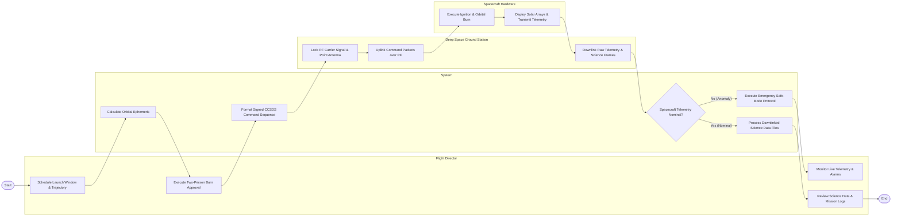

# Swimlane Diagram — Space Mission Management System

## Mermaid Code

## Flow Description | Mô tả luồng

| Lane | Actor | Role in Flow |
|------|-------|-------------|
| 1 | Flight Director | Schedules launch windows, executes mandatory two-person burn command sign-offs, monitors live spacecraft telemetry consoles, and reviews downlinked science data. |
| 2 | System | Calculates orbital mechanics ephemerides, packages cryptographically signed CCSDS command sequences, evaluates real-time telemetry limits, executes safe-mode protocols upon anomaly, and processes science data. |
| 3 | Deep Space Ground Station | Establishes RF carrier signal lock, aligns dish antennas, uplinks command sequence packages, and downlinks raw telemetry and science data frames. |
| 4 | Spacecraft Hardware | Executes delta-v thruster ignition burns, deploys solar array wings, manages attitude orientation, and streams telemetry packets back to Earth. |
