# Action Tree — Space Mission Management System

## Mermaid Code

```mermaid
graph TD
    Root["Space Mission Management System"]

    Root --> M1["Mission Planning & Flight Dynamics"]
    Root --> M2["Spacecraft Command & Telemetry"]
    Root --> M3["Orbital Navigation & Collision Avoidance"]
    Root --> M4["Crew & Life Support Operations"]
    Root --> M5["Scientific Payload & Data Downlink"]
    Root --> M6["Contingency & Anomaly Management"]

    M1 --> A11["Register Spacecraft & Bus Profiles"]
    M1 --> A12["Schedule Launch Windows & Azimuths"]
    M1 --> A13["Compute Keplerian Orbital Elements"]
    M1 --> A14["Calculate Delta-V Propellant Budgets"]

    M2 --> A21["Ingest CCSDS Telemetry Packets"]
    M2 --> A22["Decommute & Scale Engineering Units"]
    M2 --> A23["Construct Signed Command Uplinks"]
    M2 --> A24["Schedule Ground Station RF Passes"]

    M3 --> A31["Execute Orbital Maneuver Thruster Burns"]
    M3 --> A32["Predict Space Debris Conjunction Risks"]
    M3 --> A33["Command Reaction Wheel Desaturation"]
    M3 --> A34["Update Star Tracker Attitude Data"]

    M4 --> A41["Monitor Cabin O2/CO2 Pressure"]
    M4 --> A42["Track Astronaut Medical Health Metrics"]
    M4 --> A43["Plan Extravehicular Activity EVAs"]
    M4 --> A44["Schedule Crew Shift Checklists"]

    M5 --> A51["Schedule Telescope Observation Targets"]
    M5 --> A52["Downlink Raw Science Payloads"]
    M5 --> A53["Process & Calibrate Spectral Data"]
    M5 --> A54["Archive Science Datasets to Storage"]

    M6 --> A61["Trigger Automated Safe-Mode Entry"]
    M6 --> A62["Execute Launch Abort Sequence"]
    M6 --> A63["Configure Out-of-Limit Alarms"]
    M6 --> A64["Export Incident Anomaly Logs"]
```

## Module Description | Mô tả Module

| # | Module | Description | Actions |
|---|--------|-------------|---------|
| 1 | Mission Planning & Flight Dynamics | Manages spacecraft bus registrations, launch window generation, Keplerian orbital element propagation, and delta-v propellant calculations. | Register Spacecraft & Bus Profiles, Schedule Launch Windows & Azimuths, Compute Keplerian Orbital Elements, Calculate Delta-V Propellant Budgets |
| 2 | Spacecraft Command & Telemetry | Handles CCSDS telemetry frame parsing, engineering unit scaling, cryptographically signed command uplink creation, and ground station scheduling. | Ingest CCSDS Telemetry Packets, Decommute & Scale Engineering Units, Construct Signed Command Uplinks, Schedule Ground Station RF Passes |
| 3 | Orbital Navigation & Collision Avoidance | Controls orbital maneuver thruster burns, space debris conjunction prediction, reaction wheel desaturation, and star tracker attitude calibration. | Execute Orbital Maneuver Thruster Burns, Predict Space Debris Conjunction Risks, Command Reaction Wheel Desaturation, Update Star Tracker Attitude Data |
| 4 | Crew & Life Support Operations | Oversees cabin environmental pressures (O2/CO2), astronaut medical monitoring, Extravehicular Activity (EVA) spacewalk planning, and crew checklists. | Monitor Cabin O2/CO2 Pressure, Track Astronaut Medical Health Metrics, Plan Extravehicular Activity EVAs, Schedule Crew Shift Checklists |
| 5 | Scientific Payload & Data Downlink | Coordinates telescope observation targeting, raw payload file downlinking, spectral data calibration, and scientific dataset archiving. | Schedule Telescope Observation Targets, Downlink Raw Science Payloads, Process & Calibrate Spectral Data, Archive Science Datasets to Storage |
| 6 | Contingency & Anomaly Management | Controls emergency safe-mode entries, launch abort execution, yellow/red out-of-limit alarm settings, and anomaly incident logging. | Trigger Automated Safe-Mode Entry, Execute Launch Abort Sequence, Configure Out-of-Limit Alarms, Export Incident Anomaly Logs |
