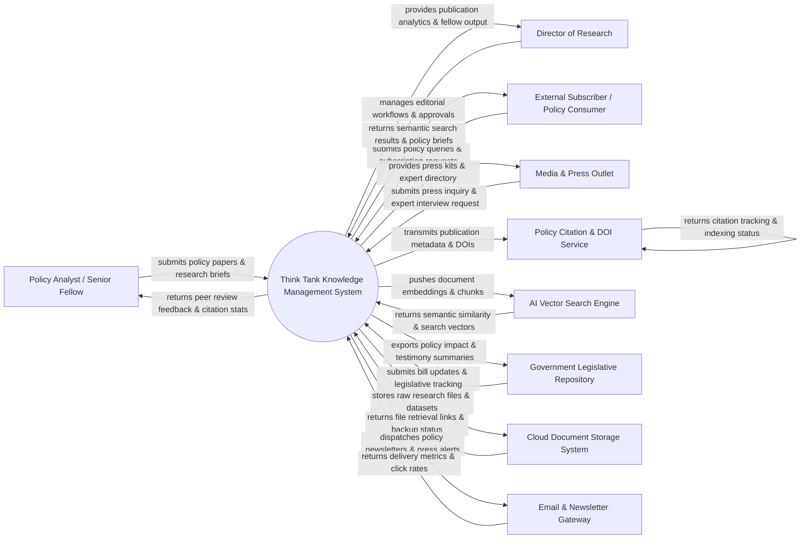

# Context Diagram — Think Tank Knowledge Management System

## Mermaid Code

## Actor & Interaction Table | Bảng Actor & Tương tác

| # | Actor | Actor Type | Data Sent TO System | Data Received FROM System | Notes |
|---|-------|------------|---------------------|---------------------------|-------|
| 1 | Policy Analyst / Senior Fellow | Primary | Policy paper drafts, policy briefs, dataset attachments, expert opinion pieces, taxonomy tagging | Editorial review feedback, citation counts, download analytics, peer comments | Resident scholars, fellows, and policy analysts generating intellectual output. |
| 2 | Director of Research | Primary | Editorial approvals, peer reviewer assignments, publication schedules, research priorities | Research output dashboards, fellow productivity metrics, peer review tracking | Senior leadership overseeing editorial quality, research agenda, and publishing. |
| 3 | External Subscriber / Policy Consumer | Primary | Search queries, topic subscriptions, report download requests, newsletter preferences | Full-text policy reports, executive summaries, semantic search recommendations | Lawmakers, journalists, academics, and public citizens reading think tank research. |
| 4 | Media & Press Outlet | Primary | Media inquiry requests, interview booking forms, press kit requests | Expert commentary quotes, press releases, media kits, expert contact info | Journalists and news channels seeking expert policy analysis and commentary. |
| 5 | Policy Citation & DOI Service | Supporting System | Digital Object Identifiers (DOIs), citation index feeds, academic cross-referencing codes | Publication metadata payloads, author ORCID records, paper URLs | External indexing agencies (e.g. Crossref, Google Scholar, JSTOR) tracking citations. |
| 6 | AI Vector Search Engine | Supporting System | Semantic vector indices, similarity search matches, RAG context chunks | Text embedding vectors, document chunk payloads, semantic query embeddings | Vector database and embedding engine powering semantic search and RAG tools. |
| 7 | Government Legislative Repository | External System | Bill text feeds, committee hearing schedules, legislative amendment records | Policy impact reports, legislative testimony briefs, policy recommendation memos | Official government portals tracking bills, laws, and public committee hearings. |
| 8 | Cloud Document Storage System | Supporting System | Encrypted file storage tokens, backup confirmations, download URLs | PDF report files, raw dataset archives, audio/video interview recordings | Cloud storage infrastructure (e.g. S3, Azure Blob) housing heavy research media. |
| 9 | Email & Newsletter Gateway | Supporting System | Subscriber bounce notices, open rates, click-through metrics, delivery logs | Policy newsletter templates, subscriber email lists, press release alerts | Email service provider dispatching research digests and policy alerts to subscribers. |

## System Boundary Description | Mô tả Phạm vi Hệ thống

The **Think Tank Knowledge Management System (TTKMS)** is a specialized knowledge management and publishing platform engineered for policy research institutes and think tanks. Inside the system boundary, TTKMS manages research drafting workflows, AI-powered semantic vector indexing, peer editorial reviews, policy brief publishing, expert directory profiles, and policy citation analytics. External to the system boundary are commercial AI vector databases (AI Vector Search Engine), digital object registries (Policy Citation & DOI Service), news press channels (Media & Press Outlet), external cloud storage infrastructure (Cloud Document Storage System), and government legislative tracking databases (Government Legislative Repository).
