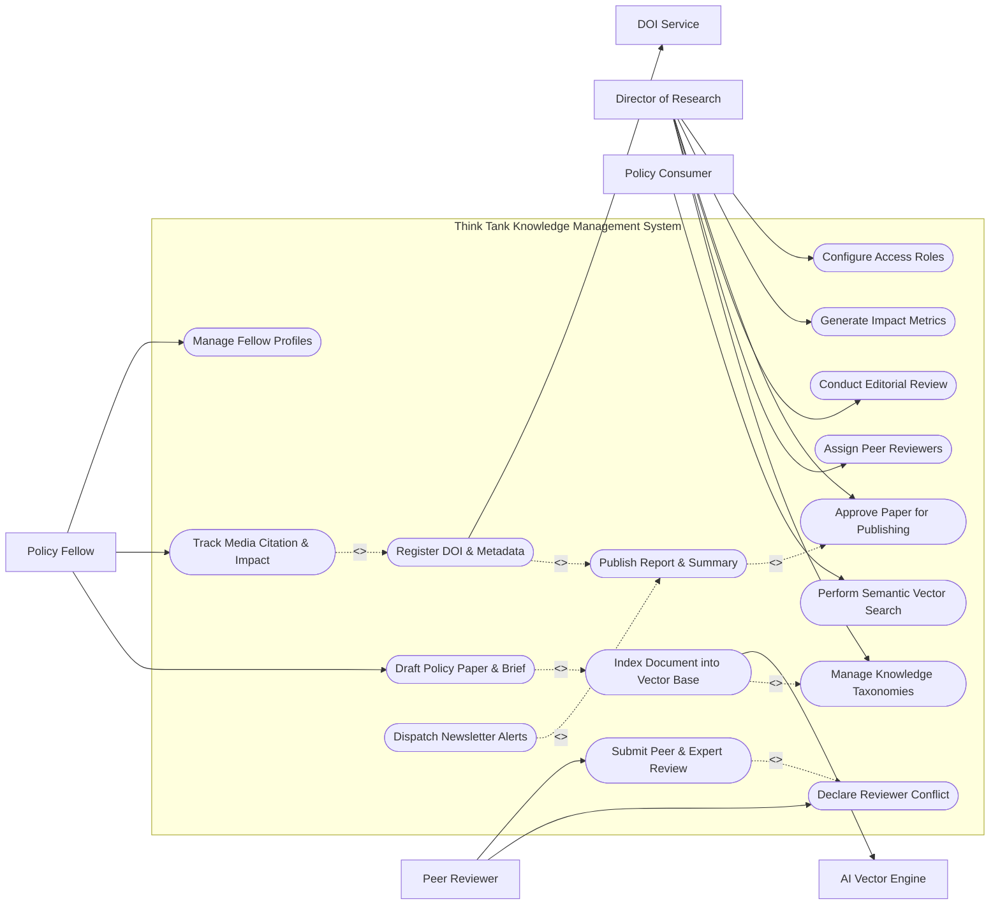

# Use Case Diagram — Think Tank Knowledge Management System

## Mermaid Code

## Actor Table | Bảng Actor

| # | Actor | Actor Type | Role Description | Related Use Cases |
|---|-------|------------|------------------|-------------------|
| 1 | Policy Fellow | Primary | Resident scholar authoring policy papers, research briefs, and tracking publication citations. | UC01, UC12, UC13 |
| 2 | Director of Research | Primary | Executive editor governing research quality, reviewer assignments, editorial approvals, and analytics. | UC04, UC05, UC08, UC09, UC15, UC16 |
| 3 | Policy Consumer | Primary | External reader or subscriber querying knowledge base via semantic vector search. | UC02 |
| 4 | Peer Reviewer | Primary | Independent policy expert evaluating research methodology, evidence rigor, and clarity. | UC06, UC07 |
| 5 | AI Vector Engine | System | External vector database generating embeddings and similarity search responses. | UC03 |
| 6 | DOI Service | System | External registry issuing digital identifiers and indexing metadata. | UC11 |

## Use Case Table | Bảng Use Case

| # | UC ID | Use Case Name | Primary Actor | Secondary Actor | Description | Priority |
|---|-------|---------------|---------------|-----------------|-------------|----------|
| 1 | UC01 | Draft Policy Paper & Brief | Policy Fellow | None | Authors a new policy paper, executive brief, or commentary with metadata and taxonomy tags. | High |
| 2 | UC02 | Perform Semantic Vector Search | Policy Consumer | AI Vector Engine | Queries the think tank knowledge base using natural language semantic vector matching. | High |
| 3 | UC03 | Index Document into Vector Base | Policy Fellow | AI Vector Engine | Chunks document text, extracts metadata embeddings, and indexes vectors into semantic database. | High |
| 4 | UC04 | Manage Knowledge Taxonomies | Director of Research | None | Configures hierarchical policy topic taxonomies, region codes, and research focus areas. | Medium |
| 5 | UC05 | Assign Peer Reviewers | Director of Research | Peer Reviewer | Matches submitted manuscripts to internal/external expert reviewers based on topic alignment. | High |
| 6 | UC06 | Declare Reviewer Conflict | Peer Reviewer | None | Recuses reviewer if financial, personal, or institutional conflict of interest exists. | Medium |
| 7 | UC07 | Submit Peer & Expert Review | Peer Reviewer | Director of Research | Evaluates paper quality, evidence backing, methodology rigor, and submits constructive feedback. | High |
| 8 | UC08 | Conduct Editorial Review | Director of Research | Policy Fellow | Performs copyediting, policy alignment check, executive summary review, and revision requests. | High |
| 9 | UC09 | Approve Paper for Publishing | Director of Research | None | Formally approves finalized policy publication for public distribution and press release. | High |
| 10 | UC10 | Publish Report & Summary | Director of Research | DOI Service | Publishes open-access PDF, generates interactive web version, and triggers newsletter dispatches. | High |
| 11 | UC11 | Register DOI & Metadata | Director of Research | DOI Service | Transmits publication metadata to Crossref/DataCite to mint an official Digital Object Identifier. | High |
| 12 | UC12 | Track Media Citation & Impact | Policy Fellow | None | Monitors media coverage, legislative citations, academic references, and social impact scores. | Medium |
| 13 | UC13 | Manage Fellow Profiles | Policy Fellow | None | Maintains scholar bio, expertise areas, publication history, media appearances, and contact details. | Medium |
| 14 | UC14 | Dispatch Newsletter Alerts | Director of Research | None | Sends targeted email alerts and policy briefs to subscribed policymakers and media contacts. | Medium |
| 15 | UC15 | Generate Think Tank Impact Metrics | Director of Research | None | Exports organizational analytics on download counts, media mentions, and policy influence. | Medium |
| 16 | UC16 | Configure Access Roles | Director of Research | None | Controls user roles, publishing permissions, and security classification levels for internal memos. | Low |

## Use Case Specification | Đặc tả Use Case

---

### UC01 — Draft Policy Paper & Brief

| Field | Detail |
|-------|--------|
| **UC ID** | UC01 |
| **Use Case Name** | Draft Policy Paper & Brief |
| **Actor(s)** | Primary: Policy Fellow / Secondary: None |
| **Description** | Allows a Policy Fellow or Senior Researcher to author a new policy paper, executive brief, or op-ed, input structured metadata, tag topic taxonomies, and attach underlying datasets. |
| **Precondition** | 1. User is logged in as an authorized Policy Fellow or Scholar.   2. The authoring environment is accessible. |
| **Main Flow** | 1. Actor selects "Create New Publication".   2. System displays authoring editor asking for Document Type (Policy Paper, Executive Brief, Working Paper, Op-Ed).   3. Actor inputs Title, Executive Summary, Main Text Body, Key Policy Recommendations, and Author list.   4. Actor selects relevant taxonomy tags from the Knowledge Taxonomy tree (e.g. Geopolitics > Indo-Pacific, Climate > Carbon Tax).   5. Actor attaches underlying dataset files, chart vectors, and reference citations.   6. Actor submits draft for vector indexing (UC03) and editorial review.   7. System validates required fields, assigns Document ID (e.g. DOC-2026-042), sets status to "Draft Submitted", and notifies Director of Research. |
| **Alternative Flow** | **AF1** — Collaborative Co-Authoring: Fellow invites external co-authors; System sends secure edit tokens allowing real-time collaborative text editing.   **AF2** — Save as Private Draft: Fellow selects "Save Draft", storing work privately without triggering indexing or review. |
| **Exception Flow** | **EX1** — Missing Executive Summary: If document type is "Policy Brief" and executive summary is empty, System prompts "Executive summary is required for policy briefs."   **EX2** — File Format Unsupported: If attached dataset is in an unapproved proprietary format, System alerts "Unsupported file format. Please upload CSV, XLSX, or JSON." |
| **Postcondition** | A Policy_Publication entity is stored in status "Draft Submitted", ready for vector indexing and peer review. |
| **Business Rule** | **BR1**: Policy briefs must not exceed 2,500 words; full policy papers must include at least 3 actionable policy recommendations. |

---

### UC03 — Index Document into AI Vector Knowledge Base

| Field | Detail |
|-------|--------|
| **UC ID** | UC03 |
| **Use Case Name** | Index Document into AI Vector Knowledge Base |
| **Actor(s)** | Primary: Policy Fellow / Secondary: AI Vector Engine |
| **Description** | Automatically extracts text chunks from submitted policy documents, generates high-dimensional vector embeddings, and indexes them into the semantic search vector database. |
| **Precondition** | 1. Document text has been submitted (UC01) or updated.   2. AI Vector Search Engine connection is active. |
| **Main Flow** | 1. System receives document processing request for a submitted policy paper.   2. System extracts plain text body, headers, footnotes, and metadata.   3. System splits text into overlapping semantic chunks (e.g. 512 tokens with 50-token overlap).   4. System sends text chunks to AI Embedding Model API to generate 1536-dimensional vector embeddings.   5. System attaches document metadata (Title, Author, Year, Taxonomy Tags, Confidentiality Level) to each vector payload.   6. System writes vector records into the AI Vector Search Engine index.   7. System marks document vector status as "Indexed" and returns completion confirmation. |
| **Alternative Flow** | **AF1** — Re-Indexing Updated Version: When a paper is edited, System deletes old chunk vectors by Document ID and re-indexes new chunks automatically.   **AF2** — Confidential Document Indexing: If document is marked "Internal Only", System tags vector payloads with restricted access ACLs. |
| **Exception Flow** | **EX1** — Vector API Timeout: If vector embedding API times out, System retries up to 3 times, then flags document as "Indexing Failed - Pending Retry Queue".   **EX2** — Corrupted PDF Text Extraction: If PDF text extraction yields unreadable characters, System alerts "OCR processing required for document text." |
| **Postcondition** | Document text chunks are indexed as searchable vectors in the vector database, enabling instant semantic search (UC02). |
| **Business Rule** | **BR1**: Vector chunks must preserve original document page numbers and section header paths for precise citation RAG attribution. |

---

### UC07 — Submit Peer & Expert Review

| Field | Detail |
|-------|--------|
| **UC ID** | UC07 |
| **Use Case Name** | Submit Peer & Expert Review |
| **Actor(s)** | Primary: Peer Reviewer / Secondary: Director of Research |
| **Description** | Allows internal fellows or external domain experts to evaluate policy paper drafts, assess policy argument validity, verify empirical data rigor, and submit review scores. |
| **Precondition** | 1. Reviewer is assigned to the paper dossier (UC05) and conflict check (UC06) is clear.   2. Paper status is "Under Peer Review". |
| **Main Flow** | 1. Reviewer logs into Reviewer Portal and opens assigned manuscript dossier.   2. System displays manuscript text, attached datasets, and structured review form side-by-side.   3. Reviewer evaluates policy argument soundness, empirical evidence quality, methodology, and writing clarity.   4. Reviewer inputs criteria scores (e.g. Methodology [1-5], Policy Value [1-5], Clarity [1-5]).   5. Reviewer enters confidential comments for Director of Research and constructive feedback for Author.   6. Reviewer selects recommendation decision: "Accept as Is", "Minor Revisions Required", "Major Revisions Required", or "Reject".   7. Reviewer submits evaluation.   8. System updates Peer_Review record status to "Submitted" and alerts Director of Research. |
| **Alternative Flow** | **AF1** — Blind Review Mode: Reviewer conducts double-blind review where author names and affiliations are redacted by the system.   **AF2** — Dataset Verification Check: Reviewer downloads raw dataset attachment to re-run statistical models before completing score. |
| **Exception Flow** | **EX1** — Incomplete Evaluation Rubric: If Reviewer misses required feedback boxes, System highlights empty fields and blocks submission.   **EX2** — Review Deadline Passed: If review is submitted after deadline, System accepts submission but flags record as "Late Review". |
| **Postcondition** | A Peer_Review evaluation record is stored, enabling the Director of Research to make editorial publishing decisions. |
| **Business Rule** | **BR1**: Major policy research reports must be evaluated by at least two independent subject matter experts prior to editorial approval. |

---

### UC10 — Publish Policy Report & Executive Summary

| Field | Detail |
|-------|--------|
| **UC ID** | UC10 |
| **Use Case Name** | Publish Policy Report & Executive Summary |
| **Actor(s)** | Primary: Director of Research / Secondary: DOI Service |
| **Description** | Executes final publication of approved policy research, generating web-optimized HTML pages, open-access PDF downloads, DOI registrations, and press distribution packages. |
| **Precondition** | 1. Publication is approved for publishing (UC09) by Director of Research.   2. Layout formatting and copyediting are finalized. |
| **Main Flow** | 1. Actor opens Approved Publishing Queue and selects target manuscript.   2. System displays pre-publication check matrix (Copyedit Approval, Formatting Check, DOI Pre-assignment, Media Kit Readiness).   3. Actor verifies checks and clicks "Publish Paper Now".   4. System triggers UC11 (Register DOI & Metadata) with DOI Service.   5. System generates public open-access PDF download file, creates web article page, and indexes metadata.   6. System changes publication status to "Published - Live" and sets public visibility.   7. System automatically triggers UC14 (Dispatch Newsletter Alerts) to notify policy subscribers and media lists. |
| **Alternative Flow** | **AF1** — Scheduled Press Embargo Release: Actor sets embargo release time (e.g. 09:00 AM EST tomorrow); System holds public release until embargo time expires.   **AF2** — Web-Only Brief Publishing: For short op-eds, System skips PDF generation and publishes directly to think tank web insight feed. |
| **Exception Flow** | **EX1** — DOI Minting Failure: If DOI registration API fails, System logs error, publishes document under temporary permalink, and queues DOI retry task.   **EX2** — Missing Cover Image / Meta Tag: If required social media preview card is missing, System prompts user to upload banner image before publishing. |
| **Postcondition** | Policy paper is publicly accessible on the web, indexed in vector search, assigned a DOI, and distributed to subscriber feeds. |
| **Business Rule** | **BR1**: All published policy reports must remain open-access without paywall restrictions to fulfill institutional public interest mission. |

---

### UC12 — Track Media Citation & Policy Impact

| Field | Detail |
|-------|--------|
| **UC ID** | UC12 |
| **Use Case Name** | Track Media Citation & Policy Impact |
| **Actor(s)** | Primary: Policy Fellow / Secondary: Director of Research |
| **Description** | Tracks, records, and aggregates external media mentions, government legislative citations, academic journal references, and altmetric social impact scores for published policy papers. |
| **Precondition** | 1. Target policy paper is in "Published" status with assigned DOI or URL.   2. External web crawler / citation tracking service feeds are enabled. |
| **Main Flow** | 1. Actor selects a published paper from "My Publications" dashboard and clicks "View Citation & Impact Analytics".   2. System displays total citations broken down into categories: News & Media Mentions, Legislative & Congressional Citations, Academic References, and Social Shares.   3. Actor reviews auto-detected media mentions (e.g. NYT, WSJ, BBC article links) and legislative bill citations.   4. Actor clicks "Manually Add Media Mention / Testimony Link" to record an un-indexed TV interview or government hearing testimony.   5. Actor inputs outlet name, journalist name, coverage date, and quote snippet.   6. System validates URL, attaches record to Publication entity, and recalculates composite Policy Impact Score.   7. System updates Fellow impact profile and generates executive impact summary report. |
| **Alternative Flow** | **AF1** — Automated News Crawler Ingestion: System background task automatically ingests web news mentions matching publication titles and updates metrics daily.   **AF2** — Export Impact Dossier for Donors: Actor generates formatted PDF summarizing policy impact for foundation grant reporting. |
| **Exception Flow** | **EX1** — Broken Media Link: If added news URL returns 404 error, System flags entry with warning icon "Unverified URL link".   **EX2** — Duplicate Citation Record: If media link is already logged, System alerts "Citation URL already exists in database". |
| **Postcondition** | Citation_Impact and Media_Mention records are updated, refreshing individual fellow and institutional impact scores. |
| **Business Rule** | **BR1**: Legislative citations in official government bills or congressional testimonies carry a 5x weighting factor in composite policy impact scoring. |
