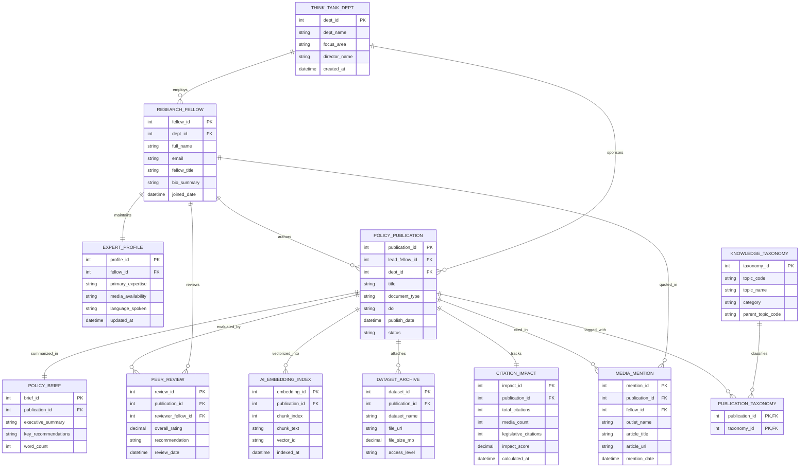

# Conceptual ERD — Think Tank Knowledge Management System

## Mermaid Code

## Entity Description Table | Bảng mô tả Entity

| # | Entity Name | Vietnamese Name | Description | Key Attributes | Main Relationships |
|---|-------------|-----------------|-------------|----------------|-------------------|
| 1 | THINK_TANK_DEPT | Khoa / Trung tâm Nghiên cứu | Research department or center within the think tank (e.g. Foreign Policy Center, Energy & Climate Program). | dept_id (PK), dept_name, focus_area, director_name | Employs Fellows, sponsors Publications |
| 2 | RESEARCH_FELLOW | Chuyên gia / Nghiên cứu viên | Scholar, policy analyst, or senior fellow producing policy research and commentaries. | fellow_id (PK), dept_id (FK), full_name, fellow_title | Belongs to Dept, maintains Expert Profile, authors Publications, conducts Reviews |
| 3 | EXPERT_PROFILE | Hồ sơ Chuyên gia | Public directory profile detailing media availability, language fluencies, and core research expertise. | profile_id (PK), fellow_id (FK), primary_expertise, media_availability | Belongs to Research Fellow |
| 4 | POLICY_PUBLICATION | Ấn phẩm Chính sách | Primary policy report, working paper, or whitepaper generated by think tank scholars. | publication_id (PK), lead_fellow_id (FK), dept_id (FK), title, document_type, doi, status | Authored by Fellow, summarized in Policy Brief, evaluated by Reviews, vectorized in Vector Index |
| 5 | KNOWLEDGE_TAXONOMY | Phân loại Tri thức | Hierarchical taxonomy classification tree (e.g. Geopolitics, Cyber Security, Monetary Policy) for content tagging. | taxonomy_id (PK), topic_code, topic_name, category | Classifies Publications (via PUBLICATION_TAXONOMY) |
| 6 | POLICY_BRIEF | Tóm tắt Chính sách | Executive summary brief extracting actionable policy recommendations from longer reports. | brief_id (PK), publication_id (FK), executive_summary, key_recommendations | Belongs to Policy Publication |
| 7 | PEER_REVIEW | Đánh giá Đồng nghiệp | Evaluation score and qualitative review notes submitted by internal or external expert reviewers. | review_id (PK), publication_id (FK), reviewer_fellow_id (FK), overall_rating, recommendation | Belongs to Publication & Reviewer Fellow |
| 8 | AI_EMBEDDING_INDEX | Chỉ mục Vector AI | Text chunk embeddings and vector IDs generated for semantic vector search and RAG indexing. | embedding_id (PK), publication_id (FK), chunk_index, chunk_text, vector_id | Belongs to Policy Publication |
| 9 | DATASET_ARCHIVE | Kho Dữ liệu Nghiên cứu | Raw empirical data files, survey spreadsheets, and analytical code supporting policy findings. | dataset_id (PK), publication_id (FK), dataset_name, file_url, access_level | Attached to Policy Publication |
| 10 | CITATION_IMPACT | Chỉ số Tác động Trích dẫn | Aggregated score tracking media mentions, legislative citations, academic references, and downloads. | impact_id (PK), publication_id (FK), total_citations, media_count, impact_score | Belongs to Policy Publication |
| 11 | MEDIA_MENTION | Trích dẫn Truyền thông | Record of external news articles, op-eds, TV interviews, or congressional testimonies quoting the publication/fellow. | mention_id (PK), publication_id (FK), fellow_id (FK), outlet_name, article_title, mention_date | Linked to Publication and Fellow |

## Relationship Description | Mô tả Quan hệ

| # | From Entity | Cardinality | To Entity | Relationship Label | Business Explanation |
|---|-------------|-------------|-----------|-------------------|----------------------|
| 1 | THINK_TANK_DEPT | one-to-many | RESEARCH_FELLOW | employs | A Think Tank Dept employs multiple Research Fellows. |
| 2 | RESEARCH_FELLOW | one-to-one | EXPERT_PROFILE | maintains | A Research Fellow maintains a unique Expert Profile. |
| 3 | RESEARCH_FELLOW | one-to-many | POLICY_PUBLICATION | authors | A Research Fellow authors multiple Policy Publications. |
| 4 | THINK_TANK_DEPT | one-to-many | POLICY_PUBLICATION | sponsors | A Dept sponsors research Publications produced in its domain. |
| 5 | POLICY_PUBLICATION | one-to-one | POLICY_BRIEF | summarized_in | A Policy Publication is summarized in an executive Policy Brief. |
| 6 | POLICY_PUBLICATION | one-to-many | PEER_REVIEW | evaluated_by | A Policy Publication is evaluated by multiple Peer Reviews. |
| 7 | RESEARCH_FELLOW | one-to-many | PEER_REVIEW | reviews | A Fellow submits Peer Reviews for fellow scholars' drafts. |
| 8 | POLICY_PUBLICATION | one-to-many | AI_EMBEDDING_INDEX | vectorized_into | A Publication is chunked and vectorized into multiple AI Embeddings. |
| 9 | POLICY_PUBLICATION | one-to-many | DATASET_ARCHIVE | attaches | A Publication attaches one or more raw Dataset Archives. |
| 10 | POLICY_PUBLICATION | one-to-one | CITATION_IMPACT | tracks | A Publication tracks a composite Citation Impact record. |
| 11 | POLICY_PUBLICATION | one-to-many | MEDIA_MENTION | cited_in | A Publication is cited across multiple external Media Mentions. |
| 12 | RESEARCH_FELLOW | one-to-many | MEDIA_MENTION | quoted_in | A Fellow is quoted across multiple external Media Mentions. |
| 13 | POLICY_PUBLICATION | many-to-many | KNOWLEDGE_TAXONOMY | tagged_with | Publications are tagged with multiple Taxonomies (via PUBLICATION_TAXONOMY). |
