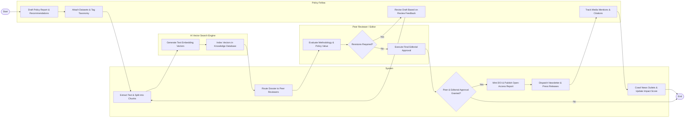

# Swimlane Diagram — Think Tank Knowledge Management System

## Mermaid Code

## Flow Description | Mô tả luồng

| Lane | Actor | Role in Flow |
|------|-------|-------------|
| 1 | Policy Fellow | Authors research reports, defines policy recommendations, uploads datasets, tags taxonomies, and monitors citation analytics. |
| 2 | System | Automates text chunking, triggers AI vector embedding generation, handles peer routing, mints DOIs, publishes open-access web reports, and tracks impact metrics. |
| 3 | Peer Reviewer / Editor | Conducts rigorous peer evaluations, checks policy argument validity, requests revisions, and executes final editorial approval. |
| 4 | AI Vector Search Engine | Computes high-dimensional text embeddings from document chunks and indexes vector records for natural language semantic search. |
