# Action Tree — Think Tank Knowledge Management System

## Mermaid Code

```mermaid
graph TD
    Root["Think Tank Knowledge Management System"]

    Root --> M1["Policy Research & Drafting"]
    Root --> M2["Knowledge Indexing & Vector Search"]
    Root --> M3["Peer Review & Editorial Workflow"]
    Root --> M4["Publication & Media Distribution"]
    Root --> M5["Policy Impact & Citation Analytics"]
    Root --> M6["System & Taxonomy Governance"]

    M1 --> A11["Draft Policy Report & Brief"]
    M1 --> A12["Attach Research Dataset Archives"]
    M1 --> A13["Tag Policy Taxonomies"]
    M1 --> A14["Co-Author Collaborative Memos"]

    M2 --> A21["Chunk Document Text"]
    M2 --> A22["Generate Embedding Vectors"]
    M2 --> A23["Index into AI Vector Base"]
    M2 --> A24["Query via RAG Semantic Search"]

    M3 --> A31["Assign Peer Reviewers"]
    M3 --> A32["Declare Conflict of Interest"]
    M3 --> A33["Submit Expert Scoring Rubric"]
    M3 --> A34["Execute Editorial Approval"]

    M4 --> A41["Mint Digital Object Identifier (DOI)"]
    M4 --> A42["Publish Open-Access Web Report"]
    M4 --> A43["Dispatch Newsletter & Press Alerts"]
    M4 --> A44["Generate Interactive Executive Brief"]

    M5 --> A51["Track Media Outlets Mentions"]
    M5 --> A52["Monitor Legislative Bill Citations"]
    M5 --> A53["Calculate Altmetric Impact Scores"]
    M5 --> A54["Export Donor Impact Reports"]

    M6 --> A61["Manage Hierarchical Taxonomies"]
    M6 --> A62["Update Scholar Expert Profiles"]
    M6 --> A63["Configure Role Permissions"]
    M6 --> A64["Export Institutional Analytics"]
```

## Module Description | Mô tả Module

| # | Module | Description | Actions |
|---|--------|-------------|---------|
| 1 | Policy Research & Drafting | Manages authoring of policy reports, executive briefs, collaborative co-authoring, and dataset archive attachments. | Draft Policy Report & Brief, Attach Research Dataset Archives, Tag Policy Taxonomies, Co-Author Collaborative Memos |
| 2 | Knowledge Indexing & Vector Search | Handles document text chunking, embedding vector generation, AI vector store indexing, and semantic RAG search queries. | Chunk Document Text, Generate Embedding Vectors, Index into AI Vector Base, Query via RAG Semantic Search |
| 3 | Peer Review & Editorial Workflow | Coordinates reviewer assignments, conflict recusals, expert rubric evaluation, and editorial publishing approvals. | Assign Peer Reviewers, Declare Conflict of Interest, Submit Expert Scoring Rubric, Execute Editorial Approval |
| 4 | Publication & Media Distribution | Manages DOI minting via Crossref, open-access web report publishing, newsletter alerts dispatch, and media press kits. | Mint Digital Object Identifier (DOI), Publish Open-Access Web Report, Dispatch Newsletter & Press Alerts, Generate Interactive Executive Brief |
| 5 | Policy Impact & Citation Analytics | Tracks news media mentions, congressional legislative citations, altmetric social scores, and donor impact summaries. | Track Media Outlets Mentions, Monitor Legislative Bill Citations, Calculate Altmetric Impact Scores, Export Donor Impact Reports |
| 6 | System & Taxonomy Governance | Controls hierarchical policy taxonomy trees, scholar expert directory profiles, security roles, and institutional analytics. | Manage Hierarchical Taxonomies, Update Scholar Expert Profiles, Configure Role Permissions, Export Institutional Analytics |
