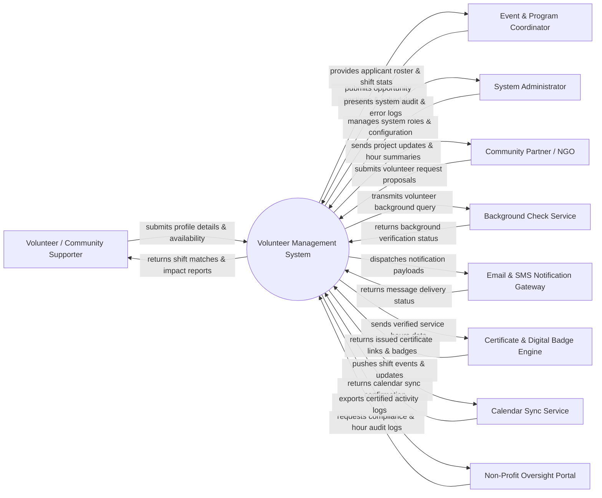

# Context Diagram — Volunteer Management System

## Mermaid Code

## Actor & Interaction Table | Bảng Actor & Tương tác

| # | Actor | Actor Type | Data Sent TO System | Data Received FROM System | Notes |
|---|-------|------------|---------------------|---------------------------|-------|
| 1 | Volunteer / Community Supporter | Primary | Profile details, skills, preferences, availability, opportunity applications, shift check-in logs, feedback | Opportunity matches, shift schedules, hour statements, impact statistics, digital certificates | Individuals offering time and skills for volunteer projects. |
| 2 | Event & Program Coordinator | Primary | Volunteer opportunity listings, shift requirements, attendance approvals, assignment overrides, team broadcasts | Applicant profiles, shift coverage metrics, real-time check-in rosters, volunteer feedback | Staff or leaders managing volunteer events and assigning shifts. |
| 3 | System Administrator | Primary | System configurations, user roles, security policies, skill taxonomies, system maintenance commands | System audit logs, error reports, platform usage metrics, user access logs | IT staff maintaining system health, security, and access control. |
| 4 | Community Partner / NGO | Primary | Project requests, beneficiary impact criteria, resource requirements, venue feedback | Approved volunteer counts, completed service hours, project impact reports | Partner non-profit organizations requesting volunteer manpower. |
| 5 | Background Check Service | Supporting System | Identity verification results, criminal background check statuses, clearance codes | Volunteer background verification request payloads, candidate identity tokens | Third-party background screening vendor API for volunteer safety vetting. |
| 6 | Email & SMS Notification Gateway | Supporting System | Delivery receipts, bounce notices, carrier failure alerts | Email payloads, SMS shift reminders, broadcast notifications, OTP codes | Messaging gateway used for shift reminders, updates, and alerts. |
| 7 | Certificate & Digital Badge Engine | Supporting System | Generated certificate PDFs, digital badge assertion tokens, credential URLs | Verified volunteer hours, milestone completion records, badge metadata | Credentialing system issuing verifiable volunteer certificates. |
| 8 | Calendar Sync Service | Supporting System | Sync confirmation tokens, calendar event IDs, sync error alerts | Shift start/end times, location details, shift updates for Google/Outlook calendars | Calendar integration service syncing shifts to volunteers' personal calendars. |
| 9 | Non-Profit Oversight Portal | Regulatory System | Audit compliance rules, grant reporting inquiries, regulatory reporting guidelines | Transparent hour logs, volunteer safety compliance reports, grant audit summaries | Government bodies or non-profit regulators verifying compliance and volunteer hours. |

## System Boundary Description | Mô tả Phạm vi Hệ thống

The **Volunteer Management System (VMS)** is a centralized digital platform designed to recruit, vet, schedule, track, and recognize volunteers across community projects and non-profit initiatives. Inside the system boundary, VMS manages volunteer user profiles, skill matching algorithms, opportunity publishing, shift assignment, automated check-in tracking, timesheet approval workflows, and impact analytics. External to the system boundary are identity vetting vendors (Background Check Service), notification infrastructure (Email & SMS Gateway), credentialing platforms (Certificate & Badge Engine), personal schedule tools (Calendar Sync Service), and regulatory reporting entities (Non-Profit Oversight Portal).
