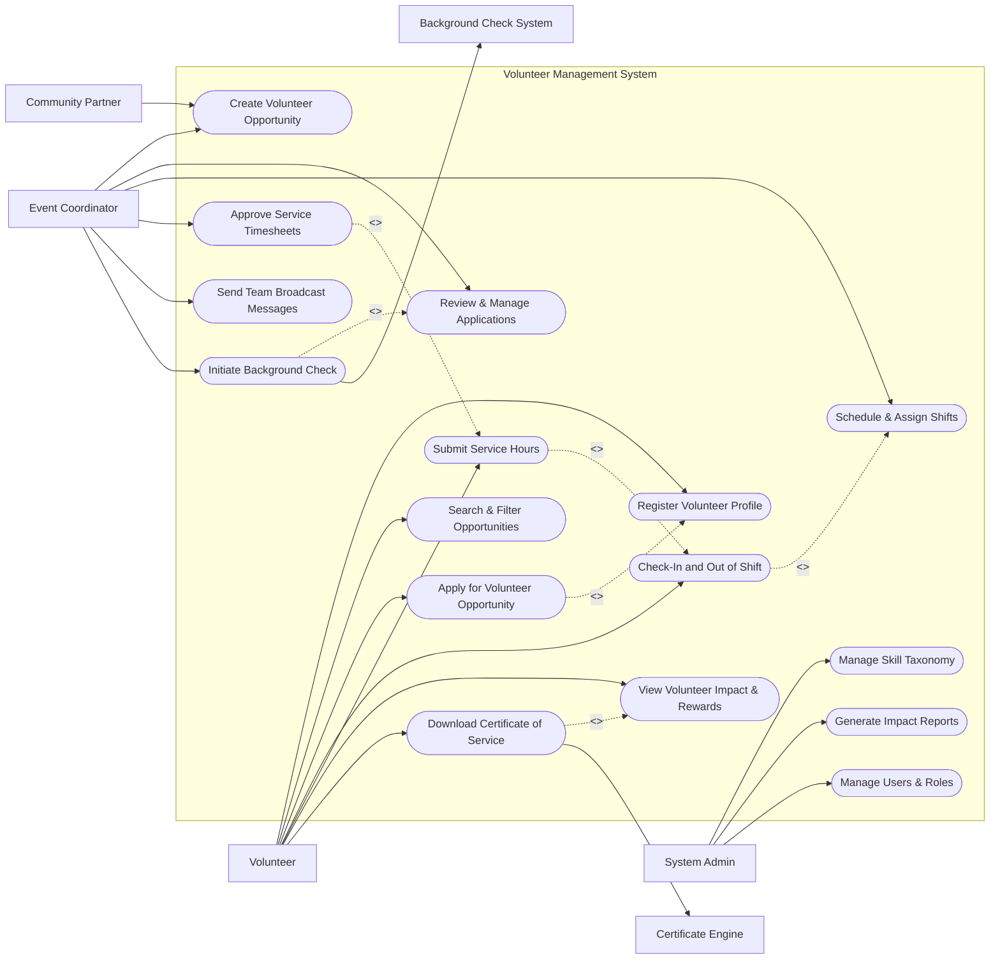

# Use Case Diagram — Volunteer Management System

## Mermaid Code

## Actor Table | Bảng Actor

| # | Actor | Actor Type | Role Description | Related Use Cases |
|---|-------|------------|------------------|-------------------|
| 1 | Volunteer | Primary | Individual contributing time, skills, and energy to events and initiatives. | UC01, UC02, UC03, UC04, UC05, UC06, UC07 |
| 2 | Event Coordinator | Primary | Staff or leader managing events, recruiting volunteers, and verifying shift hours. | UC08, UC09, UC10, UC11, UC12, UC13 |
| 3 | Community Partner | Secondary | NGO or community organization collaborating to request volunteer aid. | UC08 |
| 4 | System Admin | Primary | Administrator controlling system settings, user permissions, and compliance reports. | UC14, UC15, UC16 |
| 5 | Background Check System | System | External service performing screening and background checks. | UC13 |
| 6 | Certificate Engine | System | External credential provider issuing downloadable badges and certificates. | UC07 |

## Use Case Table | Bảng Use Case

| # | UC ID | Use Case Name | Primary Actor | Secondary Actor | Description | Priority |
|---|-------|---------------|---------------|-----------------|-------------|----------|
| 1 | UC01 | Register Volunteer Profile | Volunteer | None | Creates a volunteer account with contact info, skills, interests, and availability. | High |
| 2 | UC02 | Search & Filter Opportunities | Volunteer | None | Searches volunteer activities by location, date, cause, and required skills. | High |
| 3 | UC03 | Apply for Volunteer Opportunity | Volunteer | Event Coordinator | Submits an application for a specific volunteer role or activity. | High |
| 4 | UC04 | Check-In and Out of Shift | Volunteer | Event Coordinator | Records attendance time at a volunteer event via mobile GPS or QR code. | High |
| 5 | UC05 | Submit Service Hours | Volunteer | Event Coordinator | Logs self-reported volunteer service hours and work summaries. | Medium |
| 6 | UC06 | View Volunteer Impact & Rewards | Volunteer | None | Views cumulative served hours, completed events, impact metrics, and badges. | Medium |
| 7 | UC07 | Download Certificate of Service | Volunteer | Certificate Engine | Generates and downloads an official verified certificate of volunteer hours. | Medium |
| 8 | UC08 | Create Volunteer Opportunity | Event Coordinator | Community Partner | Publishes a new volunteer project with required skills, slots, and shift details. | High |
| 9 | UC09 | Review & Manage Applications | Event Coordinator | Volunteer | Evaluates volunteer applicants, reviews profiles, and approves/rejects candidates. | High |
| 10 | UC10 | Schedule & Assign Shifts | Event Coordinator | Volunteer | Assigns accepted volunteers to specific shifts and time slots. | High |
| 11 | UC11 | Approve Service Timesheets | Event Coordinator | Volunteer | Reviews and confirms logged volunteer hours for accuracy. | High |
| 12 | UC12 | Send Team Broadcast Messages | Event Coordinator | Volunteer | Sends announcements, updates, or alerts to volunteers signed up for a project. | Medium |
| 13 | UC13 | Initiate Background Check | Event Coordinator | Background Check System | Triggers identity and criminal background vetting for high-sensitivity roles. | High |
| 14 | UC14 | Manage Skill Taxonomy | System Admin | None | Configures categories, tags, and skill levels used for volunteer matching. | Low |
| 15 | UC15 | Generate Impact Reports | System Admin | None | Exports organizational volunteer metrics, total hours, and community impact. | Medium |
| 16 | UC16 | Manage Users & Roles | System Admin | None | Manages user accounts, assigns administrative roles, and configures access permissions. | High |

## Use Case Specification | Đặc tả Use Case

---

### UC01 — Register Volunteer Profile

| Field | Detail |
|-------|--------|
| **UC ID** | UC01 |
| **Use Case Name** | Register Volunteer Profile |
| **Actor(s)** | Primary: Volunteer / Secondary: None |
| **Description** | Allows a new user to create a volunteer account, set contact information, select skill sets, specify causes of interest, and define weekly availability. |
| **Precondition** | 1. The user has navigated to the VMS registration page.   2. The user has a valid email address or social login account. |
| **Main Flow** | 1. Actor clicks "Register as Volunteer".   2. System displays the registration form requesting full name, email, phone number, address, and password.   3. Actor enters personal information and submits step 1.   4. System validates inputs, creates pending account, and displays skill and cause selection grid.   5. Actor selects relevant skills (e.g., First Aid, Teaching, IT) and causes (e.g., Environment, Youth Education).   6. Actor sets weekly availability slots and submits registration.   7. System sends an email verification link and displays confirmation message. |
| **Alternative Flow** | **AF1** — OAuth Third-Party Registration: Actor selects "Sign up with Google/Facebook", System retrieves verified profile data, pre-populates form, and redirects to step 5.   **AF2** — Emergency Contact Entry: Actor opts to provide emergency contact info during registration; System stores emergency contact along with medical preferences. |
| **Exception Flow** | **EX1** — Email Already Registered: If the entered email already exists, System displays error "Email is already registered. Please log in or reset password."   **EX2** — Weak Password: If the entered password does not meet security criteria, System prompts user to include numbers, uppercase letters, and symbols. |
| **Postcondition** | A new Volunteer record is created in status "Pending Verification" until email verification is complete. |
| **Business Rule** | **BR1**: Volunteers must be at least 16 years old to register independently; younger applicants require parental consent upload.   **BR2**: Passwords must be at least 8 characters long with mixed-case and numeric characters. |

---

### UC03 — Apply for Volunteer Opportunity

| Field | Detail |
|-------|--------|
| **UC ID** | UC03 |
| **Use Case Name** | Apply for Volunteer Opportunity |
| **Actor(s)** | Primary: Volunteer / Secondary: Event Coordinator |
| **Description** | Allows a registered volunteer to review details of a specific volunteer opportunity and submit an application for open shifts. |
| **Precondition** | 1. Volunteer is logged in with an active and verified account.   2. The volunteer opportunity is active and has open volunteer slots. |
| **Main Flow** | 1. Actor views details of an opportunity (location, date, required skills, shift options).   2. Actor clicks "Apply for Opportunity".   3. System checks precondition (UC01 profile complete) and presents shift selection and application questionnaire.   4. Actor selects desired shifts and answers custom qualification questions (if any).   5. Actor submits the application.   6. System validates shift capacity, records the application in "Submitted" status, and notifies the Event Coordinator.   7. System displays application confirmation and adds pending shifts to Volunteer dashboard. |
| **Alternative Flow** | **AF1** — Instant Placement Opportunity: If the opportunity is designated as "Auto-Approve", System automatically sets application status to "Approved" and reserves the shift slot immediately.   **AF2** — Background Check Required: If the opportunity requires background vetting, System prompts Volunteer to consent to background check (triggers UC13). |
| **Exception Flow** | **EX1** — Shift Full: If the chosen shift fills up before submission, System alerts "Selected shift is now full" and suggests alternative shifts or waitlist.   **EX2** — Missing Prerequisite Skill: If the opportunity requires certified skills not present on Volunteer profile, System displays "Required skill missing: [Skill Name]" and prevents submission until proof is uploaded. |
| **Postcondition** | An Application record is created in status "Submitted" (or "Approved"), reserving or requesting a slot for the selected shifts. |
| **Business Rule** | **BR1**: Volunteers cannot apply for overlapping shifts across different projects.   **BR2**: Applications close 24 hours before the shift start time. |

---

### UC08 — Create Volunteer Opportunity

| Field | Detail |
|-------|--------|
| **UC ID** | UC08 |
| **Use Case Name** | Create Volunteer Opportunity |
| **Actor(s)** | Primary: Event Coordinator / Secondary: Community Partner |
| **Description** | Enables Event Coordinators to publish new volunteer activities, define required skills, set up shift schedules, and set capacity limits. |
| **Precondition** | 1. Actor is logged in as an Event Coordinator or authorized Administrator.   2. The associated organization or project entity exists in the system. |
| **Main Flow** | 1. Actor selects "Create New Opportunity" from Coordinator dashboard.   2. System displays opportunity editor form.   3. Actor inputs opportunity title, description, cause category, location (or virtual link), and required skills.   4. Actor defines shift dates, start/end times, and required volunteer quota per shift.   5. Actor sets background check requirements and approval mode (Manual Review vs. Auto-Approve).   6. Actor submits the opportunity for publishing.   7. System validates inputs, creates Opportunity and Shift records, and publishes the listing to the public search catalog. |
| **Alternative Flow** | **AF1** — Save as Draft: Actor selects "Save as Draft", System stores opportunity in "Draft" status without making it visible to volunteers.   **AF2** — Recurring Shift Setup: Actor checks "Recurring Activity", System generates weekly or monthly shift series automatically. |
| **Exception Flow** | **EX1** — Invalid Date Range: If shift end date is earlier than start date, System displays "End date must be after start date".   **EX2** — Zero Volunteer Quota: If quota is set to 0, System displays error "Shift quota must be at least 1". |
| **Postcondition** | A new Opportunity entity and associated Shift entities are persisted in status "Published". |
| **Business Rule** | **BR1**: All new opportunities created by partner organization guests require Coordinator approval before going live.   **BR2**: Opportunity titles must be unique within the same organization. |

---

### UC10 — Schedule & Assign Shifts

| Field | Detail |
|-------|--------|
| **UC ID** | UC10 |
| **Use Case Name** | Schedule & Assign Shifts |
| **Actor(s)** | Primary: Event Coordinator / Secondary: Volunteer |
| **Description** | Allows Event Coordinators to review applicant rosters, assign confirmed volunteers to shift slots, and manage attendance schedules. |
| **Precondition** | 1. Opportunity exists with approved volunteer applications.   2. Shift dates and time slots have been configured. |
| **Main Flow** | 1. Actor opens the Shift Scheduling matrix for a specific opportunity.   2. System displays shifts alongside approved volunteer pool and current fill rates.   3. Actor selects an unassigned volunteer and drags/assigns them to a designated shift slot.   4. System checks for schedule conflicts and availability match.   5. Actor confirms the shift assignment roster.   6. System updates shift status to "Assigned" and sends automated notification and calendar invite to assigned volunteers. |
| **Alternative Flow** | **AF1** — Bulk Auto-Assignment: Actor selects "Auto-Assign Volunteers", System matches applicants to shifts based on availability and skill score automatically.   **AF2** — Standby Roster Assignment: If shift is full, Actor assigns excess volunteers to "Standby/Waitlist" status. |
| **Exception Flow** | **EX1** — Schedule Conflict: If the volunteer is already assigned to another shift at the same time, System alerts "Schedule Conflict: Volunteer is assigned elsewhere from 09:00 to 12:00".   **EX2** — Maximum Hours Exceeded: If assignment exceeds volunteer max weekly hours policy, System prompts coordinator for override confirmation. |
| **Postcondition** | Volunteers are linked to Shift records with status "Scheduled", and shift capacity numbers are updated. |
| **Business Rule** | **BR1**: Volunteers must receive shift confirmation notifications at least 48 hours prior to shift commencement. |

---

### UC11 — Approve Service Timesheets

| Field | Detail |
|-------|--------|
| **UC ID** | UC11 |
| **Use Case Name** | Approve Service Timesheets |
| **Actor(s)** | Primary: Event Coordinator / Secondary: Volunteer |
| **Description** | Enables Event Coordinators to verify check-in/out logs or self-reported volunteer hours, adjust durations, and approve timesheets. |
| **Precondition** | 1. Volunteer has completed a shift or submitted a service hours claim (UC05).   2. Timesheet records are in status "Pending Approval". |
| **Main Flow** | 1. Actor opens the Timesheet Approval Queue.   2. System lists pending timesheets displaying Volunteer Name, Opportunity, Date, Check-In/Out timestamps, and claimed total hours.   3. Actor inspects check-in proof (GPS tag / QR scan record) and claimed hours.   4. Actor selects timesheet entries and clicks "Approve Hours".   5. System updates timesheet status to "Approved", updates cumulative volunteer hours, and triggers badge milestone checks.   6. System sends confirmation notification to Volunteer. |
| **Alternative Flow** | **AF1** — Adjust Hours: Actor modifies claimed hours (e.g., adjusts 5.0 hours to 4.5 hours due to late arrival), inputs reason, and clicks "Approve with Modification".   **AF2** — Reject Timesheet: Actor clicks "Reject", inputs rejection reason (e.g., "No check-in record found"), and System notifies volunteer with appeal instructions. |
| **Exception Flow** | **EX1** — Batch Approval Timeout: If batch selection exceeds 100 entries, System processes approval asynchronously and sends completion alert to Coordinator.   **EX2** — Duplicate Claim Detected: If system detects overlapping approved timesheet for the same volunteer, System flags record with warning "Potential Duplicate". |
| **Postcondition** | Timesheet status is set to "Approved", and approved hours are permanently credited to the volunteer's service history ledger. |
| **Business Rule** | **BR1**: Approved hours cannot be retroactively modified after 30 days without System Admin authorization.   **BR2**: Hours approved directly update total impact counters and trigger automated digital certificate eligibility. |
