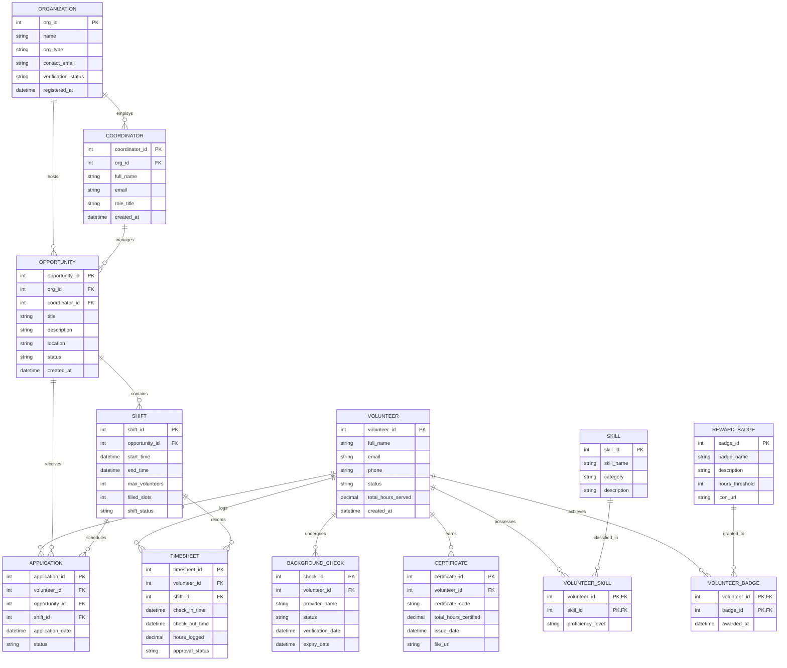

# Conceptual ERD — Volunteer Management System

## Mermaid Code

## Entity Description Table | Bảng mô tả Entity

| # | Entity Name | Vietnamese Name | Description | Key Attributes | Main Relationships |
|---|-------------|-----------------|-------------|----------------|-------------------|
| 1 | VOLUNTEER | Tình nguyện viên | Stores profile details, contact information, cumulative served hours, and status of registered volunteers. | volunteer_id (PK), full_name, email, status, total_hours_served | Has many Applications, Timesheets, Certificates, Background Checks, Skills, Badges |
| 2 | ORGANIZATION | Tổ chức | Stores details of non-profits, community groups, or entities hosting volunteer programs. | org_id (PK), name, org_type, verification_status | Has many Coordinators, Opportunities |
| 3 | COORDINATOR | Điều phối viên | Stores information for staff responsible for managing opportunities and approving volunteer hours. | coordinator_id (PK), org_id (FK), full_name, email | Belongs to Organization, manages Opportunities |
| 4 | OPPORTUNITY | Hoạt động Tình nguyện | Represents a volunteer project or event requiring volunteer participation. | opportunity_id (PK), org_id (FK), coordinator_id (FK), title, status | Belongs to Organization, contains Shifts, receives Applications |
| 5 | SHIFT | Ca Tình nguyện | Specific time slot within a volunteer opportunity with capacity limits. | shift_id (PK), opportunity_id (FK), start_time, end_time, max_volunteers | Belongs to Opportunity, has many Applications, Timesheets |
| 6 | APPLICATION | Đơn đăng ký | Tracks volunteer sign-ups for specific opportunities and shifts, including review status. | application_id (PK), volunteer_id (FK), opportunity_id (FK), shift_id (FK), status | Belongs to Volunteer, Opportunity, Shift |
| 7 | TIMESHEET | Bảng chấm công | Records attendance timestamps, logged service hours, and coordinator approval state. | timesheet_id (PK), volunteer_id (FK), shift_id (FK), check_in_time, hours_logged, approval_status | Belongs to Volunteer, Shift |
| 8 | BACKGROUND_CHECK | Xác minh Nhân thân | Tracks third-party identity and safety screening records for volunteers. | check_id (PK), volunteer_id (FK), provider_name, status, expiry_date | Belongs to Volunteer |
| 9 | CERTIFICATE | Chứng nhận Service | Official certificate of service issued to volunteers upon completing hours or projects. | certificate_id (PK), volunteer_id (FK), certificate_code, total_hours_certified, file_url | Belongs to Volunteer |
| 10 | REWARD_BADGE | Huy hiệu Khen thưởng | Gamification badge definition awarded to volunteers when milestone service thresholds are met. | badge_id (PK), badge_name, hours_threshold, icon_url | Granted to Volunteers via Volunteer_Badge |
| 11 | SKILL | Kỹ năng | Skill taxonomy entry (e.g., First Aid, Event Planning, Translation) used for matching. | skill_id (PK), skill_name, category | Associated with Volunteers via Volunteer_Skill |

## Relationship Description | Mô tả Quan hệ

| # | From Entity | Cardinality | To Entity | Relationship Label | Business Explanation |
|---|-------------|-------------|-----------|-------------------|----------------------|
| 1 | ORGANIZATION | one-to-many | COORDINATOR | employs | An Organization can employ multiple Coordinators. |
| 2 | ORGANIZATION | one-to-many | OPPORTUNITY | hosts | An Organization can host multiple volunteer Opportunities. |
| 3 | COORDINATOR | one-to-many | OPPORTUNITY | manages | A Coordinator manages one or more Opportunities. |
| 4 | OPPORTUNITY | one-to-many | SHIFT | contains | An Opportunity consists of one or many time Shifts. |
| 5 | VOLUNTEER | one-to-many | APPLICATION | submits | A Volunteer can submit applications for multiple Opportunities/Shifts. |
| 6 | OPPORTUNITY | one-to-many | APPLICATION | receives | An Opportunity receives applications from multiple Volunteers. |
| 7 | SHIFT | one-to-many | APPLICATION | schedules | A Shift receives sign-ups from multiple Volunteers. |
| 8 | VOLUNTEER | one-to-many | TIMESHEET | logs | A Volunteer logs multiple attendance Timesheets over time. |
| 9 | SHIFT | one-to-many | TIMESHEET | records | A Shift records check-in timesheets for participating Volunteers. |
| 10 | VOLUNTEER | one-to-many | BACKGROUND_CHECK | undergoes | A Volunteer can undergo background checks over time. |
| 11 | VOLUNTEER | one-to-many | CERTIFICATE | earns | A Volunteer earns certificates based on completed hours. |
| 12 | VOLUNTEER | many-to-many | SKILL | possesses | Volunteers possess multiple Skills (via VOLUNTEER_SKILL). |
| 13 | VOLUNTEER | many-to-many | REWARD_BADGE | achieves | Volunteers achieve gamification Badges (via VOLUNTEER_BADGE). |
