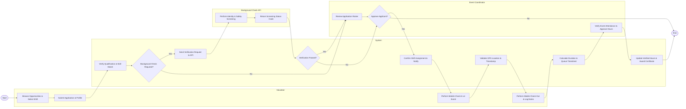

# Swimlane Diagram — Volunteer Management System

## Mermaid Code

## Flow Description | Mô tả luồng

| Lane | Actor | Role in Flow |
|------|-------|-------------|
| 1 | Volunteer | Initiates application, selects shift preferences, performs mobile GPS check-in/out on event day, and submits work logs. |
| 2 | System | Automates qualification checks, routes screening requests, validates real-time attendance timestamps, calculates hours, and issues certificates. |
| 3 | Background Check API | Receives identity payloads, executes background checks against criminal databases, and returns clearance status. |
| 4 | Event Coordinator | Evaluates applicant profiles, confirms shift assignments, supervises on-site attendance, and approves final service timesheets. |
