# Action Tree — Volunteer Management System

## Mermaid Code

```mermaid
graph TD
    Root["Volunteer Management System"]

    Root --> M1["Profile & Skill Management"]
    Root --> M2["Opportunity & Shift Management"]
    Root --> M3["Application & Matchmaking"]
    Root --> M4["Attendance & Hours Tracking"]
    Root --> M5["Recognition & Certification"]
    Root --> M6["System & Compliance Admin"]

    M1 --> A11["Register Profile"]
    M1 --> A12["Update Skills & Passions"]
    M1 --> A13["Set Weekly Availability"]
    M1 --> A14["Upload Credentials & ID"]

    M2 --> A21["Create Opportunity"]
    M2 --> A22["Configure Shift Schedules"]
    M2 --> A23["Set Capacity Limits"]
    M2 --> A24["Publish Catalog Listing"]

    M3 --> A31["Search Opportunities"]
    M3 --> A32["Submit Application"]
    M3 --> A33["Initiate Background Check"]
    M3 --> A34["Approve/Reject Candidates"]

    M4 --> A41["Mobile GPS Check-In"]
    M4 --> A42["QR Code Attendance Scan"]
    M4 --> A43["Submit Self-Reported Hours"]
    M4 --> A44["Approve Service Timesheets"]

    M5 --> A51["View Total Hours & Impact"]
    M5 --> A52["Award Milestone Badges"]
    M5 --> A53["Generate PDF Certificate"]
    M5 --> A54["Share Social Impact Card"]

    M6 --> A61["Manage Skill Taxonomy"]
    M6 --> A62["Configure User Roles"]
    M6 --> A63["Export Compliance Logs"]
    M6 --> A64["Send Mass Broadcasts"]
```

## Module Description | Mô tả Module

| # | Module | Description | Actions |
|---|--------|-------------|---------|
| 1 | Profile & Skill Management | Manages volunteer identities, skill portfolios, availability calendars, and qualification documents. | Register Profile, Update Skills & Passions, Set Weekly Availability, Upload Credentials & ID |
| 2 | Opportunity & Shift Management | Enables program coordinators to define projects, schedule shifts, set quotas, and publish listings. | Create Opportunity, Configure Shift Schedules, Set Capacity Limits, Publish Catalog Listing |
| 3 | Application & Matchmaking | Handles volunteer search filtering, application routing, background screening, and coordinator vetting. | Search Opportunities, Submit Application, Initiate Background Check, Approve/Reject Candidates |
| 4 | Attendance & Hours Tracking | Captures real-time event attendance via GPS/QR code, logs shift durations, and processes timesheet approvals. | Mobile GPS Check-In, QR Code Attendance Scan, Submit Self-Reported Hours, Approve Service Timesheets |
| 5 | Recognition & Certification | Calculates volunteer impact metrics, issues automated badges, and generates verifiable PDF service certificates. | View Total Hours & Impact, Award Milestone Badges, Generate PDF Certificate, Share Social Impact Card |
| 6 | System & Compliance Admin | Controls user roles, skill taxonomy settings, broadcast notifications, and non-profit audit reporting. | Manage Skill Taxonomy, Configure User Roles, Export Compliance Logs, Send Mass Broadcasts |
