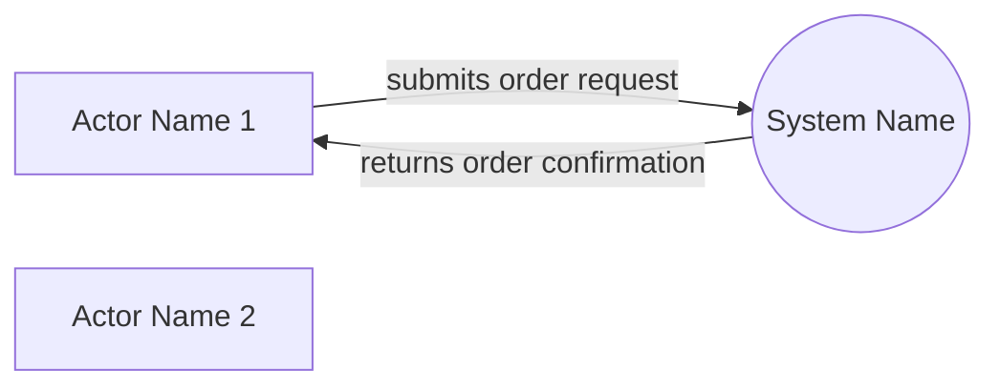
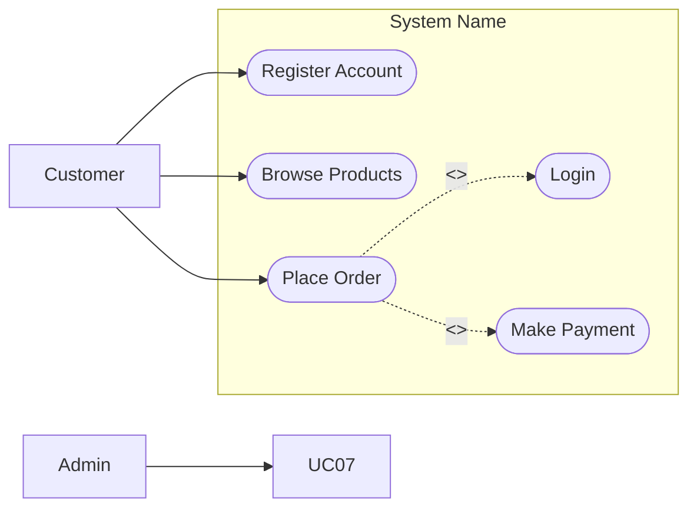
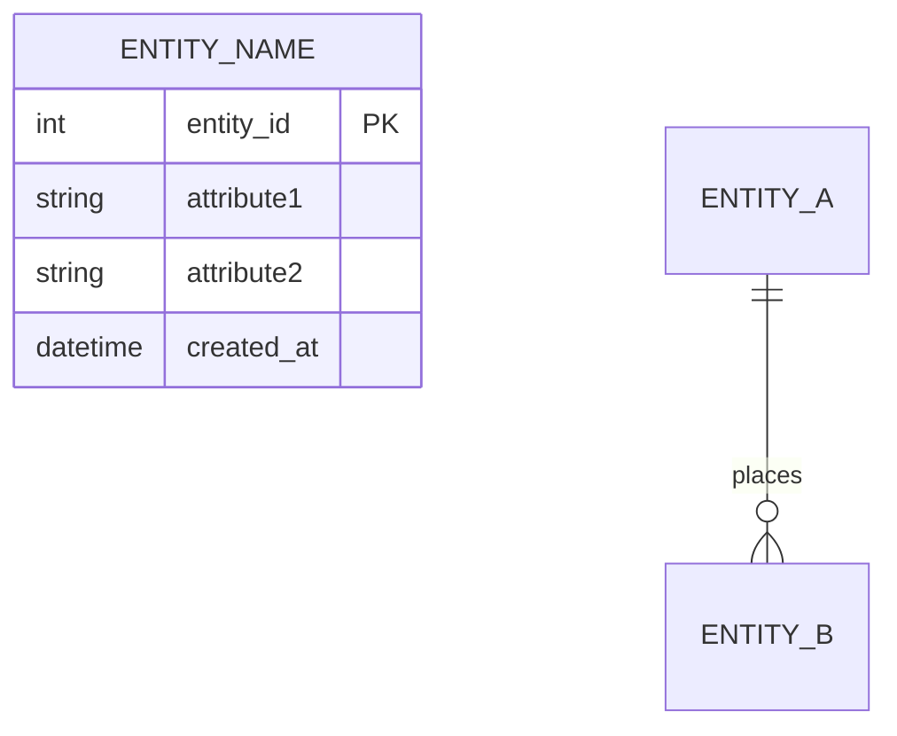
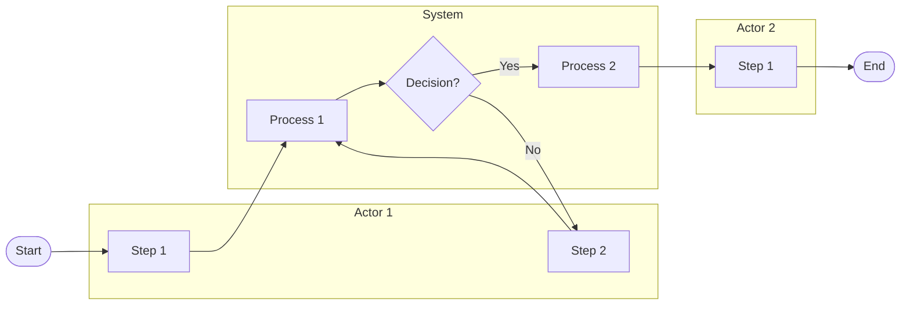
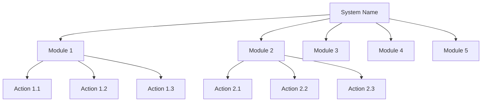

# PROMPT.md — Master Prompt Template

> **Cach dung**: Copy toan bo noi dung trong khung ` ``` ` ben duoi,
> thay `[TEN HE THONG]` bang ten that, paste vao Gemini/Antigravity.
>
> **Version**: 3.0 | **Updated**: 2026-07-22

---

```
Doc file AGENTS.md trong thu muc Source_PE de hieu day du vai tro, tieu chuan chat luong va quy trinh lam viec cua ban. Ap dung NGHIEM NGAT toan bo tieu chuan trong AGENTS.md.

Nhiem vu: Tao tai lieu BA day du cho he thong sau:
**Ten he thong**: [TEN HE THONG]

Xac dinh he thong thuoc Domain nao trong 25 domain. Tao folder snake_case BEN TRONG thu muc domain tuong ung tai:
D:\Workspaces\SU26\SWR302\Source_PE\[domain_folder]\[system_name_snake_case]\

Tao dung 5 file voi format sau (giu nguyen ten file):

================================================================
FILE 1: 01_context_diagram.md
================================================================

# Context Diagram — [System Name]

## Mermaid Code

(Tieu chuan BAT BUOC tu AGENTS.md:
 - Dung flowchart LR
 - He thong = HINH TRON: dung (("System Name"))
 - Actor = HINH VUONG: dung ["Actor Name"]
 - KHONG dung emoji, giu don gian sach se
 - Toi thieu 6-10 external actors
 - Bao gom du: Primary actors, Supporting systems, Regulatory actors
 - Nhan mui ten mo ta DATA FLOW cu the 2-5 tu, KHONG chung chung
 - 100% Tieng Anh cho labels
 - Paste vao draw.io Desktop phai hien thi dung ngay)



## Actor & Interaction Table | Bang Actor & Tuong tac

| # | Actor | Actor Type | Data Sent TO System | Data Received FROM System | Notes |
|---|-------|------------|---------------------|---------------------------|-------|
| 1 | ...   | Primary / Supporting / Regulatory | ... | ... | ... |

## System Boundary Description | Mo ta Pham vi He thong

(Mo ta 3-5 cau ve nhung gi HE THONG xu ly ben trong va nhung gi KHONG thuoc pham vi)


================================================================
FILE 2: 02_usecase_diagram.md
================================================================

# Use Case Diagram — [System Name]

## Mermaid Code

(Tieu chuan BAT BUOC tu AGENTS.md:
 - Dung flowchart LR
 - Actor = hinh chu nhat ["Actor Name"] — nam NGOAI subgraph
 - Use Case = hinh oval (["UC Name"]) — nam TRONG subgraph
 - System boundary = subgraph bao quanh tat ca UC
 - Include: duong net dut -.->|"<<include>>"|
 - Extend: duong net dut -.->|"<<extend>>"|
 - Toi thieu 12-20 use cases
 - KHONG dung emoji
 - 100% Tieng Anh cho labels)



## Actor Table | Bang Actor

| # | Actor | Actor Type | Role Description | Related Use Cases |
|---|-------|------------|------------------|-------------------|
| 1 | ...   | Primary / Secondary / System | ... | UC01, UC02,... |

## Use Case Table | Bang Use Case

| # | UC ID | Use Case Name | Primary Actor | Secondary Actor | Description | Priority |
|---|-------|---------------|---------------|-----------------|-------------|----------|
| 1 | UC01  | ...           | ...           | ...             | ...         | High / Medium / Low |

## Use Case Specification | Dac ta Use Case

(BAT BUOC dac ta toi thieu 4-5 UC quan trong nhat — day du 10 truong moi UC)

---

### UC01 — [Use Case Name]

| Field | Detail |
|-------|--------|
| **UC ID** | UC01 |
| **Use Case Name** | ... |
| **Actor(s)** | Primary: ... / Secondary: ... |
| **Description** | (Mo ta muc dich 1-2 cau) |
| **Precondition** | 1. ... <br> 2. ... |
| **Main Flow** | 1. Actor ... <br> 2. System ... <br> 3. Actor ... <br> 4. System ... <br> 5. System ... <br> 6. System ... |
| **Alternative Flow** | **AF1** — [Ten luong]: Neu [dieu kien], thi [hanh dong thay the]. <br> **AF2** — [Ten luong]: ... |
| **Exception Flow** | **EX1** — [Ten ngoai le]: Neu [loi], System hien thi [thong bao loi] va [hanh dong]. <br> **EX2** — ... |
| **Postcondition** | (Trang thai he thong va du lieu sau khi UC hoan thanh) |
| **Business Rule** | **BR1**: [Quy tac nghiep vu] <br> **BR2**: ... |

---

### UC02 — [Use Case Name]

(Tuong tu cau truc tren — dien day du 10 truong)

---

### UC03 — [Use Case Name]

(Tuong tu cau truc tren — dien day du 10 truong)

---

### UC04 — [Use Case Name]

(Tuong tu cau truc tren — dien day du 10 truong)

---

### UC05 — [Use Case Name]

(Tuong tu cau truc tren — dien day du 10 truong)


================================================================
FILE 3: 03_erd.md
================================================================

# Conceptual ERD — [System Name]

## Mermaid Code

(Tieu chuan BAT BUOC tu AGENTS.md:
 - Dung erDiagram syntax chuan
 - Entity = hinh chu nhat (mac dinh cua erDiagram)
 - Relationship = duong noi co label (verb phrase cu the)
 - Toi thieu 8-14 entities
 - Moi entity khai bao 4-8 attributes voi PK/FK
 - Cardinality chinh xac: ||--||, ||--o{, }o--o{
 - KHONG dung emoji)



## Entity Description Table | Bang mo ta Entity

| # | Entity Name | Vietnamese Name | Description | Key Attributes | Main Relationships |
|---|-------------|-----------------|-------------|----------------|-------------------|
| 1 | ...         | ...             | ...         | id, name, ...  | has many ..., belongs to ... |

## Relationship Description | Mo ta Quan he

| # | From Entity | Cardinality | To Entity | Relationship Label | Business Explanation |
|---|-------------|-------------|-----------|-------------------|----------------------|
| 1 | ...         | one-to-many | ...       | places            | Mot [A] co the tao nhieu [B] |


================================================================
FILE 4: 04_swimlane.md
================================================================

# Swimlane Diagram — [System Name]

## Mermaid Code

(Tieu chuan:
 - Dung flowchart LR voi subgraph cho moi actor/lane
 - Toi thieu 3-5 lanes, moi lane 3-5 buoc
 - Co decision node (hinh thoi) voi {} syntax
 - Co Start va End node
 - KHONG dung emoji)



## Flow Description | Mo ta luong

| Lane | Actor | Role in Flow |
|------|-------|-------------|
| 1 | ... | ... |


================================================================
FILE 5: 05_action_tree.md
================================================================

# Action Tree — [System Name]

## Mermaid Code

(Tieu chuan:
 - Dung graph TD (top-down)
 - Root node = Ten he thong
 - Level 1: 5-8 Modules chinh
 - Level 2: Moi module 3-6 actions cu the
 - KHONG dung emoji
 - 100% tieng Anh)



## Module Description | Mo ta Module

| # | Module | Description | Actions |
|---|--------|-------------|---------|
| 1 | ...    | ...         | Action 1, Action 2, ... |
```

---

## Vi du goi nhanh

```
Tao he thong: Hospital Management System
```

```
Tao he thong: Online Banking System
```

```
Tao he thong: Hotel Booking System
```

---

## Checklist chat luong output

| # | Tieu chi | Context | UseCase | ERD |
|---|----------|---------|---------|-----|
| 1 | So luong thanh phan | >= 6 actors | >= 12 UC | >= 8 entities |
| 2 | Hinh dang node | System=tron, Actor=vuong | Actor=chu nhat, UC=oval | Entity=chu nhat |
| 3 | Label cu the | Data flow 2-5 tu | Verb+Noun | Verb phrase |
| 4 | Bang mo ta du cot | 6 cot | Actor 5c + UC 7c | Entity 6c + Relation 6c |
| 5 | Dac ta UC | N/A | >= 4 UC, 10 truong/UC | N/A |
| 6 | Mermaid draw.io OK | Chay duoc | Chay duoc | Chay duoc |
| 7 | Emoji | KHONG | KHONG | KHONG |
| 8 | Ngon ngu label | 100% Tieng Anh | 100% Tieng Anh | 100% Tieng Anh |

---

## Tips nang cao

### Khi co de bai san (PDF/anh):
```
Tao he thong: [TEN HE THONG]

De bai:
[Paste noi dung de bai vao day]
```

### Khi muon lam lai mot file cu the:
```
Lam lai file 02_usecase_diagram.md cho he thong [ten]
```

### Khi muon them Use Case Specification:
```
Dac ta them UC05 va UC06 cho he thong [ten]
```

### Khi Mermaid loi sau khi paste vao draw.io:
- Xoa cac ky tu dac biet trong node label
- Boc text phuc tap trong "..."
- Thu doi flowchart LR sang graph LR
- Dam bao khong co emoji trong code
